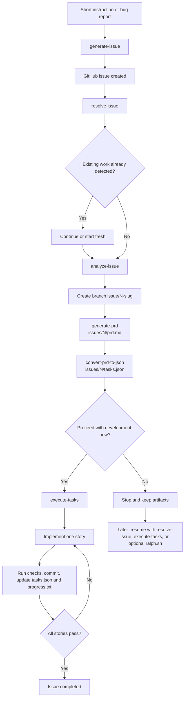

# Issue Flow

A collection of [agent skills](https://agentskills.io) for turning GitHub issues into executable work: create well-scoped issues, analyze them, generate PRDs, convert plans into structured task graphs, and implement them iteratively with quality checks or autonomous execution via Ralph.

## Skills

| Skill | Description |
|-------|-------------|
| [`generate-issue`](skills/generate-issue/) | Generates architect-quality GitHub issues from short instructions with duplicate detection and label management. |
| [`resolve-issue`](skills/resolve-issue/) | Resolves a GitHub issue end-to-end: analysis, branch, PRD, task plan, and iterative implementation. Orchestrates all sub-skills. |
| [`analyze-issue`](skills/analyze-issue/) | Analyzes a GitHub issue to extract context, scope, affected areas, and complexity. |
| [`generate-prd`](skills/generate-prd/) | Generates a structured PRD with user stories, acceptance criteria, and functional requirements. |
| [`convert-prd-to-json`](skills/convert-prd-to-json/) | Converts a PRD markdown file into a structured JSON task plan for autonomous execution. |
| [`execute-tasks`](skills/execute-tasks/) | Iteratively implements user stories from a JSON task plan with quality checks and commits. |

## End-to-End Workflow



## Interactive Walkthrough

<details>
<summary><strong>1. Create the GitHub issue with <code>generate-issue</code></strong></summary>

The pipeline can start from a short natural-language request such as "create an issue for adding rate limiting to the API".

`generate-issue` then:
- inspects the repository and stack
- expands the short request into a well-scoped technical issue
- checks for duplicates
- validates labels
- creates the issue with `gh`

Output: a published GitHub issue that is ready to be planned and executed.
</details>

<details>
<summary><strong>2. Plan the implementation with <code>resolve-issue</code></strong></summary>

`resolve-issue` is the orchestrator. It advances automatically through the planning pipeline:

1. check for existing work in `issues/{N}/`
2. analyze the issue with [`analyze-issue`](skills/analyze-issue/)
3. create the working branch `issue/{N}-{slug}`
4. generate the PRD with [`generate-prd`](skills/generate-prd/) into `issues/{N}/prd.md`
5. convert the PRD into the executable task plan with [`convert-prd-to-json`](skills/convert-prd-to-json/) into `issues/{N}/tasks.json`

At this point the planning phase is complete and the issue is ready for development.
</details>

<details>
<summary><strong>3. Decision point: start development now or stop with artifacts saved</strong></summary>

After the PRD and JSON task plan are ready, `resolve-issue` asks only one thing:

`Do you want to proceed with development now?`

- If the answer is yes, it invokes [`execute-tasks`](skills/execute-tasks/) and enters the implementation loop.
- If the answer is no, it stops cleanly and keeps the generated artifacts:
  - `issues/{N}/prd.md`
  - `issues/{N}/tasks.json`
  - the branch `issue/{N}-{slug}`

This is the handoff point between planning and development.
</details>

<details>
<summary><strong>4. Development loop: <code>execute-tasks</code> or optional <code>ralph.sh</code></strong></summary>

From the saved task plan, there are three ways to continue later:

- run `resolve-issue` again and let it resume
- invoke [`execute-tasks`](skills/execute-tasks/) directly
- run [`scripts/ralph/ralph.sh`](scripts/ralph/) for unattended autonomous execution

Both `execute-tasks` and Ralph consume the same planning artifacts. The difference is orchestration:

- `execute-tasks` runs inside the skill flow
- `ralph.sh` is an external loop that repeatedly launches fresh Claude Code sessions until all stories pass or a stop condition is hit
</details>

## Ralph (Advanced / Optional)

[Ralph](scripts/ralph/) is not part of issue creation and not part of planning. Its role starts only after `resolve-issue` has already created the branch and planning artifacts.

### What Ralph does

Ralph repeatedly runs a fresh Claude Code session against the existing task plan. In each iteration it:

1. reads `issues/{N}/tasks.json`
2. reads `issues/{N}/progress.txt`
3. checks out the branch from `branchName`
4. picks the highest-priority story where `passes: false`
5. implements only that story
6. runs quality checks
7. commits if checks pass
8. updates `tasks.json` and appends to `progress.txt`
9. repeats until every story passes or a fatal stop condition occurs

Because every iteration starts with clean context, memory persists through git history, `progress.txt`, and the task plan state in `tasks.json`.

### What Ralph does not do

Ralph does not:
- create the GitHub issue
- analyze the issue
- generate the PRD
- convert the PRD into the task plan
- decide scope for you

If those artifacts do not already exist, the script stops with an error.

### Before running Ralph

Run Ralph only after the planning pipeline is finished. In the normal flow, that means:

1. run `resolve-issue` for the target issue
2. let it complete analysis, branch creation, PRD generation, and JSON task-plan generation
3. answer "no" when asked whether to proceed with development now, so the flow stops but preserves the artifacts
4. verify these inputs exist:
   - `issues/{N}/prd.md`
   - `issues/{N}/tasks.json`
   - branch `issue/{N}-{slug}`
5. make sure the required tools are installed:
   - `claude`
   - `jq`
   - `git`
   - `curl` or `wget` only when running remotely

`tasks.json` is the critical input. In `--issue` mode Ralph reads from `issues/{N}/tasks.json` and will fail immediately if that file is missing.

### Run Ralph

```bash
# Local (from a clone of this repo)
./scripts/ralph/ralph.sh --issue 42

# Remote (from any project — no clone needed)
curl -sSL https://raw.githubusercontent.com/fabioassuncao/issue-flow/main/scripts/ralph/ralph.sh | bash -s -- --issue 42
```

Useful options:

```bash
# Stop after 15 iterations
./scripts/ralph/ralph.sh --issue 42 --max-iterations 15

# Retry transient Claude failures forever
./scripts/ralph/ralph.sh --issue 42 --retry-forever
```

In remote mode, `prompt.md` is downloaded automatically and cleaned up on exit. See the [Ralph README](scripts/ralph/) for the full script documentation.

## File Structure

All artifacts for a given issue are stored under `issues/{ISSUE_NUMBER}/`:

```
issues/
└── 42/
    ├── prd.md           # PRD (human-readable)
    ├── tasks.json       # Task plan + issue execution state
    ├── progress.txt     # Progress log
    └── archive/         # Archived previous runs
```

## Quick Start

```
Create an issue for adding rate limiting to the API

Resolve issue #42
```

See the [`resolve-issue` README](skills/resolve-issue/) for the complete pipeline documentation, or each skill's README for standalone usage.

## Requirements

- **GitHub CLI** (`gh`) — [install](https://cli.github.com/) and run `gh auth login`
- **Git** configured with push access to the repository

## Installation

### As a Claude Code Plugin

```bash
# 1. Add the marketplace
/plugin marketplace add fabioassuncao/issue-flow

# 2. Install the plugin
/plugin install issue-flow@issue-flow-marketplace
```

Once installed, skills are namespaced under `issue-flow:` (e.g., `/issue-flow:resolve-issue`).

To test locally during development:

```bash
claude --plugin-dir ./issue-flow
```

### Using [skills.sh](https://skills.sh/)

```bash
# GitHub shorthand
npx skills add fabioassuncao/issue-flow

# A specific skill only
npx skills add fabioassuncao/issue-flow --skill generate-issue
```

### Manual

1. Download the desired skill folder from this repository.
2. Copy it into your project's `.claude/skills/` directory.

After installation, the skills are automatically available in any tool that supports Agent Skills.
