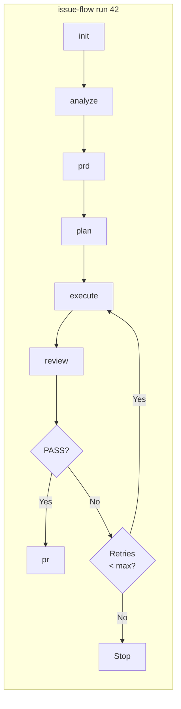

# Issue Flow

A CLI that turns GitHub issues into pull requests autonomously. Orchestrates the full pipeline -- analyze, plan, implement, review, and deliver -- via [Claude Code](https://docs.anthropic.com/en/docs/claude-code) Headless mode.

Built on the [Ralph pattern](https://ghuntley.com/ralph/) for autonomous AI agent loops.

## Quick Start

```bash
# Verify prerequisites
npx issue-flow init

# Run the full pipeline for issue #42
npx issue-flow run 42
```

## Requirements

- **Node.js** >= 18.0.0
- **Git** installed and available in PATH
- **Claude Code** (`npm install -g @anthropic-ai/claude-code`)
- **GitHub CLI** (`gh`) authenticated (`gh auth login`)

Run `npx issue-flow init` to verify all prerequisites.

## Installation

```bash
# Run directly via npx (no install needed)
npx issue-flow run 42

# Or install globally
npm install -g issue-flow
issue-flow run 42
```

## Pipeline Flow



Each phase can also be run independently: `issue-flow analyze 42`, `issue-flow prd 42`, etc. The `generate` command creates issues separately: `issue-flow generate --prompt '...'`.

## Commands

### `run` -- Full pipeline (end-to-end)

```bash
# Run the complete pipeline for an issue
npx issue-flow run 42

# Resume from a specific phase
npx issue-flow run 42 --from execute
```

Executes all phases in order: **init** -> **analyze** -> **prd** -> **plan** -> **execute** -> **review** -> **pr**. Automatically resumes from the last incomplete phase if pipeline state exists. On review failure, runs correction cycles (re-execute + re-review) up to `maxCorrectionCycles`.

| Mode | Behavior |
|------|----------|
| `auto` | Full pipeline without stops (default) |
| `manual` | Generates artifacts only, no execution |

### `init` -- Check prerequisites

```bash
npx issue-flow init
```

Verifies that `claude`, `gh` (authenticated), and `git` (inside a repo) are available. Reports pass/fail for each with install hints.

### `generate` -- Create a new issue

```bash
npx issue-flow generate --prompt "Add dark mode support to the settings page"
```

Analyzes the project and creates a detailed GitHub issue via Claude headless.

### `analyze` -- Analyze an issue

```bash
npx issue-flow analyze 42
```

Fetches issue data, analyzes the codebase, and produces a structured analysis saved to `issues/42/analysis.md`.

### `prd` -- Generate a PRD

```bash
npx issue-flow prd 42
```

Generates a Product Requirements Document from the issue analysis. Saves to `issues/42/prd.md`.

### `plan` -- Convert PRD to task plan

```bash
npx issue-flow plan 42
```

Converts the PRD into a structured `issues/42/tasks.json` with ordered user stories, acceptance criteria, and pipeline state.

### `execute` -- Run the story execution loop

```bash
npx issue-flow execute --issue 42
npx issue-flow execute --issue 42 --max-iterations 15
npx issue-flow execute --issue 42 --retry-forever
```

Runs the iterative agent loop. Each iteration is a fresh Claude instance that picks the next pending story, implements it, runs quality checks, and commits.

| Flag | Description |
|------|-------------|
| `--issue N` | Issue number -- reads artifacts from `issues/N/` |
| `--max-iterations N` | Stop after N iterations (default: unlimited) |
| `--retry-limit N` | Retry transient Claude failures up to N consecutive times (default: 10) |
| `--retry-forever` | Retry transient Claude failures indefinitely |

### `review` -- Validate the implementation

```bash
npx issue-flow review 42
```

Verifies acceptance criteria, runs tests, and checks for regressions. Outputs `PASS` or `FAIL` with findings.

### `pr` -- Create a pull request

```bash
npx issue-flow pr 42
```

Creates a well-structured PR referencing the issue, with summary and test plan.

## Pipeline State & File Structure

Each issue's state is tracked in `issues/N/tasks.json`:

```
issues/42/
  analysis.md    # Issue analysis
  prd.md         # Product requirements
  tasks.json     # Task plan with pipeline state and user stories
  progress.txt   # Execution log
```

The `pipeline` field tracks which phases have completed, enabling resume from any point:

```json
{
  "pipeline": {
    "analyzeCompleted": true,
    "prdCompleted": true,
    "jsonCompleted": true,
    "executionCompleted": false,
    "reviewCompleted": false,
    "prCreated": false
  }
}
```

## Development

```bash
cd packages/issue-flow

# Install dependencies
npm install

# Build
npm run build

# Type check
npm run typecheck

# Run tests
npm test

# Watch mode
npm run dev
```

For the full development setup, local testing, and NPM publishing guide, see [CONTRIBUTING.md](packages/issue-flow/CONTRIBUTING.md).

## Skills & Agents (Traditional Usage)

Issue Flow also ships as a set of **Claude Code skills** and a **sub-agent orchestrator** (`resolve-issue`) for interactive use. Skills can be installed in Claude Code or any tool that supports [Agent Skills](https://agentskills.io), and the sub-agent provides the full orchestrated pipeline with execution modes, auto-correction loop, and pipeline resumption.

```bash
# Install all skills via skills.sh
npx skills add fabioassuncao/issue-flow

# Install a specific skill
npx skills add fabioassuncao/issue-flow --skill generate-issue
```

For full documentation on skills, the sub-agent, installation methods (plugin marketplace, manual, skills.sh), the Ralph Loop for large task plans, and headless/CI usage, see **[Skills & Sub-Agent Architecture](docs/skills-and-agents.md)**.

## Credits

Based on [Geoffrey Huntley's Ralph pattern](https://ghuntley.com/ralph/) and the [snarktank/ralph](https://github.com/snarktank/ralph) repository.

## License

MIT
