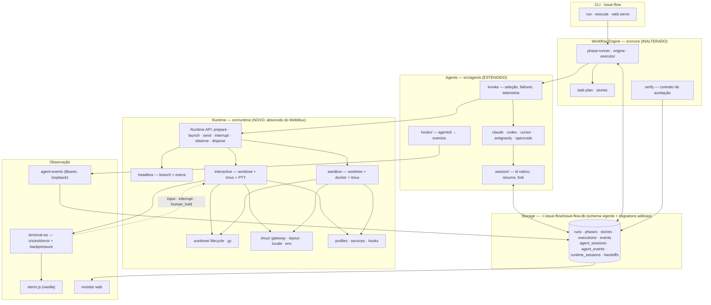
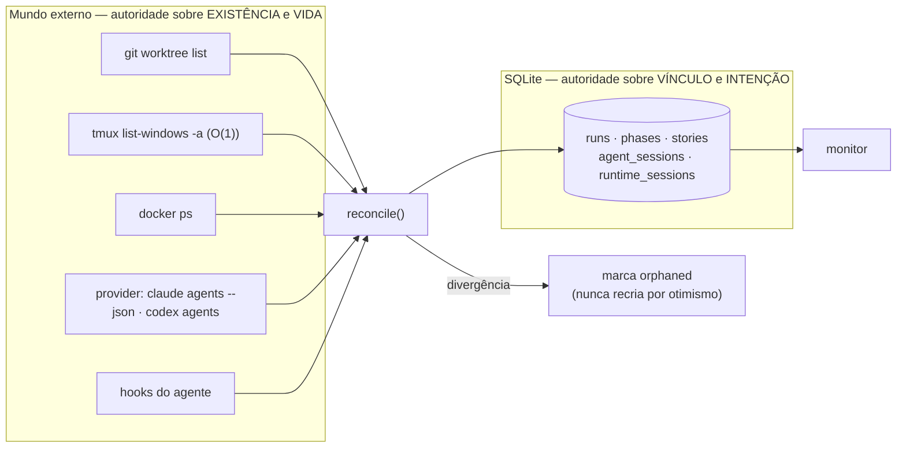

# Absorção do WebMux pelo Issue Flow — plano de portabilidade

> **Documento de pesquisa.** Coletado em **2026-09-06**, macOS 25.5, Node v22.22.1,
> tmux 3.6a, Bun 1.3.11. Baseline upstream **congelada** (§0). Decisão arquitetural de
> absorver já tomada; este documento determina **como**, não **se**.
>
> Convenção: **FATO** (verificado no código, com arquivo:linha) · **MEDIDO** (número
> coletado nesta sessão) · **NÃO DETERMINADO** (não foi possível decidir pelo código) ·
> **DECISÃO** (decisão arquitetural vigente para esta absorção).

---

## 0. Baseline upstream congelada

| Item | Valor |
|---|---|
| Upstream | `windmill-labs/webmux` |
| Commit congelado | `d8c9d5fa2fc061bff1425de2910d784a48961f1e` (`main`, 2026-08-14) |
| Versão | `0.43.1` |
| Cópia local | `.references/webmux-main` (gitignored, `/.references` em `.gitignore:3`) |
| Verificação de integridade | `diff -rq` contra clone de `d8c9d5f`: **idêntico, zero diferenças** |
| Primeiro commit upstream | 2026-03-10 · 52 stars · 14 issues abertas · não arquivado |
| Issue Flow | `0.20.0`, branch `feat/123-…`, HEAD `adb33cf` |

**FATO — licença.** O repositório **não contém arquivo `LICENSE`** e
`GET /repos/windmill-labs/webmux` responde `"license": null`. A única declaração é
`"license": "MIT"` em `package.json:74`. Não há cabeçalhos de licença em nenhum arquivo.

> ⚠️ **Consequência operacional, não jurídica.** A estratégia `COPY` (cópia literal de
> arquivos) é **proibida** enquanto o upstream não publicar o texto da licença. Isso não
> bloqueia nem suspende trabalho: use `PORT`, `ADAPT` ou `REIMPLEMENT`, que não são
> afetadas, e são as que este plano usa em 100% dos casos por outro motivo: **o backend do
> WebMux é Bun-only** (§2.2) e nenhum arquivo compila em Node sem tradução. Ou seja, a
> licença **não muda uma única decisão** deste plano — apenas fecha a porta de um atalho
> que já era impraticável. Uma issue upstream pedindo o `LICENSE` pode ser registrada como
> ação separada, mas **não é pré-requisito nem checkpoint** da implementação (§44).

---

## 1. Executive Summary — como será feita a absorção

A absorção acontece em **quatro blocos**, nesta ordem, porque é a ordem das dependências
reais do código:

```text
BLOCO A — Transporte e percepção   (o que explica a velocidade percebida)
BLOCO B — Runtime e sessão          (worktree + tmux + agent wrapper)
BLOCO C — Convenções Git            (a redução de opinião)
BLOCO D — Convergência              (oneshot ≡ run, PR/CI, multi-agente)
```

**O achado central, medido, que reordena tudo:**

| | WebMux | Issue Flow | Fonte |
|---|---|---|---|
| Infra até o agente iniciar (T0→T4) | **≈ 350 ms** | ≈ 0,8–2,5 s | **MEDIDO** §5 |
| Latência output do agente → tela | **≈ 0 ms** (push WebSocket) | **3–8 s** (poll 3 s no servidor + 5 s no browser) | **FATO** §5.4 |
| Contexto re-ingerido por fase/story | **0** (uma conversa por worktree) | **~29,7k tokens / ~$0,20** | `docs/research/2026-08-30-harness-baseline.md` |
| Execuções simultâneas | **N** (uma janela tmux por worktree) | **1** (fila serial, `run.lock` por projeto) | **FATO** §30 |
| Política de commit/PR | **nenhuma** (1 frase de system prompt) | ~700 LOC + 149 linhas de doc | **FATO** §8 |

**A velocidade do WebMux não vem do tmux nem do Bun.** Vem de quatro decisões, nesta ordem
de impacto: (1) o output é **empurrado** por WebSocket em vez de consultado por polling;
(2) o prompt viaja **no argv do próprio processo do agente**, eliminando o round-trip de
entrega; (3) a conversa é **reutilizada** dentro da worktree, eliminando a re-ingestão de
contexto; (4) as worktrees são **independentes**, então N tarefas correm de verdade em
paralelo. O tmux é consequência de (1) e (4), não causa da velocidade.

**O que vamos absorver, em uma linha cada:**

| Bloco | Absorção |
|---|---|
| **A** | Transporte push (PTY→WS→xterm.js), protocolo de 4+4 mensagens, sessões agrupadas, `load-buffer`+`paste-buffer`, eventos por hook do agente |
| **B** | Worktree manager completo, `tmux` gateway, profiles/panes, Docker sandbox, service health, agent wrappers com prompt-no-argv |
| **C** | **Remoção** de ~60% da política Git opinativa do Issue Flow, mantendo descoberta e defaults |
| **D** | `oneshot` e `run` convergem numa implementação; PR/CI canônico; handoffs estruturados |

**Principal risco:** confundir "absorver o runtime" com "absorver a ausência de garantias".
O WebMux não verifica nada, não tem banco, não tem retry, não tem failover e não tem
autenticação. O Issue Flow tem tudo isso e não pode perder nada disso. A regra de ouro
deste plano é: **absorver o caminho quente do WebMux, preservar o caminho de garantias do
Issue Flow.**

### 1.1 Contrato de execução autônoma

Este plano foi escrito para execução longa sem acompanhamento humano. Recebê-lo como
escopo de implementação autoriza o agente a analisar o estado real e tomar sozinho as
decisões operacionais e técnicas necessárias: criar, alterar, mover, remover ou refatorar
arquivos; ajustar schemas, migrations, dependências e lockfiles; executar e corrigir
testes, builds, linters, benchmarks e integrações; resolver problemas diretamente
relacionados; e manter documentação, provenance e rastreabilidade coerentes.

Fases, planos, recomendações, matrizes, testes de caracterização e gates são mecanismos de
sequenciamento e qualidade, **não pontos de confirmação humana**. Dentro do escopo pedido,
o agente avança automaticamente entre eles e escolhe entre alternativas tecnicamente
equivalentes usando, em ordem:

1. os objetivos e ADRs deste documento;
2. a arquitetura, os padrões, o código e as instruções vigentes do repositório;
3. a preservação de compatibilidade, funcionalidades e garantias existentes;
4. simplicidade e manutenibilidade;
5. menor risco técnico;
6. maior facilidade de reversão.

Uma divergência entre caminhos previstos e o repositório atual, um pré-requisito ainda não
implementado, uma dependência nova justificável, um teste que expõe defeito relacionado ou
um budget excedido exige investigação e ação autônoma — não aprovação. O agente registra
decisões relevantes e continua.

Somente a parte realmente afetada pode parar quando, depois de esgotadas alternativas
locais, mocks, fixtures, caches e caminhos reversíveis, faltar credencial indispensável,
acesso a recurso externo obrigatório ou houver decisão impossível de inferir tecnicamente
com consequência irreversível relevante. Nesse caso, o agente documenta evidências e
tentativas, conclui todo o trabalho independente e deixa o restante precisamente marcado
como bloqueado. Restrições de segurança e permissões do ambiente continuam soberanas e não
devem ser contornadas.

O estado final esperado é **um único Issue Flow**: capacidades escolhidas do WebMux
integradas às garantias existentes; `headless` preservado; modos interativo e sandbox
funcionais; frontend convergido sem perda; implementações substituídas removidas; testes,
budgets e critérios aplicáveis verdes; documentação, migrations, provenance e
rastreabilidade atualizadas; e nenhuma pendência artificial de aprovação entre fases.

---

## 2. Arquitetura do WebMux (a partir do código)

### 2.1 Forma

```text
webmux/ (Bun workspaces)
├── backend/src/           ~13k LOC produção
│   ├── adapters/          14 arquivos — I/O puro: tmux, terminal, git, docker, fs,
│   │                      config, hooks, port-probe, session-discovery, control-token,
│   │                      projects-registry, instance-registry, project-env, webmux-paths
│   ├── services/          40 arquivos — regra de negócio
│   ├── domain/            6 arquivos — tipos, políticas puras, eventos
│   ├── lib/               6 arquivos — async, branch-name, http, log, shell, type-guards
│   ├── runtime.ts         composição (DI manual)
│   └── server.ts          2.790 LOC — rotas HTTP + WS + loops de background
├── bin/src/               CLI `webmux` (11 arquivos)
├── packages/api-contract/ @ts-rest/core + zod — 43 rotas
├── frontend/src/          Svelte 5 + xterm.js + Tailwind 4
└── sandbox-image/         Dockerfile.sandbox + entrypoint.sh
```

**FATO — dependências de runtime do backend: apenas `zod` e `yaml`.** Todo o resto é API
do Bun.

### 2.2 Acoplamento ao Bun — medido

**MEDIDO** — call sites de API exclusiva do Bun em `backend/src` + `bin/src` (produção):

| API | Ocorrências | Equivalente Node |
|---|---|---|
| `Bun.env` | 33 | `process.env` |
| `Bun.spawn` | 24 | `execa` / `child_process.spawn` |
| `Bun.write` | 23 | `fs/promises.writeFile` |
| `Bun.spawnSync` | 20 | `execa.sync` |
| `Bun.file` | 18 | `fs/promises.readFile` |
| `Bun.sleep` | 9 | `timers/promises.setTimeout` |
| `Bun.serve` | 1 | `node:http` + `ws` |
| `Bun.connect` | 1 | `node:net.connect` |
| **Total** | **~129** | — |

**DECISÃO.** Nenhum arquivo do backend é `COPY`. Todos são `PORT`: tradução mecânica de
~129 call sites. O esforço é linear e verificável — não é reescrita.

### 2.3 tmux — `backend/src/adapters/tmux.ts` (314 LOC)

**FATO.** `BunTmuxGateway implements TmuxGateway` executa o binário `tmux` via
`Bun.spawnSync(["tmux", ...])`. **Não usa control mode (`tmux -C`), não usa biblioteca,
não usa PTY para comandar o tmux.** Parsing de `-F` com separador TAB.

| Método | Comando tmux | Linha |
|---|---|---|
| `ensureServer()` | `start-server` | 181 |
| `ensureSession()` | `has-session` → `new-session -d -s <s> -c <cwd> ; set-option destroy-unattached off` | 185–199 |
| `hasWindow()` | `list-windows -t <s> -F '#{window_name}'` | 224 |
| `killWindow()` | `kill-window -t <s>:<w>` (tolera 4 erros) | 231 |
| `createWindow()` | `new-window -d -t <s> -n <w> -c <cwd> [cmd]` | 245 |
| `splitWindow()` | `split-window -t <alvo> -h\|-v -c <cwd> [-l N%] [cmd]` | 256 |
| `setWindowOption()` | `set-window-option -t <s>:<w> <opt> <val>` | 265 |
| `runCommand()` | `send-keys -t <alvo> -l -- <cmd>` **+** `send-keys -t <alvo> C-m` | 272 |
| `selectPane()` | `select-pane -t <alvo>` | 277 |
| `listWindows()` | `list-windows -a -F '#{session_name}\t#{window_name}\t#{window_panes}'` | 281 |
| `getPaneId()` | `display-message -p -t <alvo> '#{pane_id}'` | 288 |
| `createParkedPane()` | `new-window -d -P -F '#{pane_id}' …` ou `split-window -d -P -F …` | 295 |
| `swapPanes()` | `swap-pane -s <src> -t <dst>` | 310 |
| `killPane()` | `kill-pane -t <alvo>` (tolerante) | 314 |

**Nomeação (funções puras, trivialmente portáveis):**

```text
buildProjectSessionName(root)     → wm-<basename(18)>-<sha1(resolve(root))[0:8]>
buildWorktreeWindowName(branch)   → wm-<branch>
buildWorktreeParkingWindowName(b) → wm-<branch>-tabs
sanitizeTmuxNameSegment(v, max)   → [^a-z0-9_.-] → '-', colapsa, apara, max 24
```

**Duas defesas que valem mais que o resto do arquivo — `PORT` obrigatório:**

1. **FATO — locale UTF-8** (`pickTmuxLocale`, `chooseUtf8Locale`, `detectUtf8Locale`).
   Sob locale não-UTF-8 (ex.: agente `launchd` sem `LANG`), o tmux reescreve o byte TAB da
   saída `-F` como `_`. Todo o parsing de `list-windows` quebra em silêncio: **toda janela
   some, toda sessão parece fechada**. `runTmux()` injeta `LC_ALL` escolhido de `locale -a`
   com preferência `C.UTF-8` → `en_US.UTF-8` → qualquer UTF-8. Origem: commit `e725f3b`.
2. **FATO — herança de environment** (`project-env.ts`, `stripProjectEnv`,
   `scrubLeakedGlobalEnv`). **O primeiro comando tmux que sobe o servidor fixa o
   environment global para toda a vida do servidor.** Se esse comando carregar o `.env` de
   um projeto, todo pane futuro — de qualquer projeto — herda aqueles segredos.
   `scrubLeakedGlobalEnv()` roda `set-environment -gu <key>` uma vez por processo para
   curar servidores já contaminados.

**Concorrência:** nenhuma primitiva de lock. A serialização vem de
`ReconciliationService` (promise `inFlight` + janela de frescor de 500 ms) e de
`mapWithConcurrency(entries, 4, …)`.

### 2.4 Terminal — `backend/src/adapters/terminal.ts` (457 LOC)

```text
Agent CLI (claude/codex) ─ roda dentro do pane tmux `wm-<branch>` da sessão do projeto
   ▲
   │ tmux attach-session -t wm-dash-<PORT>-<n>      ← SESSÃO AGRUPADA (-t owner)
   │   dentro de um wrapper PTY:
   │     darwin : python3 -c "import pty,sys;pty.spawn(sys.argv[1:])" bash -c <cmd>
   │     linux  : script -q -c <cmd> /dev/null
   │   via Bun.spawn(stdin/stdout/stderr = "pipe")
   ▼
scrollback em memória (ring, MAX_SCROLLBACK_BYTES = 1 MB)
   ▼
WebSocket  →  "o"+dados | "s"+scrollback | {type:"exit"|"error"}
   ▼
xterm.js 5.5 + FitAddon + WebLinksAddon  (frontend/src/lib/Terminal.svelte)
```

**FATO — não há `node-pty` nem equivalente.** `detectPtyWrapper()` escolhe em tempo de
boot: `python3` sempre no macOS; no Linux `script` (mais leve) com fallback `python3`. Sem
nenhum dos dois, lança erro pedindo `util-linux` ou `python3`.

**FATO — sessões agrupadas são o truque central de multi-viewer.** `buildAttachCmd()` emite
uma cadeia `&&`:

```sh
tmux new-session -d -s "$gName" -t "$ownerSession"      # sessão AGRUPADA
tmux set-option -t "$ownerSession" window-size latest
tmux set-option -t "$gName" mouse on
tmux set-option -t "$gName" set-clipboard on
tmux select-window -t "$gName:$windowName"
# unzoom defensivo: o estado de zoom É compartilhado entre sessões agrupadas
if [ "$(tmux display-message -t '…' -p '#{window_zoomed_flag}')" = "1" ]; then
  tmux resize-pane -Z -t '…'; fi
tmux select-pane -t "$paneTarget"
stty rows $rows cols $cols
exec tmux attach-session -t "$gName"
```

Cada navegador recebe sua própria sessão agrupada (`wm-dash-<PORT>-<contador>`), com
cliente, janela ativa e tamanho próprios, compartilhando as janelas da sessão-dona. É o
que permite N espectadores sem um redimensionar o outro.

**FATO — protocolo (`server.ts:412–424`, `sendWs()` em `:459`).**

| Direção | Mensagens |
|---|---|
| C→S | `{type:"input",data}` · `{type:"sendKeys",hexBytes[]}` · `{type:"selectPane",pane}` · `{type:"resize",cols,rows,initialPane?}` |
| S→C | `"o"+dados` · `"s"+scrollback` · `{type:"exit",exitCode}` · `{type:"error",message}` |

- **FATO — attach preguiçoso** (`server.ts:2254`): o **primeiro `resize`** é o sinal de
  attach. O cliente informa as dimensões reais antes de o PTY existir → sem reflow inicial.
- **FATO — prefixo de 1 caractere** no caminho quente evita `JSON.stringify` por chunk.
- **FATO — não há backpressure, sequência nem replay incremental.** `bufferedAmount` nunca
  é consultado. Reconexão = novo attach + replay do buffer de 1 MB inteiro.
- **FATO — reconexão é do cliente:** `Terminal.svelte:432–434` reconecta em
  `visibilitychange`, `focus` e `online`.

**FATO — entrega de texto e interrupção:**

```text
sendPrompt(worktreeId, target, text, paneIndex, preamble?, submitDelayMs)
  → [preamble]  tmux send-keys -t <pane> -l -- <preamble>
  →             tmux load-buffer -b wm-prompt-<ts>-<rnd> -   (texto por stdin, \0 removido)
  →             tmux paste-buffer -rp -b <buf> -t <pane> -d  (paste raw+bracketed, delete)
  → [sleep submitDelayMs]
  →             tmux send-keys -t <pane> Enter
interruptPrompt(target, paneIndex) → tmux send-keys -t <pane> C-c
sendKeys(attachId, hexBytes)       → tmux send-keys -t <win> -H <hex…>   (CSI u)
```

**Por que isso importa:** `send-keys -l` de um texto longo é entregue caractere a caractere;
uma TUI com autocomplete, slash-commands ou detecção de colagem reage no meio do caminho.
`load-buffer` + `paste-buffer -rp` entrega o bloco inteiro como colagem. **É o melhor
artefato isolado do WebMux.**

### 2.5 Eventos de runtime — `backend/src/adapters/agent-runtime.ts`

**FATO — o estado do agente nunca é lido do TTY.** `ensureAgentRuntimeArtifacts()`:

1. Gera `<gitdir>/webmux/webmux-agentctl` — um script **Python**, `chmod 0o755`.
2. Faz **merge** de hooks em `<worktree>/.claude/settings.local.json`.
3. Faz **merge** de hooks em `<worktree>/.codex/hooks.json`.
4. Adiciona `.codex/hooks.json` a `<commondir>/info/exclude` (não polui o repo).

O `agentctl` lê `<gitdir>/webmux/control.env` e faz `POST` para `WEBMUX_CONTROL_URL` com
`Authorization: Bearer <WEBMUX_CONTROL_TOKEN>`, timeout 2 s.

| Hook Claude | Matcher | Ação |
|---|---|---|
| `UserPromptSubmit` | — | `status-changed --lifecycle running` |
| `Notification` | `permission_prompt\|elicitation_dialog` | `status-changed --lifecycle idle` |
| `Stop` | — | `agent-stopped` |
| `PostToolUse` | — | `status-changed --lifecycle running` |
| `PostToolUse` | `Bash` | `claude-post-tool-use` → detecta `gh pr create` no comando e extrai a URL do PR por regex `https://github\.com/[^\s"]+/pull/\d+` |

| Hook Codex | Matcher | Ação |
|---|---|---|
| `SessionStart` | `startup\|resume\|clear` | `codex-session-start` → `idle` |
| `UserPromptSubmit` | — | `running` |
| `PermissionRequest` | — | `idle` |
| `PreToolUse` | — | `running --best-effort` |
| `PostToolUse` | `Bash` | detecção de `gh pr create` |
| `Stop` | — | `agent-stopped` |

**FATO — taxonomia completa de eventos** (`backend/src/domain/events.ts`): exatamente
**quatro** tipos.

| Evento | Payload | Produtor | Consumidor |
|---|---|---|---|
| `agent_status_changed` | `{worktreeId, branch, lifecycle: starting\|running\|idle\|stopped}` | hook do agente | `ProjectRuntime` → snapshot → UI |
| `agent_stopped` | `{worktreeId, branch}` | hook `Stop` | notificação + watcher do oneshot |
| `pr_opened` | `{worktreeId, branch, url?}` | hook `PostToolUse[Bash]` | `prs.json` + UI |
| `runtime_error` | `{worktreeId, branch, message}` | agentctl | notificação |

**Persistência:** nenhuma. Os eventos mutam a projeção em memória e viram notificação. Não
há log de eventos em disco.

### 2.6 Estado — não há banco de dados

**FATO.** Autoridade por tipo de dado:

| Dado | Autoridade | Arquivo |
|---|---|---|
| Quais worktrees existem | `git worktree list --porcelain` | `adapters/git.ts:264` |
| Sessão viva / nº de panes | `tmux list-windows -a` | `adapters/tmux.ts:281` |
| Metadados duráveis | `<gitdir>/webmux/meta.json` | `adapters/fs.ts:62` |
| Env do runtime | `<gitdir>/webmux/runtime.env` | `adapters/fs.ts:68` |
| Credencial de controle | `<gitdir>/webmux/control.env` | `adapters/fs.ts:69` |
| PRs conhecidos | `<gitdir>/webmux/prs.json` | `adapters/fs.ts:70` |
| Sessões abertas (p/ restore) | `<gitdir>/webmux/open-sessions.json` | `adapters/fs.ts:78` |
| Estado do agente | evento de hook (memória) | `services/project-runtime.ts` |
| Serviços | `Bun.connect` TCP, timeout 300 ms, `127.0.0.1` + `::1` | `adapters/port-probe.ts` |
| PR/CI | `gh` com cache **ETag** | `services/pr-service.ts:93` |

`WorktreeMeta` (`domain/model.ts:60`): `schemaVersion, worktreeId, branch, label?,
baseBranch?, createdAt, profile, agent, runtime, startupEnvValues, allocatedPorts, source?,
oneshot?, conversation?, agentTerminalStale?, tabs?, activeTabId?, forkCounter?`.

`ReconciliationService.reconcile()` reconstrói `ProjectRuntime` sob demanda: frescor 500 ms,
`mapWithConcurrency(…, 4)`, e **remove** do runtime tudo que não foi visto — a projeção
nunca acumula lixo.

---

## 3. Inventário completo de capabilities

Estratégias: **PORT** (traduzir Bun→Node preservando estrutura) · **ADAPT** (portar
mudando a forma para caber no Issue Flow) · **MERGE** (fundir com implementação existente)
· **REIMPLEMENT** (refazer; usado só onde a forma do WebMux é inadequada) · **DISCARD**.

| # | Capability WebMux | Código responsável | Testes upstream | Destino Issue Flow | Estratégia |
|---|---|---|---|---|---|
| 1 | Project registry multi-projeto | `services/project-manager.ts`, `adapters/projects-registry.ts` | `project-manager.test.ts` (13) | `src/storage/project-identity.ts` + `src/web/lock.ts` | **DISCARD** — Issue Flow já resolve, com lock mais forte |
| 2 | Worktree — criar | `services/worktree-creation-service.ts`, `lifecycle-service.ts:1383`, `adapters/git.ts:385` | `lifecycle-service.test.ts` (61), `worktree-storage.test.ts` (19) | `src/runtime/worktree/` **(novo)** | **PORT** |
| 3 | Worktree — listar/reconciliar | `services/reconciliation-service.ts` | `reconciliation-service.test.ts` (11) | `src/runtime/reconcile.ts` **(novo)** | **ADAPT** (fonte = SQLite + git + tmux) |
| 4 | Worktree — remover/prune/archive | `adapters/git.ts:321`, `services/archive-*.ts`, `auto-remove-service.ts` | `worktree-commands.test.ts` (76) | `src/runtime/worktree/` | **PORT** |
| 5 | Worktree — merge | `adapters/git.ts:404–430` (`checkout` → `merge --no-ff --no-edit` → abort+restore em falha) | `git-adapter.test.ts` (25) | `src/utils/git.ts` | **MERGE** |
| 6 | Branch — naming automático (LLM) | `services/auto-name-service.ts`, `llm-spawn.ts`, `lib/branch-name.ts` | `auto-name-service.test.ts` (12) | `src/conventions/git/branch.ts` | **ADAPT** (§8) |
| 7 | Branch — sanitização/validação | `domain/policies.ts:8–26` | `domain-policies.test.ts` (14) | `src/conventions/git/slug.ts` | **MERGE** |
| 8 | Profiles (host/docker, panes, env, systemPrompt, mounts) | `adapters/config.ts`, `domain/config.ts` | `setup.test.ts` (17) | `src/runtime/profiles.ts` **(novo)** | **PORT** |
| 9 | Profile switching com resume | `lifecycle-service.ts` (`setWorktreeProfile`) | `lifecycle-service.test.ts` | `src/runtime/profiles.ts` | **PORT** |
| 10 | Pane layout planning | `services/session-service.ts:66` (`planSessionLayout`, puro) | `session-service.test.ts` (10) | `src/runtime/tmux/layout.ts` **(novo)** | **PORT** (função pura) |
| 11 | tmux gateway | `adapters/tmux.ts` | `tmux-adapter.test.ts` (20) | `src/runtime/tmux/gateway.ts` **(novo)** | **PORT** |
| 12 | tmux — locale UTF-8 | `adapters/tmux.ts:60–110` | `tmux-adapter.test.ts` | idem | **PORT** (obrigatório) |
| 13 | tmux — env scrubbing | `adapters/project-env.ts` | — | idem | **PORT** (obrigatório) |
| 14 | Agent launch (comando) | `services/agent-service.ts` | `agent-service.test.ts` (19) | `src/agents/*.ts` (argv) | **ADAPT** — string de shell → argv (§7) |
| 15 | Agent registry/capabilities | `services/agent-registry.ts` | `agent-registry.test.ts` (11) | `src/agents/types.ts` | **DISCARD** — Issue Flow é superior (5 providers) |
| 16 | Custom agents (`startCommand`/`resumeCommand`) | `agent-service.ts:118`, `domain/config.ts` | `agent-validation-service` | `src/agents/custom.ts` **(novo)** | **PORT** |
| 17 | Claude — sessão/JSONL | `adapters/claude-cli.ts` | `claude-cli.test.ts` (14), `claude-stream-block-identity.test.ts` (9) | `src/agents/session/claude.ts` **(novo)** | **ADAPT** |
| 18 | Codex — app-server JSON-RPC | `adapters/codex-app-server.ts` | `codex-app-server.test.ts` (7) | `src/agents/session/codex.ts` **(novo)** | **PORT** |
| 19 | Session discovery em disco | `adapters/session-discovery.ts` | — | `src/agents/session/discover.ts` **(novo)** | **ADAPT** (fallback; CLIs hoje listam nativamente) |
| 20 | Conversation export | `services/conversation-export-service.ts` | `conversation-export-service.test.ts` (9) | `src/agents/session/export.ts` | **PORT** |
| 21 | Docker sandbox | `adapters/docker.ts`, `sandbox-image/` | `docker.test.ts` (23) | `src/runtime/sandbox/` **(novo)** | **PORT** |
| 22 | Terminal PTY attach | `adapters/terminal.ts` | `terminal-adapter.test.ts` (10) | `src/runtime/terminal/attach.ts` **(novo)** | **ADAPT** (`node-pty`/`script`) |
| 23 | WebSocket terminal | `server.ts:2200–2320` | — | `src/web/terminal-ws.ts` **(novo)** | **PORT** + backpressure |
| 24 | Frontend completo (39 componentes) | `frontend/` inteiro | 19 suítes, 148 casos | `packages/issue-flow/web/` | **PORT + ADAPT** — ver §48 (revoga o `REIMPLEMENT` anterior) |
| 25 | Runtime events (hooks) | `adapters/agent-runtime.ts`, `domain/events.ts` | `agent-runtime.test.ts` (9) | `src/agents/hooks/` **(novo)** | **PORT** + persistir em SQLite |
| 26 | Control token | `adapters/control-token.ts` | — | `src/web/control-token.ts` **(novo)** | **PORT** |
| 27 | One-shot | `bin/src/oneshot.ts`, `services/oneshot-watcher-service.ts` | `oneshot.test.ts` (17), `oneshot-watcher-service.test.ts` (12) | `src/commands/run.ts` | **MERGE** (§17) |
| 28 | Lifecycle hooks (`postCreate`/`preRemove`) | `lifecycle-service.ts:1450` | `lifecycle-service.test.ts` | `src/runtime/hooks.ts` **(novo)** | **PORT** |
| 29 | Service health | `adapters/port-probe.ts`, `domain/policies.ts:allocateServicePorts` | `domain-policies.test.ts` | `src/runtime/services.ts` **(novo)** | **PORT** |
| 30 | Port allocation por slot | `domain/policies.ts:96` | `domain-policies.test.ts` | idem | **PORT** (função pura) |
| 31 | PR discovery/status | `services/pr-service.ts` | `pr.test.ts` (22) | `src/issues/github/pr.ts` | **MERGE** — absorver ETag + gating |
| 32 | CI checks + logs | `pr-service.ts`, `server.ts:1769` (`gh run view --log-failed`) | `pr.test.ts` | `src/issues/github/ci.ts` **(novo)** | **PORT** |
| 33 | Review comments | `pr-service.ts:310` | `pr.test.ts` | `src/verify/pr-review` | **MERGE** |
| 34 | Linked repositories | `config.integrations.github.linkedRepos` | `pr.test.ts` | `src/issues/github/` | **PORT** |
| 35 | Auto-remove on merge | `services/auto-remove-service.ts` | — | `src/runtime/worktree/gc.ts` | **PORT** |
| 36 | Auto-pull main | `services/auto-pull-service.ts` | — | `src/runtime/worktree/gc.ts` | **PORT** |
| 37 | Session restore pós-reboot | `services/session-restore-service.ts` | `snapshot-service.test.ts` (12) | `src/runtime/reconcile.ts` | **ADAPT** — regra "vazio não sobrescreve" |
| 38 | Notifications | `services/notification-service.ts` | — | evento no snapshot | **ADAPT** |
| 39 | Diff viewer | `adapters/git.ts:449`, `DiffDialog.svelte` | — | monitor | **PORT** (backend) |
| 40 | Linear integration | `services/linear-*.ts` (2.128 LOC) | 4 suítes (79) | `src/issues/linear/`, `src/web/integrations-api.ts`, `web/src/lib/Linear*.svelte` | **ADAPT** (§ nota) |
| 41 | Mobile/chat UI | `services/agents-ui-*.ts` + `MobileChatSurface.svelte` | `agents-ui-stream-service.test.ts` (14) + `MobileChatSurface.test.ts` | `web/` + `src/agents/session/` | **PORT + ADAPT** — a superfície mobile vem junto (§48.1) |
| 42 | Init/doctor | `bin/src/init.ts` | `webmux.test.ts` | `src/commands/init.ts` | **MERGE** |
| 43 | Service (launchd/systemd) | `bin/src/service.ts` | `service.test.ts` (35), `service-restart.test.ts` (10) | `src/commands/web.ts` | **ADAPT** (opcional, P3) |
| 44 | Migration de projetos | `bin/src/migrate.ts` | `migrate.test.ts` (8) | — | **DISCARD** |
| 45 | Shell completions | `bin/src/completions.ts` | — | #123 (já em curso) | **DISCARD** |

**Nota sobre Linear (#40), revisada em 2026-09-06.** A decisão anterior era
`DISCARD`: uma integração futura entraria como Issue Provider. Ela foi
formalmente revertida por **pedido do dono do projeto**. O serviço do painel
entra como integração separada em `src/issues/linear/`: leitura de atribuídas,
auto-create headless, attachment canônico de conversa e componentes Linear.
Ele não se registra como `IssueSource` nem muda a resolução GitHub/local/inline.
`LINEAR_API_KEY` permanece exclusivamente no ambiente.

**Cobertura: 45/45 capabilities com decisão explícita.**

---

## 4. Caminho crítico de execução

### 4.1 WebMux — `POST /api/worktrees` até o agente rodando

Reconstruído de `lifecycle-service.ts:1383` (`createResolvedWorktree`):

```text
T0  POST /api/worktrees {branch?, prompt, agent, profile, baseBranch?}
 │
 ├─ resolveBranch(): se branch vazio e há prompt → AutoNameService (LLM, 15s timeout,
 │                   fallback change-<uuid8>)                       ← só quando sem nome
 ├─ resolveProfile() · resolveAgentDefinition() · resolveWorktreePath()   (puro, ~0ms)
 │
 ├─ phase="creating_worktree"     → tracker.set()  ← UI já mostra a linha (otimista)
 ├─ mkdir -p dirname(worktreePath)
T1├─ createManagedWorktree(): git worktree add [-b <branch>] <path> [<base>]
 │                            + writeWorktreeMeta(meta.json)
 │                            + allocateServicePorts()  (puro, por slot)
 │                            + writeRuntimeEnv(runtime.env)
 │                            + writeControlEnv(control.env)
 │
 ├─ phase="running_post_create_hook" → lifecycleHooks.postCreate (cwd=worktree, env=runtime)
 ├─ refreshManagedArtifactsFromMeta() → reescreve runtime.env com .env.local mesclado
 │
T2├─ phase="preparing_runtime" → ensureAgentRuntimeArtifacts()
 │                              (escreve agentctl + merge de hooks Claude/Codex)
 │  [se profile.runtime === "docker"] → docker.launchContainer()  ← +N segundos
 │
T3├─ phase="starting_session" → materializeRuntimeSession() → ensureSessionLayout()
 │     tmux start-server
 │     tmux has-session || tmux new-session -d -s <proj> -c <cwd> ; destroy-unattached off
 │     tmux list-windows (hasWindow) → se existe: kill-window          ← DESTRUTIVO
 │     tmux new-window -d -t <proj> -n wm-<branch> -c <cwd> <shellCommand>
 │     tmux set-window-option ×3 (pane-base-index 0, automatic-rename off, allow-rename off)
 │     tmux split-window … (por pane adicional do profile)
T4│     tmux send-keys -t <pane> -l -- "<comando do agente>"  +  send-keys C-m
T5│        └─ o comando JÁ CONTÉM o prompt:  claude … -- '<prompt>'   ← T5 == T4
 │     tmux select-pane -t <focus>
 │
 ├─ phase="reconciling" → reconcile(force)
 └─ 200 OK {branch, worktreeId}

T6  primeiro output    = startup da CLI do agente + latência do modelo
T7  primeira tool call = idem
```

**FATO decisivo (§8):** o prompt não é entregue depois. Ele está no argv do processo do
agente, montado por `buildAgentPaneCommand()`. **Não há espera por readiness, não há
`send-keys` do prompt, não há corrida contra a TUI.** O `sendPrompt()` com
`load-buffer`/`paste-buffer` existe apenas para **turnos subsequentes**, quando o processo
já está vivo.

### 4.2 Issue Flow — `issue-flow run <N>` até o agente rodando

```text
T0  issue-flow run 123
 ├─ boot do Node + CLI (tsup bundle)                              MEDIDO: 135–192 ms
 ├─ resolução da issue (gh issue view + hierarquia/relations)      MEDIDO: 0,6–2,2 s
 ├─ policy discovery (cacheada; gh label/issue-types)              MEDIDO: ~55 ms/chamada
 ├─ branch + checkout                                             ~100 ms
T4├─ execa('claude', argv)                                        ~5 ms
T5│    prompt via stdin (`stdinMode: 'prompt'`) ou argv           == T4
T6  primeiro output = startup da CLI + modelo
```

---

## 5. Performance forensics — medições

Todas as medições desta seção foram coletadas nesta sessão, no ambiente descrito no
cabeçalho, com `python3 -c 'time.time()*1000'` em volta de cada comando.

### 5.1 T0→T1 — worktree (repo sintético, 200 arquivos)

| Execução | `git worktree add` |
|---|---|
| #1 | 95 ms |
| #2 | 76 ms |
| #3 | 112 ms |
| #4 | 78 ms |
| #5 | 69 ms |
| **mediana** | **78 ms** |

Referência: `git status --porcelain` no worktree = 29–31 ms.

### 5.2 T1→T4 — sequência tmux exata do `ensureSessionLayout`

| Comando | MEDIDO |
|---|---|
| `tmux start-server` | 26 ms |
| `tmux new-session -d … ; set-option destroy-unattached off` | 29 ms |
| `tmux new-window -d -t … -n … -c … <cmd>` | 23 ms |
| `tmux set-window-option` ×3 | 30 ms (10 ms cada) |
| `tmux split-window -h -l 25% …` | 26 ms |
| `tmux send-keys -l --` + `send-keys C-m` | 31 ms |
| `tmux list-windows -a -F …` | 30 ms |
| `tmux new-session -d -s view -t owner` (sessão agrupada) | 28 ms |
| `tmux load-buffer` + `paste-buffer -rp -d` (**20 KB**) | **35 ms** |

**INTERPRETAÇÃO.** Cada chamada custa ~25–30 ms e é **dominada pelo spawn do processo
`tmux`**, não pelo trabalho do tmux. Um perfil de 2 panes executa ~9 chamadas:

```text
ensureSessionLayout (2 panes) ≈ 26 + 29 + 30 + 23 + 30 + 26 + 31 + 31 + 28  ≈ 254 ms
```

### 5.3 Caminho crítico comparado

| Etapa | WebMux (MEDIDO) | Issue Flow (MEDIDO) |
|---|---|---|
| Boot do orquestrador | 0 (servidor já rodando) | 135–192 ms |
| Resolução da issue | 0 (não resolve issue) | 581–602 ms (`gh issue view`) …–2,2 s com hierarquia |
| Worktree / branch | 78 ms | ~100 ms (checkout) |
| Runtime artifacts (hooks, env) | poucos ms | 0 |
| tmux | 254 ms | 0 |
| Spawn do agente | incluído no `send-keys` | ~5 ms (`execa`) |
| **T0 → T4** | **≈ 350 ms** | **≈ 0,8 – 2,5 s** |
| Entrega do prompt (T4→T5) | **0** (está no argv) | 0 (stdin/argv) |
| T5 → T6 (primeiro output) | startup da CLI + modelo | **idêntico** |

**FATO — o agente é o mesmo binário nos dois sistemas.** `claude`/`codex` custam o mesmo
startup nos dois (`docs/research/2026-08-30-harness-baseline.md`: **~3,63 s** de startup
invisível, **29.750 tokens** de contexto-base, **$0,2012** por invocação padrão). WebMux
não é mais rápido no agente. É mais rápido **antes** dele e, sobretudo, **evita repeti-lo**.

### 5.4 A causa dominante da percepção de velocidade

| Sistema | Caminho output → tela | Latência |
|---|---|---|
| WebMux | pane tmux → PTY pipe → callback → `ws.send("o"+chunk)` → `term.write()` | **≈ 0 ms** (push) |
| Issue Flow | agente → stream-json → SQLite → *poll do servidor 3 s* → HTTP → *poll do browser 5 s* → DOM | **3–8 s** |

**FATO.** `src/web/session-directory.ts:22` — `DEFAULT_POLL_INTERVAL_MS = 3000`.
`web/public/app.js:7,126` — `REFRESH_OPTIONS = [3,5,10,30]`, default `refreshSeconds: 5`.

**Esta é a maior diferença de experiência medida em todo o estudo, e a mais barata de
corrigir.** Não depende de tmux, worktree, Bun ou sessão persistente.

### 5.5 Overhead identificado no Issue Flow

| Item | MEDIDO | Natureza |
|---|---|---|
| `issue-flow --version` (boot puro) | 135–192 ms | inevitável (Node + bundle) |
| `issue-flow conventions commit …` (computação pura) | 155–193 ms | inevitável |
| `issue-flow conventions branch --issue 63` | **2.184–2.339 ms** | **rede** |
| ↳ `gh issue view 63 --json …` isolado | 581–602 ms | 1 round trip |
| ↳ resto (~1,5 s) | — | round trips adicionais (hierarquia/relations) |
| `gh label list` / `gh api orgs/../issue-types` | ~55 ms | cacheado/rápido |
| `ISSUE_FLOW_POLICY_ENABLED=false` | 2.119–2.309 ms | **não muda nada** → o custo não é discovery |

**INTERPRETAÇÃO.** Gerar um nome de branch custa **2,2 s de rede** no Issue Flow contra
**0 ms** no WebMux (o nome vem do prompt do usuário, ou de um LLM local em 15 s de teto só
quando o usuário não deu nome). O custo é legítimo — o Issue Flow *precisa* da issue — mas
é pago **uma vez por run**, não por fase, e é candidato a cache.

---

## 6. Decomposição das causas de performance

Atribuição por evidência. "Não medido isoladamente" é registrado como tal.

| Causa | Contribuição real | Evidência |
|---|---|---|
| **Transporte push vs. polling** | **3–8 s de latência percebida por evento** | MEDIDO §5.4 |
| **Reutilização de conversa** | **~3,6 s + ~29,7k tokens (~$0,20) por invocação evitada** | `harness-baseline.md` |
| **Prompt no argv (sem round-trip)** | elimina espera por readiness + risco de corrida | FATO §4.1 |
| **Paralelismo real por worktree** | N tarefas × wall time em vez de soma serial | FATO §14 |
| **tmux** | **+254 ms de custo**, não ganho. Habilita observação e paralelismo | MEDIDO §5.2 |
| **Bun** | **não medido isoladamente.** Servidor de longa duração: o boot do runtime é pago 1× | — |
| **Process startup / reuse** | 0,03–0,26 s de boot de CLI (medido na sessão anterior) — irrelevante | MEDIDO |
| **Worktree reuse** | evita `git worktree add` (78 ms) e rebuild de deps do projeto | MEDIDO §5.1 |
| **Docker image cache** | evita rebuild; container reutilizado por branch (idempotente) | FATO `docker.ts:231` |
| **Service persistence** | evita reinício de dev server por tarefa — **valor depende do projeto** | FATO |
| **Filesystem ops** | escrita de 4 arquivos pequenos por worktree — desprezível | FATO |
| **Git ops** | 78 ms (add) + 30 ms (status) por reconcile — desprezível | MEDIDO |
| **Prompt/context size** | **o Issue Flow envia contexto muito maior** (PRD, plano, story) — não medido aqui | — |
| **Permission flags** | `--yolo`/`--dangerously-skip-permissions` eliminam pausas de aprovação | FATO `agent-service.ts:44,61` |
| **Streaming/optimistic UI** | linha da worktree aparece com `phase` antes de existir | FATO §2.6 / `worktree-creation-service.ts` |
| **`--strict-mcp-config`** | **~2,0 s e ~4,3k tokens por invocação** | `harness-baseline.md` |

**NÃO DETERMINADO:** a contribuição isolada do Bun. Separá-la exigiria portar o backend
para Node e medir os dois — o que este plano faz de qualquer forma, então a resposta vem
como subproduto da Fase 2 (§37).

---

## 7. Agent wrappers — engenharia reversa

### 7.1 Como o WebMux monta o comando

**FATO** — `services/agent-service.ts`. O comando é uma **string de shell** executada por
`tmux send-keys`, com este envelope:

```text
set -a; . '<gitdir>/webmux/runtime.env'; set +a; <invocação do agente>
```

`quoteShell(v)` = `'` + `v.replaceAll("'", "'\\''")` + `'`.

| Campo | Claude | Codex |
|---|---|---|
| binário | `claude` | `codex` |
| flag sempre presente | — | `--enable hooks` |
| permissão (yolo) | `--dangerously-skip-permissions` | `--yolo` |
| system prompt | `--append-system-prompt '<sp>'` | `-c 'developer_instructions=<sp>'` |
| prompt inicial | `-- '<prompt>'` | `-- '<prompt>'` |
| resume | `--resume '<id>'` \| `--continue` | `resume '<id>'` \| `resume --last` |
| fork | `--resume '<pai>' --fork-session [--session-id '<filho>']` | `fork '<pai>'` |
| cwd | pane criado com `-c <worktreePath>` | idem |
| stdin/stdout/stderr | TTY do pane | TTY do pane |
| TTY | **sim** (é uma TUI real) | **sim** |
| env | `runtime.env` via `set -a; . …` | idem |
| interrupt | `send-keys C-c` | idem |
| término | fim do processo → pane volta ao shell | idem |

**FATO — o prompt vem depois de `--`, deliberadamente.** Comentário em
`agent-service.ts:50`: *"`codex resume --last` takes the prompt after `--`, so a follow-up
is processed before the TUI starts — no paste/Enter race."* E em `:70`: *"the prompt is
submitted as the first new turn, avoiding the tmux paste/Enter race that hits Claude's TUI
before its input loop is ready."*

**FATO — agentes custom.** Qualquer agente que não seja `claude`/`codex` (inclusive
OpenCode) é configurado com `startCommand`/`resumeCommand` em template, e recebe:

```text
export WEBMUX_AGENT_PROMPT='…';        export WEBMUX_AGENT_SYSTEM_PROMPT='…'
export WEBMUX_AGENT_WORKTREE_PATH='…'; export WEBMUX_AGENT_REPO_PATH='…'
export WEBMUX_AGENT_BRANCH='…';        export WEBMUX_AGENT_PROFILE='…'
; <template renderizado com ${PROMPT}, ${SYSTEM_PROMPT}, … substituídos pelas vars>
```

Capabilities declaradas para custom (`agent-registry.ts:110`): `terminal:true`,
`inAppChat:false`, `conversationHistory:false`, `interrupt:false`,
`resume: resumeCommand !== undefined`.

**FATO — canal estruturado é separado do TTY.** `claude -p --verbose --output-format
stream-json --include-partial-messages` (`adapters/claude-cli.ts:559`) e `codex app-server`
JSON-RPC `thread/{start,resume,read,list}` (`adapters/codex-app-server.ts:595–607`).
Histórico lido de `~/.claude/projects/<enc>/<id>.jsonl` e
`~/.codex/sessions/**/rollout-*.jsonl`. **O WebMux nunca converte saída de TUI em chat.**

### 7.2 Comparação direta com os adapters do Issue Flow

| Aspecto | WebMux | Issue Flow | Decisão |
|---|---|---|---|
| Construção do comando | **string de shell** + `quoteShell` manual | **argv** (`src/agents/argv.ts`) | **KEEP ISSUE FLOW** — argv é imune a injeção |
| Providers | 2 builtin + custom | 5 builtin com `capabilities` tipadas | **KEEP ISSUE FLOW** |
| Modo | TTY/TUI | headless (`-p`) | **MERGE** — os dois modos coexistem |
| Prompt | argv após `--` | stdin ou argv | **KEEP ISSUE FLOW**, adotar `--` no modo TTY |
| Permissão | booleano `yolo` | semântica (`read-only`/`workspace`/`autonomous`) | **KEEP ISSUE FLOW** |
| Resume | `--resume`/`resume`/`fork` | **inexistente** (sessionId capturado e descartado) | **PORT DO WEBMUX** |
| Eventos de ciclo de vida | hooks → HTTP | parsing do stream | **MERGE** — hooks são mais confiáveis |
| Custom agents | template + env vars | — | **PORT DO WEBMUX** |
| Timeout/watchdog | nenhum | `src/core/watchdog.ts` | **KEEP ISSUE FLOW** |
| Failover | nenhum | `src/agents/select.ts` por `FailureKind` | **KEEP ISSUE FLOW** |

---

## 8. Análise das convenções Git do WebMux

Esta seção responde às 25 perguntas obrigatórias do enunciado. **Todas as respostas foram
obtidas por busca exaustiva no código, não por inferência.**

### 8.1 Busca exaustiva — o que existe e o que não existe

**MEDIDO — inventário completo dos subcomandos `git` invocados em produção**
(`backend/src` + `bin/src`, excluindo testes):

```text
rev-parse   7×     worktree list/add/remove   4×
status      9×     for-each-ref               2×
log         2×     fetch                      2×
checkout    2×     branch                     2×
merge       3×     symbolic-ref               1×
diff        1×     pull                       1×
```

```text
git commit  →  0 ocorrências em produção
git add     →  0 ocorrências em produção
git push    →  0 ocorrências em produção
gh pr create → 0 ocorrências em produção
```

As únicas ocorrências de `git commit` estão em **fixtures de teste**
(`__tests__/*.test.ts`, 24 chamadas), montando repositórios sintéticos.

A única ocorrência de `gh pr create` no código de produção é
`adapters/agent-runtime.ts:158`, dentro do `agentctl`, que **detecta** o agente executando
esse comando para emitir o evento `pr_opened` — não o executa.

### 8.2 As 25 respostas

| # | Pergunta | Resposta | Evidência |
|---|---|---|---|
| 1 | Quem cria branches? | O WebMux, via `git worktree add -b <branch>` | `adapters/git.ts:385` |
| 2 | Como o nome é escolhido? | Digitado pelo usuário; se vazio **e** houver prompt, gerado por LLM | `lifecycle-service.ts:268` |
| 3 | Existe geração via LLM? | **Sim** — `AutoNameService`, default `claude-haiku-4-5-20251001`, teto 15 s | `services/auto-name-service.ts`, `llm-spawn.ts:66` |
| 4 | Qual prompt é usado? | Ver §8.3 — literal, 5 frases | `auto-name-service.ts:10` |
| 5 | Como é sanitizado? | `normalizeGeneratedBranchName` (11 regex) + `sanitizeBranchName` + `isValidBranchName` | `auto-name-service.ts:18`, `domain/policies.ts:8` |
| 6 | Colisões? | `resolveBranchAvailability()` **rejeita** com erro 4xx; não há sufixo automático | `lifecycle-service.ts:1398` |
| 7 | WebMux cria commits? | **NÃO.** Zero `git commit` em produção | §8.1 |
| 8 | Se não, quem cria? | **O agente**, com suas próprias ferramentas | — |
| 9 | Formato obrigatório de commit? | **NÃO EXISTE.** Nenhuma validação, nenhum template, nenhum lint | §8.1 |
| 10 | O agente recebe instruções sobre commits? | **Somente em oneshot**, e apenas *"3) Commit. 4) Push."* | `adapters/config.ts:50` |
| 11 | Usa Conventional Commits? | **NÃO.** A string "conventional" não aparece no código | §8.1 |
| 12 | Como commits são agrupados? | **NÃO DETERMINADO pelo WebMux** — é decisão do agente | — |
| 13 | Quem cria PRs? | **O agente** (tipicamente `gh pr create`). O WebMux só **observa** | `agent-runtime.ts:158` |
| 14 | Como o título é construído? | **Pelo agente.** WebMux não fornece título | — |
| 15 | Como o body é construído? | **Pelo agente** | — |
| 16 | Existe template? | Não no WebMux. O repositório-alvo pode ter o seu, que o agente lê | — |
| 17 | Como a issue é referenciada? | Só na integração Linear, que **comenta na issue** com prefixo `**Webmux pickup — branch \`<b>\`**`. Nada no PR | `services/linear-auto-create-service.ts` |
| 18 | Merge strategy? | `git checkout <target> && git merge --no-ff --no-edit <source>`; em falha: `merge --abort` + `checkout <ref anterior>` | `adapters/git.ts:404–430` |
| 19 | O que acontece após merge? | `auto-remove-service.ts` remove worktree + branch quando `autoRemoveOnMerge` está ligado (varredura de 60 s) | `services/auto-remove-service.ts` |
| 20–25 | *(sobre o Issue Flow)* | §9 e §10 | — |

### 8.3 O prompt de branch naming — literal

```text
SYSTEM:
Generate a concise git branch name from the task description.
Return only the branch name.
Use lowercase kebab-case.
Maximum 40 characters.
Do not include quotes, code fences, or prefixes like feature/ or fix/.

USER:
Here is the task description: <prompt>. You MUST return the branch name only,
no other text or comments. Be fast, make it simple, and concise.
```

**FATO — a instrução é explicitamente `sem prefixo`.** Não `feat/`, não `fix/`, não
`issue/`. O resultado é um nome plano de até 40 caracteres, kebab-case.

**Pipeline completo:**

```text
task/prompt
  → runShortLlmTask(claude|codex, system, user, timeout 15s)
  → normalizeGeneratedBranchName()
        remove cercas de codigo · pega 1a linha · remove "branch name:" · remove aspas
        lowercase · [^a-z0-9._/-]→'-' · [/.]→'-' · colapsa '-' · apara
        corta em 40 · apara '-' final
  → isValidBranchName()  (sanitizeBranchName(x) === x)
  → git worktree add -b <branch> <path> <base>
  ↳ timeout   → generateFallbackBranchName() = `change-<uuid8>`
  ↳ inválido  → erro
```

### 8.4 O que o WebMux realmente "impõe"

| Superfície | Política do WebMux |
|---|---|
| Nome da branch | kebab-case, ≤ 40 chars, **sem prefixo**, sanitizado |
| Mensagem de commit | **nenhuma** |
| Corpo de commit | **nenhuma** |
| Tipo/escopo | **nenhum** |
| Referência à issue | **nenhuma** |
| Título de PR | **nenhuma** |
| Corpo de PR | **nenhuma** |
| Labels de PR | **nenhuma** |
| Merge | `--no-ff` no merge local; a estratégia do PR é do GitHub |
| Nome da worktree | `<worktreeRoot>/<branch>` |
| Limpeza | opcional, `autoRemoveOnMerge` |

**Total de política Git no WebMux: 1 regra de nomeação de branch, mais uma frase de system
prompt válida apenas no modo oneshot.**

---

## 9. Comparação de convenções — Issue Flow × WebMux × proposta

### 9.1 Superfície atual do Issue Flow

**MEDIDO** — `packages/issue-flow/src/conventions/`: 1.727 linhas (produção + testes),
das quais `git/` = 466 LOC de produção + 322 de teste. `docs/git-conventions.md`: 149
linhas. `docs/conventions.md`: 351 linhas.

### 9.2 Tabela comparativa

| Convenção | Issue Flow atual | WebMux | Origem WebMux | Recomendação |
|---|---|---|---|---|
| **Branch naming** | `{type}/{N}-{slug}`, escada de 5 degraus para o tipo, `BRANCH_MAX_LENGTH`, colisão via `collide()` | `<kebab-case>` ≤40, sem prefixo | LLM + `sanitizeBranchName` | **MANTER a forma, SIMPLIFICAR a escada.** `{type}/{N}-{slug}` é útil: agrupa no `git branch --list` e carrega a issue. A escada de 5 degraus para inferir o tipo é excessiva → reduzir a 2 (tipo declarado ou `feat`) |
| **Commit subject** | `<type>(<scope>)[!]: <subject>`, header ≤72 | nenhuma | — | **MANTER como default, tornar substituível.** Já é o que a descoberta faz; o problema é que o fallback se apresenta como regra |
| **Commit body** | wrap em 72 colunas | nenhuma | — | **CONFIGURABLE** |
| **Commit type** | vocabulário fechado de 11 | nenhum | — | **USEFUL DEFAULT** — não rejeitar tipos fora da lista quando o repo declara os seus |
| **Commit scope** | opcional, proibido conter nome de provider | nenhum | — | **MANTER a proibição de provider** (é uma garantia de rastreabilidade, não estética) |
| **Issue reference** | `Refs #N` (nunca `Closes`) no rodapé + `Story: US-NNN` | nenhuma | — | **REMOVER `Story:` do commit.** Pertence ao banco, não à mensagem. Manter `Refs #N` |
| **PR title** | `<type>(<scope>): <subject>`, consolidado pega o maior impacto | nenhuma (agente decide) | — | **MANTER como default** |
| **PR body** | template do repo governa; 4 seções obrigatórias | nenhuma | — | **MANTER a deferência ao template.** Remover a exigência de "explicar brevemente seções não aplicáveis" |
| **PR labels** | tabela de 3 dimensões + proibições explícitas | nenhuma | — | **DEGRADAR para USEFUL DEFAULT** — hoje são ~30 linhas de doc prescritiva para uma decisão de baixo impacto |
| **Squash/rebase/merge** | `Closes #N` vs `Refs #N` determinístico por estado de verificação | `merge --no-ff` local | `git.ts:418` | **MANTER** — é a única regra ligada a uma garantia real (verificação) |
| **Worktree naming** | não usa worktrees | `<worktreeRoot>/<branch>` | `resolveWorktreePath` | **PORT** |
| **Cleanup** | branch permanece | `autoRemoveOnMerge` opcional | `auto-remove-service.ts` | **PORT** (opt-in) |

### 9.3 Classificação de cada regra atual

| Regra atual do Issue Flow | Classificação | Ação |
|---|---|---|
| Branch `{type}/{N}-{slug}` | **USEFUL DEFAULT** | manter, configurável (já é: `policy.git.branchConvention`) |
| Escada de 5 degraus para o tipo de mudança (`change-type.ts`, 127 LOC) | **UNNECESSARILY OPINIONATED** | reduzir a 2 degraus; ~70 LOC a menos |
| `ISSUE_TYPE_MAP` / `TITLE_PREFIX_MAP` / `DEFAULT_LABEL_TYPE_MAP` | **CONFIGURABLE** | manter só `DEFAULT_LABEL_TYPE_MAP`, sobreponível |
| `style`/`revert` rebaixados para `chore` no branch | **REMOVE** | regra sem consequência observável |
| Commit `<type>(<scope>)!: <subject>` | **USEFUL DEFAULT** | manter |
| Vocabulário fechado de 11 tipos | **CONFIGURABLE** | aceitar tipos declarados pelo repositório |
| Header ≤72 / body wrap 72 | **USEFUL DEFAULT** | manter |
| `Refs #N` obrigatório, `Closes` proibido em commit | **ESSENTIAL** | manter — `Closes` em commit fecha issue por merge acidental |
| Rodapé `Story: US-NNN` | **REMOVE** | o vínculo está em `stories` no SQLite |
| `commit.signoff` | **CONFIGURABLE** | manter |
| Proibição de token de provider em type/scope | **ESSENTIAL** | manter |
| Título de PR Conventional | **USEFUL DEFAULT** | manter |
| `Closes` vs `Refs` por estado de verificação | **ESSENTIAL** | manter |
| 4 seções obrigatórias no corpo do PR | **CONFIGURABLE** | template do repo vence; sem template, 2 seções |
| Tabela prescritiva de labels de PR (3 dimensões) | **UNNECESSARILY OPINIONATED** | reduzir a "aplique labels existentes que o diff sustente" |
| Proibição de inferir `high`/`medium`/`low`/`blocked` | **ESSENTIAL** | manter |
| Independência de provider nas convenções | **ESSENTIAL** | manter |

**Resultado: 5 ESSENTIAL · 5 USEFUL DEFAULT · 4 CONFIGURABLE · 2 UNNECESSARILY
OPINIONATED · 2 REMOVE.** Estimativa de remoção: **~170 LOC de produção e ~60 linhas de
documentação prescritiva.**

---

## 10. Convenções propostas — política canônica

### 10.1 Princípio

> **Strong defaults, minimal policy.** O Issue Flow declara um default para toda decisão
> que precisa de uma, e cede a decisão inteira assim que o repositório declara a sua.

### 10.2 Precedência (confirmada, não inventada)

**FATO** — `src/policy/AGENTS.md` já define e `mergeConfigLayers()` já aplica:

```text
Issue Flow defaults
  < convenções descobertas no repositório
  < chave "policy" de .issue-flow.json
  < ISSUE_FLOW_POLICY_*
  < flags de CLI
```

**DECISÃO: não mudar a escada.** Ela já é exatamente a que o enunciado §18 pede. O que
muda é **o quanto o degrau de baixo prescreve**.

### 10.3 Contrato canônico

Já existe `src/conventions/git/types.ts` (148 LOC). A mudança é de **conteúdo**, não de
forma:

```ts
export interface GitConvention {
  branch: {
    pattern: string;              // default '{type}/{N}-{slug}'; '{slug}' = estilo WebMux
    maxLength: number;            // default 60
    autoName: AutoNameConfig | null;  // NOVO — §10.4
  };
  commit: {
    format: 'conventional' | 'free';  // NOVO — 'free' delega ao agente
    types: readonly string[] | 'any';  // 'any' quando o repo declara os seus
    footer: { refs: boolean; signoff: boolean };  // 'story' REMOVIDO
  };
  pullRequest: {
    titleFormat: 'conventional' | 'free';
    bodyTemplate: string | null;  // template do repo vence sempre
    closesWhenVerified: boolean;  // ESSENTIAL, default true
  };
  merge: { strategy: 'no-ff' | 'squash' | 'rebase'; cleanupWorktree: boolean };
}
```

### 10.4 Branch naming — a fusão

**DECISÃO.** Absorver o `AutoNameService` como **terceiro caminho**, não como substituto:

```text
1. Issue conhecida            → {type}/{N}-{slug}          (comportamento atual)
2. Sem issue, com descrição   → AutoNameService (LLM)      ← PORTADO DO WEBMUX
3. Sem issue, sem descrição   → change-<uuid8>             ← PORTADO DO WEBMUX
```

O caminho 2 é exatamente o caso que o Issue Flow hoje não atende: `source: inline` /
documento arbitrário, onde o slug sai do título e frequentemente fica ruim. `maxLength` do
WebMux é 40; o Issue Flow usa `BRANCH_MAX_LENGTH` — manter o do Issue Flow, que já lida
com prefixo.

### 10.5 Commits — a mudança de postura

| Antes | Depois |
|---|---|
| O Issue Flow define o formato; o repositório pode sobrescrevê-lo | **O repositório define; o Issue Flow preenche a lacuna** |
| `format` implícito | `commit.format: 'conventional' \| 'free'`, com `'free'` deixando o agente escrever |
| Rodapé `Refs #N` + `Story: US-NNN` | apenas `Refs #N` |
| 11 tipos fechados | `types: 'any'` quando o repositório declara os seus (commitlint, histórico) |

**Justificativa medida:** a descoberta já lê commitlint, husky `commit-msg`, release-please
e o histórico (`src/policy/discovery.ts:473–513`). O Issue Flow **já sabe** quando o
repositório tem convenção. O que faltava era **agir** sobre isso desligando o fallback em
vez de sobrepô-lo.

---

## 11. Estratégia de descoberta de convenções

**FATO — já implementada.** `src/policy/discovery.ts` lê hoje:

| Fonte | Linha |
|---|---|
| `PULL_REQUEST_TEMPLATE.{md,markdown,txt,}` em `.github/`, raiz, `docs/`, e diretório | 206–257 |
| `CONTRIBUTING.md`, `CODE_OF_CONDUCT.md` | 306 |
| `AGENTS.md`, `CLAUDE.md` — **em todo nível do monorepo, raiz primeiro** | 309, 337–343 |
| documentos linkados de `AGENTS.md`/`CLAUDE.md`, um nível | 343 |
| `package.json` (commitlint em devDeps/config) | 473 |
| `release-please-config.json`, `.release-please-manifest.json` | 486 |
| `.husky/commit-msg` | 511 |
| labels via `gh label list` | budget de 1 chamada |
| Issue Types via `gh api orgs/{org}/issue-types` | idem |
| templates da organização via GraphQL `issueTemplates` | idem |

**NÃO descoberto hoje** (lacunas reais):

| Fonte ausente | Valor | Esforço |
|---|---|---|
| `.gitmessage` (`commit.template` do git) | declaração direta de formato | baixo |
| `commitlint.config.{js,cjs,mjs,ts,json}` como arquivo (hoje só via `package.json`) | comum | baixo |
| `.github/workflows/*.yml` com `commitlint`/`semantic-pull-request` | valida título de PR | médio |
| histórico de commits (N recentes) para inferir formato quando nada é declarado | último recurso | médio |
| histórico de branches (`for-each-ref refs/heads`) para inferir padrão de branch | idem | baixo |

**DECISÃO.** Adicionar as cinco. Nenhuma altera a precedência; todas alimentam o mesmo
`PolicySource` com `status: 'declared' | 'inferred' | 'unavailable'`. A distinção
`declared` × `inferred` é o que autoriza desligar o fallback: **só uma convenção
`declared` desliga; uma `inferred` apenas informa.**


---

## 12. Arquitetura de worktrees

**FATO — ciclo de vida completo** (`lifecycle-service.ts`, `adapters/git.ts`):

| Operação | Implementação |
|---|---|
| Criar (`mode: "new"`) | `git worktree add -b <branch> <path> <baseBranch>` |
| Criar (`mode: "existing"`) | `git worktree add <path> <branch>`, com `startPoint` quando a branch só existe no remoto |
| Base branch | `input.baseBranch` ou `config.workspace.mainBranch`; validado por `isValidBranchName`; rejeita `base === branch` |
| Path | `resolveWorktreePath(branch)` = `resolve(worktreeRoot, branch)`; `worktreeRoot` default `../worktrees` |
| Disponibilidade | `resolveBranchAvailability()` — erro 4xx em colisão; `deleteBranchOnRollback` decide se o rollback apaga a branch |
| Rollback | `cleanupFailedCreate()` — remove worktree, container e branch; erros de limpeza são concatenados à causa original |
| Listar | `git worktree list --porcelain` → `parseGitWorktreePorcelain()` → `filterLiveWorktreeEntries()` (descarta paths inexistentes) |
| Status | `git status --porcelain` (dirty) + `rev-parse HEAD` + contagem ahead |
| Remover | `git worktree remove [--force] <path>` + `git branch -d|-D <branch>` |
| Merge | `checkout <target>` → `merge --no-ff --no-edit <source>` → em falha `merge --abort` + `checkout <ref>` |
| Archive | `<gitdir>/webmux/archive-state.json`, podado contra a lista viva |
| Auto-remove | varredura de 60 s quando `autoRemoveOnMerge`; roda **headless**, sem depender do dashboard |
| Auto-pull | `fetch <remote> <branch>` + `merge --ff-only` na main, intervalo configurável |
| Hooks | `postCreate` após criar, `preRemove` antes de remover; cwd = worktree, env = `runtime.env` + `WEBMUX_*` |
| Portas | `allocateServicePorts(existingMetas, services)` — função **pura**: acha o menor slot livre e aplica `portStart + slot*portStep` |
| Linked repos | `config.integrations.github.linkedRepos[{repo, alias, dir?}]` — só para PR/CI, não cria worktree |
| Concorrência | `WorktreeCreationTracker` impede duas criações da mesma branch; `ensureBranchNotRemoving/Creating` responde 409 |

**DECISÃO — `PORT` integral para `src/runtime/worktree/`.** O Issue Flow não tem nenhuma
implementação concorrente (`utils/shell.ts:146` só permite `worktree remove|prune`), então
não há fusão a fazer: é adição pura. Testes upstream: `lifecycle-service.test.ts` (61
casos) + `worktree-storage.test.ts` (19) + `git-adapter.test.ts` (25) = **105 casos**.

**Ponto de atenção — o Issue Flow hoje roda na branch, não em worktree.** A absorção
**não** troca o modo atual: `worktree` vira uma opção de isolamento (§26), e o modo
"branch no repo" continua sendo o default, porque é o que funciona em CI e em repositórios
onde o usuário não quer um segundo diretório.

---

## 13. Arquitetura tmux

Já detalhada em §2.3. O que interessa para a absorção:

**DECISÃO — `PORT` de `adapters/tmux.ts` + `services/session-service.ts` para
`src/runtime/tmux/`**, dividido em:

```text
src/runtime/tmux/gateway.ts   ← BunTmuxGateway → ExecaTmuxGateway (mesma interface)
src/runtime/tmux/names.ts     ← funções puras de nomeação (PORT direto, 30 LOC)
src/runtime/tmux/locale.ts    ← pickTmuxLocale + chooseUtf8Locale (PORT obrigatório)
src/runtime/tmux/env.ts       ← stripProjectEnv + scrubLeakedGlobalEnv (PORT obrigatório)
src/runtime/tmux/layout.ts    ← planSessionLayout (função pura) + ensureSessionLayout
```

**Mudanças obrigatórias durante o port:**

| # | Mudança | Motivo |
|---|---|---|
| 1 | `Bun.spawnSync` → `execa.sync` com `env` **completo** | `execa` **mescla** `process.env` por padrão; o WebMux depende do env ser **substituído**. Passar `extendEnv: false` |
| 2 | `ensureSessionLayout` deixa de matar a janela existente incondicionalmente | Ver §26 — o Issue Flow precisa distinguir "reabrir" de "recriar" |
| 3 | Prefixo de sessão inclui o `project-id` do Issue Flow | O Issue Flow já tem identidade de projeto estável (`src/storage/project-identity.ts`); usar hash de path é redundante |
| 4 | Socket tmux dedicado (`-L issue-flow`) | Isola do tmux pessoal do usuário; elimina a classe inteira de bugs de env global compartilhado |

A mudança #4 é uma melhoria sobre o upstream, mas é de **uma flag**, e resolve
estruturalmente o bug que o `scrubLeakedGlobalEnv` cura de forma reativa. Aplicar já no
port, com o scrubbing mantido como rede de segurança.

---

## 14. Arquitetura do sandbox Docker

**FATO — `buildDockerRunArgs()` (`adapters/docker.ts:86`), argumentos exatos:**

```text
docker run -d --name <nome> -w <worktreeDir>
  --add-host host.docker.internal:host-gateway
  --user <hostUid>:<hostGid>                    ← arquivos criados pertencem ao usuário
  -p 127.0.0.1:<porta>:<porta>  (por serviço)   ← NUNCA 0.0.0.0
  -e HOME=/root -e TERM=xterm-256color -e IS_SANDBOX=1
  -e GIT_CONFIG_COUNT=2
  -e GIT_CONFIG_KEY_0=safe.directory -e GIT_CONFIG_VALUE_0=<worktreeDir>
  -e GIT_CONFIG_KEY_1=safe.directory -e GIT_CONFIG_VALUE_1=<mainRepoDir>
  -e <passthrough...>                           ← allowlist; chaves reservadas protegidas
  -e <runtimeEnv...>                            ← chaves inválidas descartadas com warning
  --mount type=bind,source=<SSH_AUTH_SOCK>,target=<SSH_AUTH_SOCK>
  --mount type=bind,source=<hostPath>,target=<guestPath>[,readonly]   (por mount do profile)
  <image>
```

**FATO — higiene de segurança já presente:** portas só em loopback; `--user` do host;
`reservedKeys` não podem ser sobrescritas pelo passthrough; `isValidEnvKey()` rejeita
chaves malformadas; `--mount` em vez de `-v` para o socket SSH (`-v` tentaria `mkdir` no
caminho do socket e falharia).

**FATO — imagem** (`sandbox-image/Dockerfile.sandbox`): `debian:bookworm-slim` + Node 22 +
`gh` + Rust + `asciinema` + Bun + Playwright/Chromium + AWS CLI. `entrypoint.sh` roda
`bun install` quando existe `bun.lock` e faz `exec "$@"`.

**FATO — integração container ↔ tmux ↔ terminal:** o pane tmux executa
`docker exec -it -w <worktree> <container> /bin/sh -c '<comando com bootstrap do runtime.env>'`.
O container **não sabe que o tmux existe**; o terminal web é exatamente o mesmo caminho.

**DECISÃO — duas etapas separadas, como o enunciado exige:**

**Etapa 1 — `PORT FOR PARITY`.** Traduzir `docker.ts` (384 LOC) e o Dockerfile sem mudar
comportamento. Testes: `docker.test.ts` (23 casos), quase todos sobre `buildDockerRunArgs`
— **função pura, portam sem alteração**.

**Etapa 2 — `HARDEN`** (depois da paridade, nunca junto):

| Ameaça | Estado no WebMux | Endurecimento proposto |
|---|---|---|
| Container roda como usuário do host, com o worktree montado | por design | manter; documentar que **não** é isolamento contra código malicioso |
| `SSH_AUTH_SOCK` montado | agente pode assinar/push com a chave do usuário | tornar opt-in explícito por profile |
| `envPassthrough` com credenciais | allowlist manual | validar contra padrões de segredo e logar o que foi passado |
| Sem `--read-only`, sem `--cap-drop`, sem limites | ausente | `--cap-drop=ALL --security-opt no-new-privileges --pids-limit --memory` |
| Sem restrição de rede | container fala com a internet | profile `network: none\|bridge`, default `bridge` |
| Socket do Docker | **não é montado** — correto | manter proibido, explicitamente |
| Imagem com Rust+Playwright+AWS | superfície grande | imagem mínima como default, a atual como `full` |

---

## 15. Arquitetura do terminal

Caminho crítico já mapeado em §2.4. Decisões de port:

| Camada | WebMux | Issue Flow | Estratégia |
|---|---|---|---|
| PTY | `python3 pty.spawn` / `script -q` | — | **`node-pty` em `optionalDependencies`, com fallback para o truque `script`/`python3`** |
| Attach | sessão agrupada tmux | — | **PORT literal** |
| Scrollback | ring 1 MB em memória | — | **PORT** + gravação opcional em `asciicast v2` |
| Transporte | `Bun.serve` WS | `node:http` | **PORT** sobre `ws` |
| Protocolo | 4 in / 4 out, prefixo de 1 char | — | **PORT** + 2 adições (§ abaixo) |
| Frontend | Svelte + xterm.js | vanilla JS | **REIMPLEMENT** em vanilla com `@xterm/xterm` |
| Reconexão | `visibilitychange`/`focus`/`online` | — | **PORT** |
| Resize | `tmux resize-window -x -y` | — | **PORT** |
| Autenticação | **nenhuma** | loopback-only nas rotas de escrita | **NÃO PORTAR a ausência** — token obrigatório no handshake |

**Duas adições obrigatórias ao protocolo** (o upstream não tem, e são baratas):

1. **Backpressure.** Antes de `ws.send`, checar `ws.bufferedAmount`; acima de um limite,
   descartar chunks intermediários e enviar um marcador `{type:"truncated",bytes:N}`. Sem
   isso, um agente que despeja megabytes trava o event loop do servidor.
2. **Sequência + replay incremental.** Cada chunk carrega um offset monotônico; na
   reconexão o cliente envia o último offset e recebe só o delta. Substitui o replay de
   1 MB inteiro a cada `visibilitychange`.

**Segurança do terminal — não negociável:**

```text
single-user localhost      → bind explícito 127.0.0.1 + token no handshake + Origin check
remote autenticado         → + TLS + auth real + expiração + rate limit + audit_log
multi-usuário/multi-tenant → FORA DE ESCOPO (exigiria socket tmux por usuário e sandbox
                             obrigatório; não perseguir)
```

**FATO — o WebMux não tem nenhuma autenticação.** `Bun.serve({port, routes, fetch,
websocket})` é chamado **sem `hostname`** (default `0.0.0.0`) e o servidor loga
`Network: http://<ip-da-lan>:<porta>`. O `control-token` autentica apenas **hook → servidor**.
Esta é a única parte do WebMux que este plano **rejeita explicitamente**.

---

## 16. Profiles

**FATO — `ProfileConfig`** (`domain/config.ts`, `adapters/config.ts`):

```yaml
profiles:
  <nome>:
    runtime: host | docker
    image: <string>            # obrigatório quando runtime: docker
    yolo: bool                 # → --dangerously-skip-permissions / --yolo
    envPassthrough: [KEY, ...]
    systemPrompt: >            # ${VAR} expandido a partir do runtime env
    mounts: [{hostPath, guestPath?, writable?}]
    panes:
      - id: <string>
        kind: agent | shell | command
        focus: bool
        split: right | bottom
        sizePct: number
        cwd: repo | worktree
        workingDir: <relativo>   # só para kind: command
        command: <string>        # obrigatório para kind: command
```

**FATO — default:** `panes: [{id:"agent",kind:"agent",focus:true}, {id:"shell",kind:"shell",split:"right",sizePct:25}]`.

**FATO — `planSessionLayout()` é pura**: recebe templates + contexto e devolve
`{sessionName, windowName, shellCommand, panes[], focusPaneIndex}`. `ensureSessionLayout()`
é a única parte com I/O. Essa separação é excelente e deve ser preservada no port.

**FATO — troca de profile** (`PUT /api/worktrees/:name/profile`): grava o novo profile no
`meta.json`, destrói a janela, recria com o novo layout e relança o agente com
`launchMode: "resume"` + o `conversationId` do meta. **A conversa sobrevive à troca de
layout.**

**DECISÃO — `PORT` para `src/runtime/profiles.ts` + `src/runtime/tmux/layout.ts`.** Um
ajuste: o Issue Flow tem `AgentPermission` semântica (`read-only`/`workspace`/`autonomous`);
o `yolo: bool` do WebMux mapeia para `autonomous`. **Não introduzir um segundo eixo de
permissão** — `yolo` é traduzido na leitura da config, não guardado.

---

## 17. One-shot e a convergência com `run`

**FATO — fluxo do `webmux oneshot`** (`bin/src/oneshot.ts`, 1.077 LOC):

```text
webmux oneshot [branch] --prompt <txt> [--agent] [--base] [--profile] [--linear ID|TEAM]
 │
 ├─ resolveProjectBaseUrl(port)                 ← fala com o servidor já rodando
 ├─ POST /api/worktrees {..., oneshot:{autoCloseOnDone, postToLinearOnDone?}}
 │     └─ meta.oneshot presente = "armado"
 ├─ systemPrompt = config.oneshot.systemPrompt (default: 5 frases, §8.2 #10)
 ├─ WS ws://…/agents/:name/conversation         ← acompanha a conversa estruturada
 ├─ oneshot-watcher-service (servidor):
 │     evento agent_stopped OU pr_opened  →  desarma  →  fecha a sessão
 │     qualquer interação do browser      →  DESARMA (o humano assumiu)
 └─ [--linear] posta a conversa de volta na issue
```

**FATO — o "armado" é o próprio campo `meta.oneshot`.** Sua presença é o sinal; qualquer
input vindo do terminal WS chama `disarmOneshotIfArmed(branch, "terminal-ws-input")`
(`server.ts:2231`). É um mecanismo elegante de *human takeover* implícito.

**DECISÃO — `MERGE` com `issue-flow run`.** As duas são a mesma coisa com garantias
diferentes:

| | `webmux oneshot` | `issue-flow run` | Convergência |
|---|---|---|---|
| Entrada | prompt livre / Linear | issue GitHub/local/inline | **manter a do Issue Flow**, aceitar prompt livre como `source: inline` |
| Fases | uma (o agente faz tudo) | analyze→prd→plan→execute→review→pr | **manter as do Issue Flow** |
| Verificação | nenhuma | contrato de aceitação + revisor independente | **manter a do Issue Flow** |
| Conclusão | evento `agent_stopped` ou `pr_opened` | fim da pipeline | **absorver os eventos** como sinal adicional |
| Takeover humano | desarma no primeiro input | inexistente | **PORT** — o melhor mecanismo do WebMux |
| Auto-close | sim | n/a | **PORT** como opção |

O resultado é **uma** implementação: `issue-flow run`, ganhando (a) `--prompt` livre,
(b) desarme automático no takeover humano, (c) auto-close opcional.

---

## 18. Contratos de eventos de runtime

**FATO — taxonomia atual do WebMux: 4 eventos** (§2.5). O Issue Flow tem sua própria
taxonomia de eventos de sessão (`src/core/session/events.ts`) já persistida em SQLite.

**DECISÃO — não inventar taxonomia nova; estender a existente.** Mapeamento:

| Evento WebMux | Evento Issue Flow | Ação |
|---|---|---|
| `agent_status_changed{lifecycle:"running"}` | `agent:busy` | **novo**, aditivo |
| `agent_status_changed{lifecycle:"idle"}` | `agent:awaiting-input` | **novo** — o mais valioso |
| `agent_status_changed{lifecycle:"stopped"}` | já coberto pelo fim da invocação | mapear |
| `agent_stopped` | fim de fase | mapear |
| `pr_opened{url}` | `pr:opened` | **novo**, já existe conceito em `pull_requests` |
| `runtime_error{message}` | `ClassifiedFailure` | mapear para `classify()` |

**Contrato do endpoint** (portado de `agent-runtime.ts` + `control-token.ts`):

```text
POST /api/agent-events
Authorization: Bearer <token de ~/.issue-flow/control-token, chmod 600>
Content-Type: application/json
{ "runId": "...", "phase": "execute", "type": "agent_status_changed",
  "lifecycle": "idle", "occurredAt": "..." }
→ 204
```

**Diferenças deliberadas em relação ao upstream:**

1. **Persistir.** O WebMux só muta memória. O Issue Flow grava em `agent_events` (§23) —
   sem isso, um `awaiting_input` que acontece com o monitor fechado desaparece.
2. **Chave de correlação.** WebMux usa `worktreeId`+`branch`. O Issue Flow usa
   `runId`+`phase`, que é o que a pipeline conhece.
3. **Reescrever o `agentctl` em Node**, não Python. O Issue Flow já exige Node ≥22.13;
   depender de `python3` adicionaria um pré-requisito que hoje não existe.

---

## 19. Serviços e health

**FATO.** `services[]` = `{name, portEnv, portStart?, portStep?, urlTemplate?}`.
`allocateServicePorts()` (`domain/policies.ts:96`) é **pura**: usa o primeiro serviço com
`portStart` como referência, deduz os slots ocupados a partir dos `meta.allocatedPorts`
existentes, acha o menor slot livre e aplica `portStart + slot*portStep` a todos.
`BunPortProbe.isListening(port)` tenta `127.0.0.1` **e** `::1` em paralelo, timeout 300 ms,
resolve `true` no primeiro sucesso. `urlTemplate` é expandido com `expandTemplate()` sobre
o runtime env.

**DECISÃO — `PORT` para `src/runtime/services.ts`.** `allocateServicePorts` é função pura
com testes: porta literalmente. `BunPortProbe` → `net.connect` (5 linhas). Só faz sentido
quando existir worktree com serviços — portanto **fase tardia** (§37).

---

## 20. Git / GitHub / PR / CI canônicos

**FATO — inventário de chamadas `gh` do WebMux:**

| Chamada | Onde | Detalhe |
|---|---|---|
| `gh pr list --json …` | `pr-service.ts:266` | por repo (principal + `linkedRepos`), timeout |
| `gh api repos/{o}/{r}/pulls/{n}/comments?per_page=100 --include` | `:322` | **cache ETag** por path; parseia headers antes do corpo |
| `gh pr view <url> --json state,isDraft` | `:406` | draft vs ready-for-review |
| `gh pr list --state all` | `:619` | varredura de auto-remove |
| `gh run view <id> --log-failed` | `server.ts:1769` | logs de CI que falharam |
| `gh auth status` | `bin/src/init.ts:168` | doctor |

**FATO — dois loops com políticas distintas:**

- **Display sync (10 s)**: PR/CI para a UI, **gated** por `hasRecentDashboardActivity()` —
  não consulta nada enquanto ninguém está olhando.
- **Auto-remove sweep (60 s)**: manutenção headless, **sem gating** — precisa rodar com o
  dashboard fechado.

**DECISÃO — escolha canônica por responsabilidade:**

| Responsabilidade | Canônico | Motivo |
|---|---|---|
| Descoberta de issue | **Issue Flow** | WebMux não tem |
| Criação de PR | **Issue Flow** | WebMux delega ao agente; o Issue Flow precisa do `Closes`/`Refs` determinístico |
| Status de PR (open/draft/merged) | **WebMux** (`PORT`) | mais completo, com draft |
| Comentários de review | **MERGE** | absorver o **cache ETag** |
| Checks de CI + logs | **WebMux** (`PORT`) | Issue Flow não tem `gh run view --log-failed` |
| Repos vinculados | **WebMux** (`PORT`) | Issue Flow não tem |
| Gating por atividade | **WebMux** (`PORT`) | economiza rate limit |
| Merge local | **MERGE** | `--no-ff` + abort/restore do WebMux é mais seguro |

---

## 21. Matriz de paridade de features

Consolidação de §3 com o estado de execução. **45 capabilities, 45 decisões.**

| Decisão | Qtd. | Capabilities |
|---|---|---|
| **PORT** | 23 | 2, 4, 8, 9, 10, 11, 12, 13, 16, 18, 20, 21, 23, 25, 26, 28, 29, 30, 32, 34, 35, 36, 39 |
| **ADAPT** | 12 | 3, 6, 14, 17, 19, 22, 24, 37, 38, 40, 41, 43 |
| **MERGE** | 6 | 5, 7, 27, 31, 33, 42 |
| **REIMPLEMENT** | 0 | — |
| **DISCARD** | 4 | 1, 15, 44, 45 |

**Registry multi-projeto (capability 1)**: a decisão `DISCARD` de §3 vale para o *código*
(`projects-registry.ts` é substituído pela tabela `projects`), **não** para a capability —
ela é absorvida em §47, com `ProjectManager` e `deriveProjectPrefix` portados.

**Nenhuma capability relevante desaparece silenciosamente.** Linear (#40), a
única perda funcional que este texto registrava, entrou depois por reversão
expressa do ADR-14 e sem se confundir com o registry de Issue Providers.

---

## 22. Matriz de adoção por arquivo-fonte

| Fonte upstream (`.references/webmux-main/`) | LOC | Destino Issue Flow | Estratégia | Testes upstream |
|---|---|---|---|---|
| `backend/src/adapters/tmux.ts` | 314 | `src/runtime/tmux/{gateway,names,locale}.ts` | PORT | `tmux-adapter.test.ts` (20) |
| `backend/src/adapters/project-env.ts` | ~60 | `src/runtime/tmux/env.ts` | PORT | — |
| `backend/src/services/session-service.ts` | 155 | `src/runtime/tmux/layout.ts` | PORT | `session-service.test.ts` (10) |
| `backend/src/adapters/terminal.ts` | 457 | `src/runtime/terminal/{attach,scrollback,input}.ts` | ADAPT | `terminal-adapter.test.ts` (10) |
| `backend/src/server.ts` (WS: 2200–2320, 412–424, 459–472) | ~180 | `src/web/terminal-ws.ts` | PORT | — |
| `backend/src/adapters/git.ts` | 483 | `src/utils/git.ts` (merge) + `src/runtime/worktree/git.ts` | MERGE | `git-adapter.test.ts` (25) |
| `backend/src/services/lifecycle-service.ts` | 1.523 | `src/runtime/worktree/lifecycle.ts` | PORT | `lifecycle-service.test.ts` (61) |
| `backend/src/services/tab-logic.ts` + trechos de tabs/refresh de `lifecycle-service.ts` | ~380 | `src/agents/session/tabs.ts` + `src/runtime/tmux/{gateway,names}.ts` | ADAPT — tabs viram AgentSessions; refresh vira reattach/resume | `tab-logic.test.ts` + blocos de tabs/refresh em `lifecycle-service.test.ts` |
| `backend/src/services/worktree-creation-service.ts` | 40 | `src/runtime/worktree/progress.ts` | PORT | — |
| `backend/src/services/reconciliation-service.ts` | 263 | `src/runtime/reconcile.ts` | ADAPT | `reconciliation-service.test.ts` (11) |
| `backend/src/services/session-restore-service.ts` | ~120 | `src/runtime/reconcile.ts` | ADAPT | `snapshot-service.test.ts` (12) |
| `backend/src/adapters/fs.ts` | 364 | `src/runtime/worktree/meta.ts` | ADAPT (meta→SQLite, env→arquivo) | `worktree-storage.test.ts` (19) |
| `backend/src/domain/policies.ts` | 144 | `src/conventions/git/slug.ts` + `src/runtime/services.ts` | MERGE | `domain-policies.test.ts` (14) |
| `backend/src/services/auto-name-service.ts` + `llm-spawn.ts` + `lib/branch-name.ts` | ~250 | `src/conventions/git/auto-name.ts` | ADAPT | `auto-name-service.test.ts` (12) |
| `backend/src/adapters/agent-runtime.ts` | 530 | `src/agents/hooks/{install,agentctl,contract}.ts` | PORT (Python→Node) | `agent-runtime.test.ts` (9) |
| `backend/src/adapters/control-token.ts` | 25 | `src/web/control-token.ts` | PORT | — |
| `backend/src/domain/events.ts` | ~90 | `src/agents/hooks/contract.ts` | ADAPT | — |
| `backend/src/services/agent-service.ts` | 252 | `src/agents/tty.ts` (novo modo TTY) | ADAPT (shell→argv) | `agent-service.test.ts` (19) |
| `backend/src/adapters/claude-cli.ts` | 767 | `src/agents/session/claude.ts` | ADAPT | `claude-cli.test.ts` (14) + (9) |
| `backend/src/adapters/codex-app-server.ts` | 862 | `src/agents/session/codex.ts` | PORT | `codex-app-server.test.ts` (7) |
| `backend/src/adapters/session-discovery.ts` | ~105 | `src/agents/session/discover.ts` | ADAPT | — |
| `backend/src/adapters/config.ts` (profiles/panes) | 682 | `src/runtime/profiles.ts` + `src/config/runtime.ts` | ADAPT | `setup.test.ts` (17) |
| `backend/src/adapters/docker.ts` | 384 | `src/runtime/sandbox/docker.ts` | PORT | `docker.test.ts` (23) |
| `sandbox-image/` | ~80 | `packages/issue-flow/sandbox/` | PORT | — |
| `backend/src/adapters/port-probe.ts` | 57 | `src/runtime/services.ts` | PORT | — |
| `backend/src/services/pr-service.ts` | 675 | `src/issues/github/{pr,ci,comments}.ts` | MERGE | `pr.test.ts` (22) |
| `backend/src/services/auto-remove-service.ts` + `auto-pull-service.ts` | ~200 | `src/runtime/worktree/gc.ts` | PORT | — |
| `bin/src/oneshot.ts` + `services/oneshot-watcher-service.ts` | 1.236 | `src/commands/run.ts` (merge) | MERGE | `oneshot.test.ts` (17) + (12) |
| `frontend/` (39 componentes, 9 módulos) | 8.730 | `packages/issue-flow/web/` | **PORT + ADAPT** (§48) | 19 suítes, **148 casos** |
| `backend/src/services/linear-service.ts` + `linear-auto-create-service.ts` | 2.128 | `src/issues/linear/{client,auto-create,conversation}.ts` + `src/web/integrations-api.ts` + `src/commands/serve.ts` | ADAPT | comportamentos críticos das 4 suítes (79) adaptados em testes focados com doubles HTTP/lifecycle; sem conta real |
| `frontend/src/lib/Linear{Panel,Badge,DetailDialog,PostDialog}.svelte` | 314 | `web/src/lib/Linear{Panel,Badge,DetailDialog,PostDialog}.svelte` | ADAPT | `LinearComponents.test.ts` + testes de `App`, `TopBar` e `WorktreeList` |
| `backend/src/services/project-manager.ts` + `adapters/projects-registry.ts` | ~280 | — | DISCARD | 13 casos descartados |
| `packages/api-contract/` | ~1.300 | `packages/issue-flow-contract/` | **PORT** (§48.2) | — |
| `bin/src/worktree-commands.ts` (`tab`, `refresh`) | ~180 | `src/commands/tab.ts` + `src/commands/worktree.ts` | ADAPT — domínio direto, confirmação e JSON puro | `worktree-commands.test.ts` |

**Total portado/adaptado: ~11.100 LOC de produção.** Descartado: ~1.600 LOC.

---

## 23. Mapa de migração de código-fonte

Formato exigido pelo enunciado (§37). Exemplo completo para os três primeiros itens; o
padrão se repete para os 31 da tabela §22.

```text
────────────────────────────────────────────────────────────────────────
original:     .references/webmux-main/backend/src/adapters/tmux.ts
destination:  packages/issue-flow/src/runtime/tmux/gateway.ts
              packages/issue-flow/src/runtime/tmux/names.ts
              packages/issue-flow/src/runtime/tmux/locale.ts
strategy:     PORT
changes:      • Bun.spawnSync → execa.sync({ extendEnv: false, env })
              • classe BunTmuxGateway → ExecaTmuxGateway (interface idêntica)
              • + flag `-L issue-flow` (socket dedicado)
              • buildProjectSessionName usa o project-id do Issue Flow
tests:        backend/src/__tests__/tmux-adapter.test.ts (20 casos) → vitest
              (import de bun:test → vitest; nenhuma outra mudança)
dependencies: execa (já presente)
removed:      nenhum (Issue Flow não tinha tmux)
────────────────────────────────────────────────────────────────────────
original:     .references/webmux-main/backend/src/services/auto-name-service.ts
              .references/webmux-main/backend/src/services/llm-spawn.ts
              .references/webmux-main/backend/src/lib/branch-name.ts
destination:  packages/issue-flow/src/conventions/git/auto-name.ts
strategy:     ADAPT
changes:      • Bun.spawn → execa
              • llm-spawn passa a usar src/agents/registry.ts (5 providers,
                não 2), reaproveitando resolução de modelo e auth
              • entra como 2º caminho de branch naming, não substituto (§10.4)
tests:        auto-name-service.test.ts (12) → vitest
              + novos: "sem issue + descrição → LLM", "timeout → change-<uuid8>"
dependencies: nenhuma nova
removed:      nenhum
────────────────────────────────────────────────────────────────────────
original:     .references/webmux-main/backend/src/adapters/agent-runtime.ts
destination:  packages/issue-flow/src/agents/hooks/install.ts
              packages/issue-flow/src/agents/hooks/agentctl.ts   (Node, não Python)
              packages/issue-flow/src/agents/hooks/contract.ts
              packages/issue-flow/src/web/agent-events.ts
strategy:     PORT
changes:      • script Python → script Node (Issue Flow já exige Node ≥22.13)
              • correlação worktreeId+branch → runId+phase
              • eventos persistidos em SQLite (tabela agent_events)
              • merge de hooks preserva grupos alheios (lógica upstream mantida)
tests:        agent-runtime.test.ts (9) → vitest
              + novos: idempotência do merge, remoção limpa, token inválido → 401
dependencies: nenhuma nova
removed:      nenhum
────────────────────────────────────────────────────────────────────────
```

---

## 24. Mapa de migração de convenções

| Convenção atual | Código atual | Problema | Comportamento WebMux | Nova decisão | Código removido |
|---|---|---|---|---|---|
| Escada de 5 degraus p/ tipo | `conventions/git/change-type.ts` (127 LOC) | complexidade sem consequência observável; 3 mapas de tradução | não existe | 2 degraus: tipo declarado, senão `feat` | ~70 LOC + `ISSUE_TYPE_MAP` + `TITLE_PREFIX_MAP` |
| `style`/`revert` → `chore` no branch | `git/branch.ts:13` | regra sem efeito prático | não existe | remover | ~4 LOC |
| Rodapé `Story: US-NNN` | `git/commit.ts` (`STORY_ID`) | duplica o vínculo que está em `stories` | não existe | remover do commit | ~15 LOC + testes |
| Vocabulário fechado de 11 tipos | `git/types.ts` | rejeita tipos legítimos do repo | não existe | `types: readonly string[] \| 'any'` | 0 (muda o tipo) |
| 4 seções obrigatórias no corpo do PR | `docs/git-conventions.md` + prompts | prescreve onde o template do repo deveria mandar | não existe | template do repo vence; sem template, 2 seções | ~20 linhas de doc |
| Tabela prescritiva de labels de PR | `docs/git-conventions.md` (~30 linhas) | política densa p/ decisão de baixo impacto | não existe | "aplique labels existentes que o diff sustente" | ~28 linhas de doc |
| Formato de commit sempre imposto | `git/commit.ts` + prompts | fallback se comporta como regra | 1 frase de system prompt | `commit.format: 'conventional' \| 'free'` | 0 (adiciona opção) |
| Branch sempre `{type}/{N}-{slug}` | `git/branch.ts` | falha para entrada sem issue | LLM sem prefixo | + `auto-name` como 2º caminho | 0 (adiciona caminho) |

**Total estimado: ~90 LOC de produção e ~48 linhas de documentação prescritiva removidas.**

**O que NÃO muda, e por quê:** independência de provider (garantia de rastreabilidade);
`Refs` em vez de `Closes` no commit; `Closes` vs `Refs` no PR conforme o estado de
verificação; proibição de inferir labels de prioridade/triagem. **Essas quatro são
garantias, não estética** — e são exatamente o que o WebMux não tem.

---

## 25. Mapa de deleção

| Código eliminado | Onde | Quando | Substituído por |
|---|---|---|---|
| `ISSUE_TYPE_MAP`, `TITLE_PREFIX_MAP`, 3 degraus da escada | `src/conventions/git/change-type.ts` | Fase 4 | tipo declarado ou `feat` |
| Rodapé `Story:` | `src/conventions/git/commit.ts` | Fase 4 | tabela `stories` |
| Rebaixamento `style`/`revert` | `src/conventions/git/branch.ts` | Fase 4 | nada |
| Tabela de labels de PR e regra das 4 seções | `docs/git-conventions.md` | Fase 4 | 3 linhas de orientação |
| `web/public/index.html` (277 linhas) | painel anterior | Fase 8D | `web/index.html` + `web/src/**` (Svelte), servido em `/` |
| `web/public/app.js` (2.421 linhas) | painel anterior | Fase 8D | `web/src/lib/{Execution*,format,vocabulary,snapshot,executions}` |
| `web/public/app.css` (1.528 linhas) | painel anterior | Fase 8D | `web/src/{tokens.css,app.css}` — a paleta e a camada `.if-*` |
| Rota `/legacy/` + `/legacy` 301 + `LEGACY_ROUTES` + `loadLegacyAssets` + opção `publicDir` | `src/web/server.ts` | Fase 8D | `loadDashboardAssets` sozinho; sem build, `/` responde uma página que diz isso e linka `status.json` |
| Guarda de deriva da paleta (`tokens.test.ts`, 1 caso) | `web/src/tokens.test.ts` | Fase 8D | `lib/contrast.test.ts`, que recalcula os 19 pares a partir de `tokens.css`/`app.css` |
| `web/public` no `files` do `package.json` | `packages/issue-flow/package.json` | Fase 8D | só `web/dist` |
| *(nada)* | `src/agents/`, `src/core/`, `src/resilience/`, `src/storage/` | — | **preservados integralmente** |
| *(nada — preservado por §50.8)* | `status.json` | Fase 8D | **mantido**: rota estática, único fallback sem JS, alvo do `<noscript>` |

**Nenhum sistema duplicado é criado** (§40 do enunciado). Verificação por fase:

| Responsabilidade | Implementação única após a absorção |
|---|---|
| Worktree manager | `src/runtime/worktree/` (o Issue Flow não tinha) |
| Abstração Git | `src/utils/git.ts` (absorve os métodos do WebMux) |
| Convenção de branch | `src/conventions/git/branch.ts` (+ `auto-name.ts` como caminho) |
| Formatador de PR | `src/conventions/git/pull-request.ts` |
| Agent launcher | `src/agents/` (dois **modos**: headless e TTY; um só launcher) |
| Session manager | `src/agents/session/` |
| Runtime | `src/runtime/` (três **modos**: headless, interactive, sandbox) |

---

## 26. Arquitetura de runtime — headless, interactive, sandbox

**DECISÃO.** Três modos sobre **um** contrato, escolhidos por configuração. O modo
`headless` é o default e **nunca deixa de existir** (§41 do enunciado).

```ts
// src/runtime/types.ts
export type RuntimeMode = 'headless' | 'interactive' | 'sandbox';

export interface RuntimeContext {
  mode: RuntimeMode;
  workdir: string;              // repo (headless) ou worktree (interactive/sandbox)
  isolation: 'branch' | 'worktree';
  env: Record<string, string>;
  services: ServiceRuntimeState[];
}

export interface Runtime {
  prepare(input: PrepareInput): Promise<RuntimeContext>;   // branch ou worktree + hooks
  launch(ctx: RuntimeContext, inv: AgentInvocation): Promise<AgentHandle>;
  send(handle: AgentHandle, text: string): Promise<void>;  // no-op em headless
  interrupt(handle: AgentHandle): Promise<void>;
  observe(handle: AgentHandle): AsyncIterable<AgentEvent>;
  dispose(ctx: RuntimeContext, opts: DisposeOptions): Promise<void>;
}
```

| Modo | Isolamento | Processo | Observação | Uso |
|---|---|---|---|---|
| `headless` | branch no repo | `execa`, stream-json | eventos estruturados | CI, default, tudo que hoje funciona |
| `interactive` | git worktree | pane tmux (TTY) | terminal + eventos | trabalho com humano por perto |
| `sandbox` | worktree + container | `docker exec` em pane tmux | idem | código não confiável, deps conflitantes |

**FATO — `AgentInvocation` e `AgentRunResult` não mudam.** É isso que garante que
failover, watchdog, resilience, telemetria e o reducer de sessão continuem valendo sem
alteração. O modo troca **onde** e **como**, nunca **o quê**.

---

## 27. Arquitetura de sessão — os sete conceitos separados

O enunciado §9 exige que estes não sejam misturados. Definição e dono:

| Conceito | Definição | Dono | Persistência |
|---|---|---|---|
| `WorkflowExecution` | um `run` da pipeline sobre uma issue | `src/core/engine.ts` | `runs` (SQLite) |
| `WorkflowPhase` | analyze/prd/plan/execute/review/pr | `src/core/phase-runner.ts` | `phases` |
| `Story` | unidade verificável dentro de uma execução | `src/core/task-plan.ts` | `stories` |
| `AgentConversation` | histórico do modelo; id nativo do provider | **o provider** | `~/.claude/**`, `~/.codex/**`, servidor OpenCode |
| `AgentSession` | vínculo durável (conversa ↔ run/fase/story) + estado de vida; Root/forks de um worktree continuam sendo linhas deste mesmo conceito | `src/agents/session/` | `agent_sessions` |
| `RuntimeSession` | worktree + env + portas + serviços + container | `src/runtime/` | `runtime_sessions` + disco |
| `tmux Session` | multiplexador: 1 sessão/projeto, janela principal por worktree e parking privado para seus forks | `src/runtime/tmux/` | tmux (efêmero) |
| `TerminalSession` | um attach de um espectador à AgentSession ativa, sem ganhar ownership do pane | `src/web/terminal-ws.ts` | memória |
| `Worktree` | diretório + branch | git | `git worktree list` |
| `Sandbox` | container | docker | `docker ps` |

**O que realmente permanece vivo no WebMux — verificado no código:**

| Elemento | Sobrevive ao fechar o browser? | Sobrevive ao `openWorktree`? | Sobrevive a reboot? |
|---|---|---|---|
| tmux session/window | **sim** (`destroy-unattached off`) | **não** — `ensureSessionLayout` mata e recria | não |
| shell do pane | sim | não | não |
| processo do agente | **sim** | **não** | não |
| conversa do agente | sim (arquivo) | **sim** — via `--resume <id>` | **sim** |
| contexto do modelo | sim | sim (recarregado do arquivo) | sim |
| worktree | sim | sim | **sim** |
| container | sim | sim (reutilizado, idempotente) | depende do restart policy |
| serviços dentro dos panes | sim | **não** (panes recriados) | não |

**FATO decisivo.** A continuidade do WebMux vem de **`--resume` nativo do agente**, não da
sobrevivência do processo. O processo vivo entrega uma coisa diferente e igualmente real:
**o agente continua trabalhando com o browser fechado.**

**DECISÃO — corrigir isso no port.** `ensureSessionLayout` do Issue Flow deve distinguir:

```text
reattach  → janela existe e o pane do agente está vivo  → NÃO recriar; só reattachar
resume    → janela morreu, conversa existe              → recriar + --resume <id>
fresh     → nada existe                                 → criar do zero
```

Isso é uma melhoria sobre o upstream de ~20 linhas, e é o que transforma "sessão
persistente" de promessa em fato.

**DECISÃO DO BLOCO D — aba é `AgentSession`, não layout.** Root e forks do
mesmo `worktreeId` permanecem na tabela `agent_sessions`; não existe tabela
`tabs`. `tabId` é o id da AgentSession e `conversationId` continua pertencendo
ao provider. Migração 22 acrescenta `parent_session_id`, `tab_sequence` e
`pane_token`, enquanto o binding do worktree recebe o active id e um contador
monotônico. O pane físico só é autoritativo com `%N` + owner tag do projeto +
janela main/parking + token persistido. Create/select/delete/refresh mantêm um
lock durável sobre tmux e SQLite; refresh executa o `reattach`/`resume` acima e
nunca o kill/recreate upstream. Somente Claude/Codex no runtime host são
forkáveis; sandbox, providers sem fork nativo e fases de revisão são recusados.

---

## 28. Arquitetura multi-agente

**DECISÃO — depois da paridade, nunca junto (§31 do enunciado: "não transforme todo fluxo
em multi-agent obrigatoriamente").**

```text
WorkflowExecution
├── phase: analyze     → AgentSession A   (efêmera, isolada)
├── phase: prd/plan    → AgentSession A   (mesma — contexto ajuda)
├── phase: execute     → AgentSession B   (por Story; persistente)
│     └── Story US-001 → B1     Story US-002 → B2   (paralelizáveis por worktree)
├── phase: review      → AgentSession C   (SEMPRE nova, SEMPRE outro provider)
└── phase: pr          → AgentSession D   (efêmera)
```

**Invariante inegociável:** `review`, `verify` e `pr-review` **nunca** reutilizam sessão —
nem por configuração explícita. O revisor independente do #85 deixa de ser independente se
herdar a conversa de quem escreveu o código. A tentativa é erro de configuração, com teste
que a defende.

---

## 29. Comunicação entre agentes

**Regra explícita do enunciado: não usar `tmux send-keys` como barramento.** O contrato é
de dados, persistido, auditável:

```ts
// src/agents/handoff/types.ts
export interface Handoff {
  id: string; runId: string;
  from: { sessionId: string; phase: AgentPhase; provider: AgentProviderId };
  to:   { phase: AgentPhase; provider?: AgentProviderId };
  summary: string;
  decisions: Array<{ question: string; choice: string; rationale: string }>;
  artifacts: Array<{ kind: 'file'|'prd'|'plan'|'diff'|'log'; path: string; digest: string }>;
  commits: string[];
  findings: Array<{ severity: 'blocker'|'major'|'minor'; text: string }>;
  openQuestions: string[];
  nextObjective: string;
  createdAt: string;
}
```

**Regra de segurança herdada do survey de #83:** o conteúdo de um handoff é **dado**, nunca
instrução. O prompt que o injeta deve dizê-lo explicitamente — é texto produzido por um
agente sendo entregue a outro que roda com permissão ampla.

Tabela `handoffs` em SQLite; o handoff é escrito no fim da fase e lido no início da
seguinte. Nada trafega por terminal.

---

## 30. Recuperação e reconciliação

**Autoridade por tipo de dado — o contrato:**

| Dado | Autoridade | Nosso banco guarda |
|---|---|---|
| Worktrees existentes | **git** (`worktree list --porcelain`) | projeção |
| Branch, dirty, ahead | **git** | projeção |
| Janela/pane vivo | **tmux** (`list-windows -a`) | último `liveness` observado |
| Container vivo | **docker** (`docker ps`) | projeção |
| Conversa existe / id | **o provider** (`claude agents --json`, `codex agents`, arquivos de sessão) | último id + `last_seen_at` |
| Agente processando ou esperando | **hook do agente** | estado corrente + timestamp |
| Vínculo sessão ↔ run/fase/story | **SQLite** | **autoridade** |
| Progresso do workflow | **SQLite** (`runs`/`phases`/`stories`) | **autoridade** |
| Portas alocadas | **SQLite** + `runtime.env` | autoridade |

**Regra:** o banco é autoridade sobre **intenção e vínculo**; o mundo externo é autoridade
sobre **existência e vida**. Divergência resolve-se sempre a favor do mundo externo,
marcando a linha como `orphaned` — nunca recriando estado por otimismo.

| Cenário | Resposta |
|---|---|
| Issue Flow reinicia, tmux vivo | `reconcile()` reencontra janela + `sessionId` → **reattach**, sem custo |
| Issue Flow reinicia, tmux morto, resume disponível | `--resume <id>`: paga startup, **não** paga contexto |
| Máquina reinicia | tudo morto exceto worktree e conversa. `reconcile()` marca sessões `stale`; **snapshot vazio nunca sobrescreve** o conjunto conhecido (regra do WebMux, `session-restore-service.ts`) |
| Container reinicia | `findContainer(branch)` reutiliza; se morreu, `launchContainer` idempotente |
| WebSocket cai | só afeta observação; execução não depende do socket. Reconexão + replay incremental |
| Agente trava | `src/core/watchdog.ts` (silêncio > limite) → `interrupt` → `dispose` → `FailureKind: stalled` → política existente |
| Agente do produto pede input e ninguém responde | hook `Notification`/`PermissionRequest` → `awaiting_input`; após `awaitingInputTimeout` termina como `configuration` não-retryable e registra intervenção externa necessária. Isso descreve comportamento do runtime entregue, não um checkpoint para o agente que implementa este plano |
| Worktree existe, sessão não | `fresh` ou `resume` conforme haja conversa |
| Sessão existe, estado inconsistente | mundo externo vence sobre existência; `runs`/`phases` vencem sobre progresso; sessão órfã é encerrada e registrada em `audit_log` |

---

## 31. Concorrência e paralelismo

### 31.1 Por que múltiplas tarefas funcionam bem no WebMux

**FATO — não há lock global.** A busca por primitivas de exclusão no backend encontra
apenas duas, ambas de escopo estreito:

| Primitiva | Escopo | Onde |
|---|---|---|
| `ReconciliationService.inFlight` | uma reconciliação por vez, por projeto | `reconciliation-service.ts:135` |
| `WorktreeCreationTracker` | uma criação por **branch** (409 em duplicata) | `worktree-creation-service.ts` |

Todo o resto do estado é **por worktree**: diretório próprio, `meta.json` próprio,
`runtime.env` próprio, portas próprias (slot exclusivo), janela tmux própria, container
próprio. Não há estado compartilhado mutável entre worktrees.

`mapWithConcurrency(entries, 4, fn)` limita a leitura durante a reconciliação — é
throttling de I/O, não exclusão mútua.

### 31.2 Escalabilidade medida

**MEDIDO** — criação de N janelas tmux com 2 panes cada, e custo da reconciliação:

| N | Criar N janelas (2 panes) | Por janela | `tmux list-windows -a` |
|---|---|---|---|
| 1 | 39 ms | 39 ms | 24 ms |
| 2 | 44 ms | 22 ms | 21 ms |
| 5 | 79 ms | 15 ms | 23 ms |
| 10 | 171 ms | 17 ms | 25 ms |
| 20 | 319 ms | 15 ms | 23 ms |

**MEDIDO** — 5 worktrees:

| Estratégia | Tempo |
|---|---|
| serial | 291 ms |
| paralela (`&` + `wait`) | **118 ms** (2,5×) |

**INTERPRETAÇÃO — duas conclusões acionáveis:**

1. **O custo marginal por sessão é constante (~15 ms).** O tmux não degrada até 20 janelas.
   Escalar para 20 agentes simultâneos custa ~320 ms de infra.
2. **A reconciliação é O(1) em chamadas tmux.** `list-windows -a` custa ~23 ms
   **independentemente de N** — uma única chamada devolve todas as janelas. É por isso que
   o `ReconciliationService` pode rodar a cada 500 ms sem custo perceptível. **Copiar esse
   padrão:** uma chamada agregada, nunca uma por entidade.

### 31.3 Estado atual do Issue Flow

**FATO.** Execução multi-issue é uma **fila serial** (`src/execution/`), com `run.lock` por
projeto (`src/execution/registry.ts` é o único leitor cross-project). Duas issues nunca
correm ao mesmo tempo.

**DECISÃO.** O paralelismo é consequência do isolamento por worktree, não uma feature
separada. Habilitar apenas no modo `interactive`/`sandbox`, com teto configurável
(`runtime.maxConcurrent`, default 1 → comportamento atual preservado). O `run.lock` passa a
ser por **unidade de execução** (issue ou story), não por projeto.

---

## 32. Interação humana

Esta seção especifica uma funcionalidade do **produto em execução**. Ela não cria pontos de
aprovação para o agente que implementa este plano, cuja autonomia é regida por §1.1.

**FATO — o mecanismo do WebMux é elegante e minúsculo.** `meta.oneshot` presente = "modo
autônomo armado". Qualquer input vindo do WebSocket do terminal chama
`disarmOneshotIfArmed(branch, "terminal-ws-input")` (`server.ts:2231`, `:2243`). Não há
máquina de estados: **o humano tocar no teclado é o sinal.**

**DECISÃO — absorver o mecanismo, tipar o estado.** Capacidades a preservar e ampliar:

| Capacidade | Como |
|---|---|
| Assistir | WS do terminal, push, sem parsing |
| Acessar o terminal | attach por sessão agrupada tmux |
| Enviar instruções | `load-buffer` + `paste-buffer -rp -d` + `Enter` |
| Responder perguntas | idem (o agente está esperando no TTY) |
| Interromper | `send-keys C-c` |
| Pausar / retomar | estado `human_hold`: watchdog pausado, fases não avançam |
| Assumir manualmente | **automático no primeiro input** (padrão WebMux) → `human_hold` |
| Devolver o controle | comando explícito `issue-flow resume <run>` → volta a `running` |
| Ver o que o agente espera | evento `awaiting_input` do hook `Notification`/`PermissionRequest` |
| Identificar necessidade de intervenção | `awaiting_input` sem resposta por N minutos → notificação + escalada |

**Regra de segurança do estado:** enquanto `human_hold`, o watchdog **não** mata o processo
e a pipeline **não** avança de fase. Sem isso, o watchdog mataria a sessão exatamente
enquanto o humano pensa.

---

## 33. Migração de testes

**MEDIDO — inventário upstream:**

| Métrica | Valor |
|---|---|
| Arquivos de teste | **86** |
| Casos (`it`/`test`) | **883** |
| Importam apenas `describe/expect/it` (+hooks) de `bun:test` | **67** |
| Tocam `Bun.*` diretamente | **17** |
| Spawnam `git`/`tmux` reais (integração) | **7** |

**Maiores suítes:**

| Casos | Arquivo |
|---|---|
| 76 | `bin/src/worktree-commands.test.ts` |
| 61 | `backend/src/__tests__/lifecycle-service.test.ts` |
| 35 | `bin/src/service.test.ts` |
| 23 | `backend/src/__tests__/docker.test.ts` |
| 22 | `backend/src/__tests__/pr.test.ts` |
| 20 | `backend/src/__tests__/tmux-adapter.test.ts` |
| 19 | `worktree-storage.test.ts`, `agent-service.test.ts` |
| 17 | `bin/src/oneshot.test.ts` |

**DECISÃO — o custo de portar testes é linear e conhecido:**

| Classe | Qtd. | Esforço |
|---|---|---|
| `bun:test` → `vitest`, sem outra mudança | 67 arquivos | **1 linha de import cada** (as APIs `describe/it/expect/beforeEach/afterEach` são compatíveis) |
| + adaptação de `Bun.*` (mocks de spawn/file/write) | 17 arquivos | substituir por mocks de `execa`/`fs` — o WebMux já injeta dependências (`setTerminalAdapterDependenciesForTests`), o que facilita |
| Integração real com `git`/`tmux` | 7 arquivos | rodam como estão sob `vitest.integration.config.ts` (já existe no Issue Flow) |
| Descartados (project-manager e migrate) | casos restantes | não portados; Linear e api-contract foram revertidos e ganharam suítes locais |

**Estimativa: ~770 casos aproveitáveis.** Para comparação, esse número é da mesma ordem de
grandeza da suíte atual do Issue Flow — a absorção **dobra** a cobertura das áreas novas
sem escrevê-la do zero. Este é, isoladamente, o maior argumento a favor de `PORT` sobre
`REIMPLEMENT`.

---

## 34. Characterization tests

Escritos **antes** de qualquer modificação, contra o WebMux rodando (`bun test` na cópia
local) e depois contra o Issue Flow portado. O par deve produzir a mesma saída.

**Runtime:**

| # | Teste | Baseline capturada |
|---|---|---|
| C1 | criar worktree | path, branch, `meta.json`, portas alocadas, janela tmux existe |
| C2 | gerar branch a partir de descrição | nome kebab-case ≤40, sem prefixo; timeout → `change-<uuid8>` |
| C3 | iniciar runtime | `runtime.env` com as chaves esperadas; hooks instalados em `.claude`/`.codex` |
| C4 | iniciar agente | comando exato no pane; prompt presente no argv após `--` |
| C5 | enviar prompt | `load-buffer` + `paste-buffer -rp -d` + `Enter`; buffer removido depois |
| C6 | receber output | primeiro frame WS é `"s"+scrollback`, seguintes `"o"+chunk` |
| C7 | criar sandbox | `docker run` args exatos (função pura — comparação literal) |
| C8 | trocar profile | janela recriada, layout novo, `--resume <mesmo id>` |
| C9 | reconectar terminal | novo attach; nenhum processo do agente morto |
| C10 | oneshot | desarma em `agent_stopped` ou `pr_opened`, e no primeiro input humano |
| C11 | criar PR | *(não aplicável ao WebMux — ele não cria)* |
| C12 | remover worktree | worktree, branch e container removidos; `preRemove` executado |

**Convenções Git** (§36 do enunciado):

| # | Entrada | Saída esperada |
|---|---|---|
| G1 | issue #63 tipo Feature, título X | `feat/63-<slug>` |
| G2 | descrição livre, sem issue | branch gerada por LLM, kebab-case ≤40, **sem prefixo** |
| G3 | LLM indisponível/timeout | `change-<uuid8>` |
| G4 | repo com `commitlint.config.js` | convenção **descoberta**; fallback do Issue Flow **desligado** |
| G5 | repo com regra explícita em `AGENTS.md` | regra explícita vence sobre tudo |
| G6 | repo sem nenhuma convenção | default do Issue Flow |
| G7 | repo com `.gitmessage` | template descoberto e respeitado |
| G8 | todas as stories `passes:true`, sem findings | corpo do PR contém `Closes #N` |
| G9 | entrega parcial | `Refs #N` |
| G10 | `commit.format: 'free'` | mensagem do agente preservada, sem reescrita |
| G11 | scope contendo `claude`/`codex` | scope descartado (invariante de provider) |

---

## 35. Orçamentos de performance

**Derivados das medições de §5 e §31.2 — não inventados.** Tolerância = margem para o
overhead legítimo do Issue Flow (SQLite, telemetria, classificação de falha).

| Métrica | Baseline WebMux (MEDIDO) | Budget Issue Flow | Tolerância |
|---|---|---|---|
| `git worktree add` | 78 ms (mediana) | ≤ 150 ms | +92% (escrita em SQLite) |
| `ensureSessionLayout` (2 panes) | 254 ms | ≤ 400 ms | +57% |
| Custo marginal por sessão adicional | 15 ms | ≤ 30 ms | +100% |
| Reconciliação (`list-windows -a`) | 23 ms, **O(1) em N** | ≤ 50 ms, **e obrigatoriamente O(1)** | complexidade é invariante, não budget |
| T0→T4 (worktree pronto + agente iniciado) | ≈ 350 ms | **≤ 600 ms** | +71% |
| Entrega de prompt subsequente (20 KB) | 35 ms | ≤ 80 ms | +129% |
| Reconexão de terminal (attach) | 28 ms + replay | ≤ 100 ms | inclui replay incremental |
| **Latência output → tela** | **≈ 0 ms (push)** | **≤ 250 ms p95** | **teto duro** |
| Boot do CLI | n/a (servidor vivo) | ≤ 250 ms | atual: 135–192 ms |
| Contexto re-ingerido por story (execute) | 0 (conversa reutilizada) | **0 após a 1ª invocação** | invariante |

**Regra de regressão:** qualquer PR que exceda um budget falha o gate e precisa de
justificativa explícita na descrição. A métrica de latência output→tela é **teto duro**:
não há justificativa aceitável para voltar ao polling de 3–8 s no caminho interativo.

---

## 36. Árvore final do repositório

```text
packages/issue-flow/src/
├── agents/                      ← EXISTENTE, estendido
│   ├── {claude,codex,cursor,antigravity,opencode}.ts   (inalterados)
│   ├── {invoke,registry,resolve,select,health}.ts      (inalterados)
│   ├── argv.ts, permissions.ts, process.ts             (inalterados)
│   ├── tty.ts                   ← NOVO  modo TTY (do agent-service.ts)
│   ├── custom.ts                ← NOVO  agentes por template
│   ├── session/                 ← NOVO
│   │   ├── types.ts  repository.ts  reconcile.ts  discover.ts  export.ts
│   │   └── {claude,codex,opencode}.ts
│   ├── hooks/                   ← NOVO
│   │   └── install.ts  agentctl.ts  contract.ts
│   └── handoff/                 ← NOVO (fase tardia)
│       └── types.ts  repository.ts
├── runtime/                     ← NOVO  (o coração da absorção)
│   ├── types.ts                 Runtime, RuntimeMode, RuntimeContext
│   ├── headless.ts              modo atual, sem mudança de comportamento
│   ├── interactive.ts           worktree + tmux
│   ├── sandbox.ts               worktree + docker + tmux
│   ├── profiles.ts              profiles, panes, systemPrompt, mounts
│   ├── services.ts              alocação de portas + health probe
│   ├── hooks.ts                 postCreate / preRemove
│   ├── reconcile.ts             git + tmux + docker + provider → SQLite
│   ├── worktree/
│   │   └── lifecycle.ts  git.ts  meta.ts  progress.ts  gc.ts
│   ├── tmux/
│   │   └── gateway.ts  names.ts  locale.ts  env.ts  layout.ts
│   ├── terminal/
│   │   └── attach.ts  scrollback.ts  input.ts  pty.ts
│   └── sandbox/
│       └── docker.ts  args.ts
├── conventions/git/             ← EXISTENTE, simplificado
│   ├── branch.ts                (escada reduzida)
│   ├── auto-name.ts             ← NOVO (do auto-name-service)
│   ├── commit.ts                (sem rodapé Story:)
│   ├── change-type.ts           (−70 LOC)
│   ├── pull-request.ts  slug.ts  types.ts  index.ts
├── policy/                      ← EXISTENTE, +5 fontes de descoberta
├── web/                         ← EXISTENTE, estendido
│   ├── server.ts  lock.ts  session-directory.ts   (existentes)
│   ├── terminal-ws.ts           ← NOVO
│   ├── agent-events.ts          ← NOVO
│   └── control-token.ts         ← NOVO
├── issues/github/               ← EXISTENTE, estendido
│   └── pr.ts  ci.ts  comments.ts  linked-repos.ts   ← NOVOS/absorvidos
├── core/  execution/  resilience/  storage/  telemetry/  verify/  routing/
│                                ← INALTERADOS (as garantias do Issue Flow)
└── storage/db/migrations.ts     ← migrations aditivas, na próxima versão livre

packages/issue-flow/web/           ← SUBSTITUÍDO pelo frontend portado (§48)
├── src/App.svelte                 casca, estado em runes Svelte 5
├── src/lib/*.svelte               34 componentes portados
├── src/lib/{api,types,utils,themes,worktree-list,worktree-conversation,…}.ts
├── src/lib/*.test.ts              19 suítes, 148 casos
├── vite.config.ts  tailwind       pipeline de build próprio
└── dist/                          estáticos servidos pelo node:http atual
   (public/{index.html,app.js,app.css} do monitor vanilla são REMOVIDOS)

packages/issue-flow-contract/      ← NOVO (port de packages/api-contract)
└── src/{contract,schemas,client,index}.ts   @ts-rest/core + zod

packages/issue-flow/sandbox/
└── Dockerfile  entrypoint.sh    ← NOVOS (do sandbox-image/)

docs/
├── runtime.md                   ← NOVO (headless/interactive/sandbox)
├── git-conventions.md           ← SIMPLIFICADO (−48 linhas)
└── research/2026-09-06-webmux-absorption.md   ← este documento
```

---

## 37. Diagramas

### 37.1 Arquitetura resultante



### 37.2 Caminho crítico — de T0 ao primeiro output

```mermaid
sequenceDiagram
  autonumber
  participant U as Usuário / CLI
  participant E as Engine
  participant R as Runtime (interactive)
  participant G as git
  participant T as tmux
  participant A as Agent CLI
  participant W as WebSocket
  participant X as xterm.js

  U->>E: run 123
  E->>R: prepare({issue, profile})
  R->>G: worktree add -b feat/123-… (78 ms)
  R->>R: meta + runtime.env + control.env + hooks
  R->>T: start-server / new-session / new-window / split (254 ms)
  Note over R,T: T0→T4 ≈ 350 ms
  R->>T: send-keys -l -- "…; claude … -- '<prompt>'"
  T->>A: exec (prompt JÁ no argv — T5 == T4)
  A-->>T: bytes ANSI
  T-->>W: PTY pipe → "o"+chunk
  W-->>X: push (≈ 0 ms)
  A->>E: hook UserPromptSubmit → POST /api/agent-events {running}
  A->>E: hook Notification → {awaiting_input}
  X-->>A: input humano → paste-buffer → human_hold
```

### 37.3 Autoridade de estado na reconciliação



---

## 38. ADRs

| ADR | Decisão | Consequência |
|---|---|---|
| **ADR-01** | Todo código do WebMux entra por `PORT`/`ADAPT`, nunca `COPY` | O backend é Bun-only (~129 call sites): nenhum arquivo compila em Node sem tradução. Resolve também a ausência de `LICENSE` upstream |
| **ADR-02** | `AgentInvocation`/`AgentRunResult` não mudam | Failover, watchdog, resilience, telemetria e reducer continuam válidos sem alteração |
| **ADR-03** | `headless` continua sendo o default e nunca é removido | CI, ambientes sem tmux/docker e o comportamento atual permanecem intactos |
| **ADR-04** | Comandos de agente são montados como **argv**, nunca string de shell | O modelo do Issue Flow é imune a injeção; a string de shell do WebMux não é portada |
| **ADR-05** | Estado do agente vem de **hook**, nunca de parsing de TTY | TUIs mudam entre releases; um parser produz dado plausível e errado |
| **ADR-06** | Terminal e chat estruturado são canais **independentes** | Nenhuma decisão de workflow lê bytes do TTY |
| **ADR-07** | `review`/`verify`/`pr-review` nunca reutilizam sessão | Isolamento metodológico é o que torna `verified` uma afirmação |
| **ADR-08** | Mundo externo é autoridade sobre existência; SQLite sobre vínculo | Divergência → `orphaned`, nunca recriação otimista |
| **ADR-09** | Socket tmux dedicado (`-L issue-flow`) | Elimina estruturalmente o vazamento de env global que o upstream cura de forma reativa |
| **ADR-10** | Nenhuma superfície web sem autenticação | O WebMux expõe shell remoto sem credencial; esta é a única parte explicitamente rejeitada |
| **ADR-11** | Convenções: repositório declara → Issue Flow cede; repositório silencia → Issue Flow decide | Reduz política sem perder default |
| **ADR-12** | `PORT FOR PARITY` antes de `HARDEN`, nunca simultâneos | Uma mudança de comportamento durante um port torna a regressão indistinguível do bug |
| **ADR-13** | Reconciliação usa chamadas **agregadas** (`list-windows -a`), nunca uma por entidade | Medido O(1) até N=20; é o que viabiliza polling de 500 ms |
| **ADR-14** | Linear é absorvido como integração do painel e loop headless, separado do registry de Issue Providers | **Reversão em 2026-09-06, por pedido do dono do projeto:** listar atribuídas, auto-create, badge/painel/detalhe, post de conversa canônica e configuração voltam; `LINEAR_API_KEY` fica somente no ambiente e a resolução GitHub/local/inline não muda |
| **ADR-15** | O frontend do WebMux é portado **integralmente** (Svelte 5, Tailwind 4, Vite 6, xterm.js, `diff2html`, api-contract) e **substitui** o monitor vanilla | Revoga as decisões de §3 cap. 24, §5 e §22. Port integral com substituição não mistura stacks — o custo é um segundo pipeline de build, contra 8.730 LOC de produção e 4.624 de teste prontos (§48.0) |
| **ADR-16** | `AgentSession` com `run_id`/`phase`/`story_id` **nuláveis** é o que permite sessão livre sem segundo modelo de execução | Um modelo, dois modos. Sessão livre nunca aciona a pipeline; a pipeline nunca reaproveita sessão livre em `review`/`verify` (ADR-07) |
| **ADR-17** | Paridade do WebMux é pré-requisito de aceitação do frontend, não consequência | O Roteiro B (workflow) não pode impedir o Roteiro A (sessão livre em um clique) — §48.6 |
| **ADR-18** | O painel antigo só é removido quando os três blocos de §50.7 estiverem verdes; até lá convive em `/legacy` | Sem esse gate, "adotar o frontend do WebMux" vira perda silenciosa das decisões de produto do painel atual (§50.0) |
| **ADR-19** | Os tokens de papel do Issue Flow são a fonte da verdade; `light`, `dark` e as cinco paletas WebMux são conjuntos completos em `tokens.css`, e Tailwind e xterm apenas os consomem | **Reversão em 2026-09-06, por pedido do dono do projeto:** GitHub Dark, Dracula, Nord, Solarized Dark e One Dark voltam como adição a `system`/`light`/`dark`. Toda paleta explícita só entra com os 19 pares recalculados na página e todos ≥ o mínimo; nenhuma cor literal em classe utilitária nem paleta xterm duplicada (§50.4) |
| **ADR-20** | "execução" e "sessão" são conceitos distintos e coexistem no glossário | Execução = corrida do workflow sobre uma Task; sessão = agente vivo num worktree, com ou sem execução (§50.4) |
| **ADR-21** | Uma aba de agente é outra `AgentSession` no mesmo `worktreeId`, não estado de layout nem uma tabela nova | `tabId` é o id da sessão; provider mantém `conversationId`; migração 22 guarda raiz/fork, active id, contador e token do pane. Seleção move o processo autenticado, refresh reattach/resume, e nenhum `%N` é aceito sem owner+janela+nonce |

---

## 39. Roadmap incremental

Cada fase declara **ADD / MIGRATE / DEPRECATE / DELETE** (§46 do enunciado). Nenhuma fase
acumula código sem remover dívida quando há dívida a remover.

| Fase | Objetivo | ADD | MIGRATE | DEPRECATE | DELETE | Risco | Critério de conclusão |
|---|---|---|---|---|---|---|---|
| **0 — Baseline congelada** | Provenance e reprodutibilidade | `.references/` documentado, `docs/provenance.md` | — | — | — | nenhum | SHA registrado; `diff -rq` limpo (**feito**) |
| **1 — Transporte push** ⭐ | Matar a latência de 3–8 s | eventos SSE/WS no monitor | monitor passa a receber push | polling de 5 s no browser | — | baixo | p95 output→tela ≤ 250 ms |
| **2 — Eventos por hook** ⭐ | Ver `awaiting_input` **no headless** | `agents/hooks/`, `web/agent-events.ts`, próxima migration livre (`agent_events`) | — | — | — | baixo | `awaiting_input` visível durante um `execute` headless |
| **2B — Project Registry** ⭐ | Um só conceito de projeto para CLI, servidor, painel e runtime | `storage/projects/`, `runtime/project-manager.ts`, `commands/project.ts`, `commands/serve.ts`, `web/projects-api.ts`, migration livre seguinte | `session-directory` consulta o registry | descoberta de projeto por varredura como fonte primária | — | baixo | P1–P12 verdes; `serve` com 3 projetos; `run` direto inalterado |
| **3 — Runtime API** | Contrato de 3 modos | `runtime/types.ts`, `runtime/headless.ts` | invocação atual passa por `headless` | — | — | médio | suíte atual passa 100% sem mudança de comportamento |
| **4 — Convenções Git** | Reduzir opinião | `commit.format`, `types:'any'`, 5 fontes de descoberta, `auto-name.ts` | testes G1–G11 | escada de 5 degraus | ~90 LOC + 48 linhas de doc | médio | G1–G11 verdes; `docs/git-conventions.md` menor |
| **5 — Worktree manager** | Isolamento por worktree | `runtime/worktree/` | 105 casos upstream → vitest | — | — | médio | C1, C12 verdes; budget 150 ms |
| **6 — tmux runtime** | Sessão persistente | `runtime/tmux/` (+ `-L`, + reattach) | 30 casos upstream | — | — | **alto** | C3 verde; budget 400 ms; ausência de tmux degrada limpo |
| **7 — Agent wrappers TTY** | Agente em pane | `agents/tty.ts`, `agents/custom.ts`, `agents/session/` | 40 casos upstream | — | — | **alto** | C4, C5 verdes; prompt no argv; `--resume` funcional |
| **8 — Terminal web (backend)** | Transporte do TTY | `runtime/terminal/`, `web/terminal-ws.ts` | 10 casos upstream | — | — | **alto** | C6, C9 verdes; backpressure e replay incremental testados |
| **8B — Port do frontend** ⭐ | Base estrutural do WebMux | `packages/issue-flow/web/` (34 componentes), `packages/issue-flow-contract/`, pipeline `vite` | 19 suítes / 148 casos | — | — | **alto** | **Bloco 1** de §50.7 (Roteiro A) verde; painel antigo **intacto** em `/legacy` |
| **8C — Funcionalidades do painel do Issue Flow** | Nada do painel atual se perde | dashboard, abas, 4 blocos, Kanban, histórico, drawer, tema, métricas, `AGENTS.md` do painel migrado | — | — | — | **alto** | **Bloco 2** de §50.7 (U1–U21) verde |
| **8D — Consolidação de UX e remoção do antigo** | Uma só interface | colisões de §50.4 (vocabulário, idioma, tokens), navegação de §50.5 | — | painel vanilla | `web/public/{index.html,app.js,app.css}` | médio | **Bloco 3** (I1–I7) verde; só então o antigo sai |
| **9 — Human-in-the-loop** | Takeover e devolução | `human_hold`, pausa do watchdog, `issue-flow resume` | — | — | — | médio | C10 verde; watchdog não mata sob hold |
| **9B — Sessões livres** ⭐ | Abrir agente sem issue nem workflow | `run_id/phase/story_id` nuláveis, `commands/session.ts`, `/api/sessions`, `session link` | — | — | — | médio | S1–S7 verdes; sessão livre a um clique |
| **10 — Profiles e services** | Panes, portas, health | `runtime/profiles.ts`, `runtime/services.ts` | 27 casos upstream | — | — | médio | C8 verde |
| **11 — Reconciliação** | Sobreviver a tudo | `runtime/reconcile.ts` | 23 casos upstream | — | — | médio | matriz de §30 coberta por teste |
| **12 — Sandbox (paridade)** | Docker | `runtime/sandbox/`, `sandbox/Dockerfile` | 23 casos upstream | — | — | médio | C7 verde — args idênticos |
| **13 — Sandbox (hardening)** | Endurecer | `cap-drop`, `no-new-privileges`, limites, `network` | — | mounts implícitos | — | baixo | threat model de §14 endereçado |
| **14 — PR/CI/GitHub** | Implementação canônica | `issues/github/{ci,comments,linked-repos}.ts`, cache ETag, gating | 22 casos upstream | polling não-gated | duplicatas | baixo | uma implementação por responsabilidade |
| **15 — Convergência do oneshot** | Uma implementação | `--prompt` livre, auto-close, desarme por takeover | 29 casos upstream | — | — | médio | `run` cobre 100% do `oneshot` |
| **16 — Paralelismo** | N execuções | `runtime.maxConcurrent`, `run.lock` por unidade | — | lock por projeto | — | **alto** | 5 execuções simultâneas; budget 30 ms/sessão |
| **17 — Multi-agente e handoffs** | Papéis coordenados | `agents/handoff/`, tabela `handoffs` | — | — | — | **alto** | handoff persistido e consumido entre fases |

⭐ **Fases 1, 2, 2B, 8B e 9B entregam valor isolável** segundo os critérios indicados na
tabela. As fases 1 e 2, em particular, não dependem de tmux, worktree, docker nem sessão e
endereçam a maior diferença de experiência medida (§5.4).

---

## 40. Plano de issues do GitHub

Uma Epic e **22 issues de implementação**, alinhadas às fases. A tabela mostra o prefixo
de título usado como fallback; quando o GitHub oferecer Issue Type nativo, aplique o tipo e
remova o prefixo textual, conforme `docs/conventions.md`. Trabalho arquitetural ou de
refatoração usa `Task` mais a label existente correspondente. Nenhuma issue deste roteiro
usa `Research`, porque todas autorizam entrega de código.

| # | Título proposto | Tipo | Labels | Depende de |
|---|---|---|---|---|
| E | `[Epic] Absorção do WebMux: runtime interativo, worktrees e convenções Git` | Epic | `architecture`, `backend` | — |
| 1 | `[Feature] Monitor por push: eliminar a latência de polling no caminho interativo` | Feature | `monitoring`, `frontend`, `high` | — |
| 2 | `[Feature] Eventos de ciclo de vida do agente por hook, com endpoint autenticado` | Feature | `backend`, `monitoring`, `high` | — |
| 2B | `[Task] Project Registry unificado: CLI, servidor e painel multi-projeto` | Task | `architecture`, `backend`, `high` | — |
| 3 | `[Task] Runtime API: headless, interactive e sandbox sobre um contrato` | Task | `architecture`, `backend` | 2 |
| 4 | `[Task] Convenções Git: strong defaults, política mínima e descoberta ampliada` | Task | `architecture`, `backend`, `high` | — |
| 5 | `[Feature] Worktree manager absorvido do WebMux` | Feature | `backend` | 3 |
| 6 | `[Feature] Runtime tmux: gateway, layout, locale e socket dedicado` | Feature | `backend` | 3, 5 |
| 7 | `[Feature] Modo TTY dos agentes, agentes custom e sessões com resume nativo` | Feature | `backend` | 6 |
| 8 | `[Feature] Terminal web embutido: PTY e WebSocket com backpressure` | Feature | `backend` | 7 |
| 8B | `[Task] Port integral do frontend WebMux como base da interface do Issue Flow` | Task | `frontend`, `architecture`, `high` | 8 |
| 8C | `[Feature] Portar as funcionalidades do painel do Issue Flow para a nova interface` | Feature | `frontend`, `high` | 8B |
| 8D | `[Task] Consolidar a UX das duas interfaces e remover o painel antigo` | Task | `frontend`, `refactor` | 8C |
| 9 | `[Feature] Human-in-the-loop: takeover, human_hold e devolução ao workflow` | Feature | `backend` | 8 |
| 9B | `[Feature] Sessões livres: agente sem issue, sem plano e sem workflow` | Feature | `backend`, `frontend` | 9 |
| 10 | `[Feature] Profiles, panes, alocação de portas e service health` | Feature | `backend` | 6 |
| 11 | `[Task] Reconciliação: autoridade de estado entre git, tmux, docker, provider e SQLite` | Task | `architecture`, `backend` | 5, 6, 7 |
| 12 | `[Feature] Sandbox Docker — paridade com o WebMux` | Feature | `backend`, `infra` | 6 |
| 13 | `[Feature] Sandbox Docker — hardening` | Feature | `backend`, `infra` | 12 |
| 14 | `[Task] PR, CI e comentários de review: uma implementação canônica com cache ETag` | Task | `backend`, `refactor` | — |
| 15 | `[Task] Convergência do oneshot com issue-flow run` | Task | `backend`, `refactor` | 9 |
| 16 | `[Feature] Execução paralela por unidade de isolamento` | Feature | `backend` | 11 |
| 17 | `[Feature] Multi-agente por papéis e handoffs estruturados` | Feature | `architecture`, `backend` | 16 |

---

## 41. Provenance

**Registro centralizado, sem poluir arquivos** (§44 do enunciado). Criar
`docs/provenance.md` com uma tabela e **nenhum cabeçalho de licença por arquivo**:

```markdown
| Destino | Origem upstream | Repo | Commit | Estratégia | Licença declarada |
|---|---|---|---|---|---|
| src/runtime/tmux/gateway.ts | backend/src/adapters/tmux.ts | windmill-labs/webmux | d8c9d5f | PORT | package.json: MIT (sem LICENSE) |
| … | … | … | … | … | … |
```

Regras:

1. Uma linha por par origem→destino, atualizada na mesma PR que faz o port.
2. `NOTICE` na raiz reconhecendo o WebMux como origem arquitetural.
3. **Ação externa não bloqueante:** uma issue upstream pode pedir a publicação do
   `LICENSE`, mas não faz parte do caminho crítico nem suspende fase alguma. Enquanto não
   houver licença publicada, nenhum arquivo é copiado literalmente — o que este plano já
   garante por ADR-01.

---

## 42. Metodologia por componente

Ordem obrigatória (§42 do enunciado), aplicada a cada item de §22:

```text
UNDERSTAND → CHARACTERIZE → PORT → COMPILE → PORT TESTS → VERIFY PARITY
           → INTEGRATE → REMOVE DUPLICATE → IMPROVE
```

Duas violações proibidas:

- **Redesenhar durante o port.** Se algo do WebMux parece errado, portar primeiro e
  registrar a melhoria separadamente. As três exceções já determinadas por este documento são o socket dedicado
  (ADR-09), o reattach não-destrutivo (§27) e a autenticação (ADR-10) — todas registradas
  como decisão consciente, não como improviso durante o port.
- **Portar e endurecer juntos** (ADR-12).

---

## 43. Respostas diretas às perguntas obrigatórias de performance

| # | Pergunta | Resposta |
|---|---|---|
| 1 | Por que o WebMux inicia tão rápido? | Porque o servidor já está vivo, o prompt vai no argv do agente, e a infra até o processo custa **≈350 ms medidos** |
| 2 | Quanto vem de tmux? | **Nada** — tmux **custa** 254 ms. Ele habilita observação e paralelismo, não velocidade |
| 3 | Quanto vem da invocação do agente? | O agente é o mesmo binário nos dois sistemas; ~3,63 s de startup são idênticos |
| 4 | Quanto vem de reuso de sessão? | **~3,6 s + ~29,7k tokens (~$0,20) por invocação evitada** |
| 5 | Quanto vem da worktree? | 78 ms de criação evitados + reuso de `node_modules`/caches do projeto |
| 6 | Quanto vem de serviços já ativos? | Depende do projeto; não medido isoladamente |
| 7 | Quanto vem do Bun? | **NÃO DETERMINADO** isoladamente. O boot do runtime é pago 1× num servidor de longa duração |
| 8 | Quanto vem de operações assíncronas? | Concreto: UI otimista (`WorktreeCreationTracker`) mostra a worktree antes de existir |
| 9 | Quanto vem de streaming? | **A maior parcela da percepção**: 3–8 s → ≈0 ms (§5.4) |
| 10 | Quanto vem de prompts/contexto menores? | O WebMux não constrói contexto: o prompt é o que o usuário digitou. O Issue Flow injeta PRD+plano+story — diferença legítima, não desperdício |
| 11 | Quais otimizações portar diretamente? | Push em vez de polling; prompt no argv; `load-buffer`+`paste-buffer`; `list-windows -a` agregado; gating por atividade; cache ETag; `--strict-mcp-config` |
| 12 | Onde o Issue Flow tem overhead desnecessário? | Polling do monitor (3 s + 5 s); resolução de issue sem cache (**2,2 s medidos**); ausência de reuso de conversa |
| 13 | Qual overhead pertence às garantias? | SQLite, telemetria, classificação de falha, verificação independente, failover — **preservar integralmente** |
| 14 | Como preservar qualidade mantendo velocidade? | As garantias custam ~1,3% do wall (`harness-baseline.md`). O que custa caro é o contexto reconstruído, que **não** é garantia |
| 15 | Como evitar regressão? | Budgets de §35 no CI, com o teto duro de latência output→tela |

---

## 44. Resultado final

```text
o que o WebMux faz            → §3 (45 capabilities)
onde está implementado        → §22 (arquivo por arquivo)
como os agentes são executados→ §7
por que é rápido              → §5, §6, §43 (medido)
como as worktrees funcionam   → §12
como o sandbox funciona       → §14
como o tmux funciona          → §2.3, §13
como o Git funciona           → §8 (read + worktree + merge; nada mais)
como as branches são nomeadas → §8.3 (LLM, kebab-case, sem prefixo)
como os commits são criados   → §8.2 (pelo AGENTE; o WebMux não commita)
como os PRs são construídos   → §8.2 (pelo AGENTE; o WebMux não cria PR)
quais convenções existem      → §8.4 (uma: nome de branch)
qual código absorver          → §22
para onde                     → §36
o que adaptar                 → §22, §23
quais testes portar           → §33 (~770 de 883 casos)
que código antigo eliminar    → §24, §25
qual a arquitetura final      → §26, §36, §37
```

---

## 45. Maturidade comparada por componente

> **Motivação.** A absorção não pode reproduzir funcionalidade e perder engenharia. Esta
> seção compara, componente a componente, a implementação do WebMux com a equivalente do
> Issue Flow e diz de **qual das duas o código canônico deve partir**. Cada ficha cobre as
> sete dimensões exigidas: responsabilidades · comportamentos e casos especiais ·
> abstrações/contratos/dependências · otimizações · testes que protegem · equivalente atual
> no Issue Flow · o que manter/substituir/mesclar/remover.

### 45.0 Correções de premissa, verificadas no código

Três afirmações precisam ser corrigidas **antes** do plano, porque conduziriam o porte na
direção errada:

| Premissa | Verificação | Correção |
|---|---|---|
| "WebMux tem um módulo **Cloud CLI**" | `grep -rni cloud` em `backend/src`, `bin/src`, `packages`, `frontend/src`, `.webmux*.yaml` → **0 ocorrências** | **Não existe.** A leitura provável é `adapters/claude-cli.ts` (**Claude** CLI), que existe e é analisado em §45.2-A. `codex cloud` é subcomando da própria CLI do Codex, não do WebMux |
| "O **filesystem** do WebMux é mais maduro" | `adapters/fs.ts` grava com `Bun.write` direto (linhas 100, 141, 179, 223, 228, 363) — **sem escrita atômica** | **Invertido.** O Issue Flow tem `writeFileAtomic` (mkdir + temp ao lado do alvo + `rename` + fallback `EXDEV` → copy+unlink), documentado como invariante em `src/utils/AGENTS.md`. **Portar `fs.ts` como está seria uma regressão** |
| "Os **serviços internos** do WebMux são mais robustos em geral" | não existe camada de retry/backoff em lugar nenhum (`grep -riE 'retry\|backoff\|attempt'` → só um `catch (retryError)` e um poll em `session-discovery`) | **Parcialmente invertido.** O WebMux tem **higiene de timeout** exemplar (todo I/O externo com teto explícito: 300 ms, 5 s, 15 s, 30 s, 60 s, 120 s) e **zero** política de retry. O Issue Flow tem taxonomia de falha + política de retry + failover |

**A regra correta, portanto, é bidirecional:**

> Quando o WebMux tiver a solução mais completa para uma responsabilidade, parta do código
> dele. **Quando o Issue Flow tiver, parta do dele — e não deixe o porte reintroduzir a
> versão mais fraca.**

O risco de perder engenharia existe nas duas direções, e a segunda é mais fácil de cometer
sem perceber, porque o código do WebMux chega como "referência".

### 45.1 Matriz de direção canônica

| # | Responsabilidade | WebMux | Issue Flow | Base canônica | Confiança |
|---|---|---|---|---|---|
| A | Parsing de conversa Claude (blocos, deltas, tool calls) | `adapters/claude-cli.ts` (767 LOC) | `core/stream.ts` (92 LOC) | **WebMux** | alta |
| B | Cliente Codex app-server (JSON-RPC) | `adapters/codex-app-server.ts` (862 LOC) | inexistente | **WebMux** | alta |
| C | Orquestração de invocação (timeout, watchdog, shutdown, usage) | inexistente | `agents/{claude,codex,…}.ts` + `core/watchdog.ts` | **Issue Flow** | alta |
| D | Eventos de ciclo de vida do agente (hooks) | `adapters/agent-runtime.ts` (530 LOC) | inexistente | **WebMux** | alta |
| E | Git — worktree, merge com rollback | `adapters/git.ts` (483 LOC) | inexistente | **WebMux** | alta |
| F | Git — chokepoint, allowlist destrutiva, preflight | `lib/shell.ts` (41 LOC) | `utils/{shell,git}.ts` | **Issue Flow** | alta |
| G | Filesystem — persistência de estado | `adapters/fs.ts` (364 LOC) | `utils/fs.ts` (`writeFileAtomic`) + SQLite | **Issue Flow** (forma) + **WebMux** (conteúdo do modelo) | alta |
| H | Docker sandbox | `adapters/docker.ts` (384 LOC) | inexistente | **WebMux** | alta |
| I | Hooks de lifecycle do projeto | `adapters/hooks.ts` (82 LOC) | inexistente | **WebMux** | alta |
| J | Loops periódicos | `lib/async.ts` (`startSerializedInterval`) | `setInterval` simples em `web/session-directory.ts` | **WebMux** | média |
| K | Concorrência limitada | `lib/async.ts` (`mapWithConcurrency`) | inexistente | **WebMux** | média |
| L | Registro/seleção de agentes, capabilities, failover | `services/agent-registry.ts` (169 LOC, 2 agentes) | `agents/{registry,resolve,select,health}.ts` (5 providers) | **Issue Flow** | alta |
| M | Construção de comando do agente | `services/agent-service.ts` (string de shell) | `agents/argv.ts` (argv) | **Issue Flow** | alta |
| N | Taxonomia de falha e retry | inexistente | `resilience/` | **Issue Flow** | alta |
| O | Higiene de timeout em I/O externo | disciplinada, universal | parcial | **WebMux** (a prática) | média |
| P | Reconciliação de estado derivado | `services/reconciliation-service.ts` | `core/session/reducer*.ts` + SQLite | **mesclar** | média |

**Resultado: 8 componentes partem do WebMux, 6 do Issue Flow, 2 são mescla.**

### 45.2 Fichas por componente

#### A — Parsing de conversa Claude · base: **WebMux**

| Dimensão | Constatação |
|---|---|
| **Responsabilidades no WebMux** | Ler `claude -p --output-format stream-json --include-partial-messages`; construir blocos de conteúdo com identidade estável; ler transcrições `~/.claude/projects/<enc>/<id>.jsonl`; sumarizar sessões por `cwd` |
| **Comportamentos e casos especiais** | `stream_event` → `message_start` / `content_block_start` / `content_block_delta` (deltas parciais de texto); `assistant` → blocos `text` e `tool_use`; `user` → `tool_result` correlacionado por `tool_use_id`; `result` com `is_error`; `error` de topo. **Identidade de bloco `${anthropicMessageId}:${contentBlockIndex}`**, compartilhada entre stream e transcrição persistida — é o que impede duplicação quando o mesmo bloco chega pelos dois caminhos. `tool_result` aceita `string` ou array de blocos. Truncamento em 2.000 chars com sufixo contando o resto. Linha malformada → `null`, nunca exceção |
| **Abstrações e contratos** | `ClaudeCliGateway` (interface: `listSessions`/`readSession`/`sendMessage`), `ClaudeCliRunHandle` (`completion`, `interrupt`, `sessionId` como Promise), `parseClaudeStreamLine()` **pura** |
| **Otimizações** | `parseClaudeStreamLine` é pura e testável sem processo; `sessionId` exposto como Promise resolvida no primeiro evento que o traz, sem esperar o fim do turno |
| **Testes** | `claude-cli.test.ts` (14) + `claude-stream-block-identity.test.ts` (9) — o segundo existe só para proteger a regra de identidade |
| **Equivalente no Issue Flow** | `core/stream.ts` (92 LOC) extrai **apenas** `result`, `is_error` e `usage`; `emitClaudeEvent` em `agents/claude.ts` reduz tudo a `AgentEvent = {kind:'text'\|'tool'}` — sem identidade, sem correlação de `tool_result`, sem deltas parciais |
| **Decisão** | **Substituir o parser**, manter o consumidor. `parseClaudeStreamLine` do WebMux vira o parser canônico em `src/agents/session/claude-stream.ts`. `AgentEvent` ganha variantes **aditivas** (`toolResult`, `delta`, `id`), preservando `{kind:'text'\|'tool'}` para os consumidores atuais. `core/stream.ts` mantém `result`/`usage`/heartbeat e passa a delegar o parsing |
| **Não perder** | A regra de identidade de bloco e o teste que a protege. É o detalhe que evita mensagem duplicada no monitor e é invisível até quebrar |

#### B — Cliente Codex app-server · base: **WebMux**

| Dimensão | Constatação |
|---|---|
| **Responsabilidades** | Falar JSON-RPC com `codex app-server` sobre stdio: `thread/start`, `thread/resume`, `thread/read`, `thread/list` |
| **Comportamentos e casos especiais** | `pending: Map<number, PendingRequest>` com `nextId` monotônico; `initialized` enviado após o handshake; **`rejectPending(error)` quando o processo morre** — nenhuma promessa fica pendurada; resposta inválida vira `CodexAppServerRequestError` tipado; toda resposta validada por schema **zod** antes de ser entregue; stdout e stderr lidos em leitores independentes, stderr só para log |
| **Abstrações e contratos** | Cliente tipado com `clientName`/`clientVersion`; schemas zod por método; união discriminada de eventos de thread |
| **Otimizações** | Um processo daemon reutilizado por todas as requisições, em vez de um `codex exec` por chamada |
| **Testes** | `codex-app-server.test.ts` (7) |
| **Equivalente no Issue Flow** | **Nenhum.** `agents/codex.ts` consome JSONL de `codex exec` — um processo por invocação, sem canal de controle |
| **Decisão** | **Portar integralmente** para `src/agents/session/codex-app-server.ts`. É a base do `SessionRuntime` do Codex e o que habilita `codex queue --thread` |
| **Não perder** | `rejectPending` no `exited`. Sem isso, a morte do daemon deixa o Issue Flow travado esperando uma resposta que nunca chega — falha que o watchdog não pega, porque não há processo filho da invocação |

#### C — Orquestração de invocação · base: **Issue Flow**

| Dimensão | Constatação |
|---|---|
| **Responsabilidades no Issue Flow** | `timeout` absoluto via execa; watchdog de inatividade; registro de filho para shutdown gracioso; classificação de falha; captura de `usage`/custo; `harnessVersion`; failover |
| **Comportamentos e casos especiais** | `reject:false` para que timeout resolva em vez de lançar; `wasTimedOut()` cruza `timedOut`, sinal e exit 137/143 com 90% do teto decorrido; `stripFinalNewline:false`; fallback triplo de saída (`result` do stream → JSON do stdout → texto cru) para builds da CLI que ignoram `--output-format`; `watchdog.stop()` + `unregister()` em todos os caminhos, inclusive rejeição |
| **Equivalente no WebMux** | **Nenhum.** O WebMux lança o agente num pane tmux e não observa o processo |
| **Decisão** | **Manter integralmente.** O modo TTY absorvido entra **por dentro** desta orquestração, não ao lado dela |
| **Não perder** | O fallback triplo de saída e a atribuição de timeout. São defesas contra comportamento real de CLI que ninguém reescreve por acaso |

#### D — Eventos de ciclo de vida (hooks) · base: **WebMux**

| Dimensão | Constatação |
|---|---|
| **Responsabilidades** | Gerar `webmux-agentctl`; instalar hooks em `.claude/settings.local.json` e `.codex/hooks.json`; receber eventos autenticados |
| **Comportamentos e casos especiais** | **Merge preservando grupos alheios**: `isWebmuxHookGroup()` identifica os próprios grupos pelo prefixo do comando e só substitui esses — os hooks do usuário sobrevivem; `.codex/hooks.json` gerado é adicionado a `<commondir>/info/exclude`, e `resolveGitCommonDir()` resolve o `commondir` para funcionar **dentro de worktree**; matcher `permission_prompt\|elicitation_dialog` no `Notification`; `--best-effort` no `PreToolUse` do Codex (falha do hook não derruba o turno); detecção de `gh pr create` com regex sobre o `tool_response`; timeout de 2 s no POST |
| **Abstrações** | `AgentRuntimeArtifacts` (3 caminhos), `HookConfigFile`, `CommandHookConfig` |
| **Testes** | `agent-runtime.test.ts` (9) |
| **Equivalente no Issue Flow** | **Nenhum.** Estado do agente é inferido do stream |
| **Decisão** | **Portar**, com o script em Node (não Python) e correlação por `runId`+`phase` |
| **Não perder** | O merge que preserva grupos alheios e o `resolveGitCommonDir`. Um porte ingênuo sobrescreve o `settings.local.json` do usuário e escreve o exclude no lugar errado dentro de worktree |

#### E / F / G — Git e filesystem · base **dividida**

| Aspecto | Base | Justificativa |
|---|---|---|
| `git worktree add/list/remove`, parsing `--porcelain`, `filterLiveWorktreeEntries` | **WebMux** | Issue Flow não tem |
| `merge --no-ff --no-edit` com `merge --abort` + `checkout <ref anterior>` em falha | **WebMux** | rollback correto que o Issue Flow não implementa |
| Chokepoint único de shell, allowlist de git destrutivo, retry opt-in | **Issue Flow** | `utils/AGENTS.md`: "`run()` é o único caminho de shell"; a allowlist cobre 20 subcomandos. `lib/shell.ts` do WebMux não tem nada disso |
| `preflightRepository`, `stripRemoteUrlCredentials`, `normalizeRemoteUrl` | **Issue Flow** | não existem no WebMux |
| Escrita de estado | **Issue Flow** (`writeFileAtomic` + SQLite) | `Bun.write` direto do WebMux perde dado em crash no meio da escrita |
| **Modelo** de estado por worktree (`WorktreeMeta`, `runtime.env`, `control.env`) | **WebMux** | o *conteúdo* é bom; muda só o *veículo* |

**Decisão combinada:** as operações de worktree e merge do WebMux entram **através** do
`run()` do Issue Flow, herdando allowlist e retry. `WorktreeMeta` vira tabela SQLite;
`runtime.env` e `control.env` continuam arquivos (são consumidos por `bash` e por hooks),
gravados com `writeFileAtomic`.

#### H — Docker sandbox · base: **WebMux**

Detalhado em §14. **Não perder:** `--mount type=bind` para o socket SSH (com `-v` o Docker
tenta `mkdir` no caminho do socket e falha); `--user <hostUid>:<hostGid>`; portas
publicadas **apenas** em `127.0.0.1`; `reservedKeys` que o passthrough não pode sobrescrever;
`GIT_CONFIG_COUNT`/`safe.directory` para os dois diretórios; idempotência por branch em
`launchContainer`. Cada um desses é uma sessão de depuração que não precisa ser repetida.

#### I — Hooks de lifecycle do projeto · base: **WebMux**

**Não perder — o caso especial que um reimplementador jamais adivinharia:** se `direnv`
estiver instalado **e** existir `.envrc` no worktree, o hook roda como
`direnv exec <cwd> bash -c <comando>`, precedido de `direnv allow`. Sem isso, o
`postCreate` de qualquer projeto que use direnv roda sem o ambiente do projeto e falha de
forma confusa. A disponibilidade do `direnv` é cacheada por instância.

#### J / K — Primitivas assíncronas · base: **WebMux**

`startSerializedInterval(run, intervalMs)`: nunca sobrepõe execuções; se o tick chega com
uma execução em curso, marca `rerunRequested` e reexecuta **uma** vez ao terminar;
`stopped` corta o rerun; a função de cancelamento é o retorno. Injeção de
`scheduleEvery`/`cancelSchedule` para teste com timers falsos.

O Issue Flow usa `setInterval` simples no `session-directory.ts`. Com o banco crescendo,
dois polls podem se sobrepor. **Decisão: adotar `startSerializedInterval` como primitiva
única de loop periódico** (`src/utils/async.ts`) e migrar os loops existentes.

`mapWithConcurrency(items, limit, fn)` — pool de workers, preserva a ordem dos resultados.
**Decisão: portar**; é pré-requisito da reconciliação O(1).

#### L / M / N — Camada de agentes · base: **Issue Flow**

| Aspecto | WebMux | Issue Flow | Base |
|---|---|---|---|
| Providers | 2 builtin + custom por template | 5 com `capabilities` tipadas | **Issue Flow** |
| Permissão | `yolo: boolean` | semântica de 3 níveis, traduzida por runner | **Issue Flow** |
| Seleção | profile fixo | por fase, com routing e shadow mode | **Issue Flow** |
| Saúde/circuito | inexistente | `health.ts` persistido, cooldown, half-open | **Issue Flow** |
| Failover | inexistente | por `FailureKind`, nunca por nome de provider | **Issue Flow** |
| Comando | string de shell | argv | **Issue Flow** |
| Agentes custom por template | **existe** | inexistente | **WebMux** (absorver só isto) |

**Decisão:** manter a camada do Issue Flow inteira; absorver **apenas** o conceito de agente
custom (`startCommand`/`resumeCommand` + variáveis `*_AGENT_*`), traduzido para argv e
declarando `capabilities` restritas, como o WebMux já faz.

### 45.3 O risco inverso — o que o Issue Flow não pode perder no porte

Lista de verificação obrigatória ao final de cada fase. Um porte que reintroduza qualquer
item da coluna direita é uma regressão, mesmo com todos os testes verdes.

| Garantia do Issue Flow | Forma degradada que o código do WebMux traria |
|---|---|
| `writeFileAtomic` | `Bun.write`/`writeFile` direto |
| Chokepoint `run()` + allowlist de git destrutivo | `Bun.spawnSync(["git", …])` espalhado |
| argv | string de shell com aspas manuais |
| Taxonomia de falha + retry + failover | erro cru propagado |
| Watchdog de inatividade | nenhuma detecção de travamento |
| Permissão semântica por fase | `yolo: boolean` |
| Autoridade de estado explícita | projeção em memória sem árbitro |
| Auth em superfície web | bind `0.0.0.0` sem credencial |
| Isolamento de `review`/`verify` | sessão reaproveitada por conveniência |
| Telemetria com redaction | log cru |

---

## 46. Rastreabilidade obrigatória por módulo portado

Todo módulo absorvido carrega a cadeia completa. Ela vive em **`docs/provenance.md`** (uma
linha por par origem→destino, §41) e em um bloco por módulo em
**`docs/absorption-trace.md`**, escrito na mesma PR do porte:

```markdown
### <módulo>

**WebMux original**
`.references/webmux-main/<path>` @ d8c9d5f — <LOC> linhas

**Comportamento existente**
- <comportamento 1, com o caso especial que o motiva>
- <comportamento 2>
- Casos especiais que NÃO podem se perder: <lista>

**Implementação no Issue Flow**
`packages/issue-flow/src/<path>` — estratégia: PORT | ADAPT | MERGE

**Adaptações realizadas**
| O quê | Por quê |
|---|---|
| Bun.spawn → execa (extendEnv:false) | runtime |
| <adaptação estrutural> | <razão explícita> |

**Comportamento deliberadamente NÃO portado**
| O quê | Por quê |
|---|---|

**Testes de paridade**
| Teste | Origem | Casos | Estado |
|---|---|---|---|
| <arquivo>.test.ts | <upstream>.test.ts | <n> | ✅ |
| characterization C<n> | §34 | — | ✅ |

**Orçamentos**
| Métrica | Budget | Medido |
```

**Regra de aceitação:** uma PR de porte sem seu bloco em `docs/absorption-trace.md` está
incompleta. A seção "Comportamento deliberadamente NÃO portado" pode estar vazia, mas não
pode estar ausente — é onde uma simplificação silenciosa vira decisão explícita.

---

## 47. Modelo multi-projeto — registry, servidor central e modo direto

> Objetivo: preservar `cd /projeto && issue-flow run 42` **e** oferecer
> `issue-flow serve` como central permanente de vários projetos, com **um único**
> conceito de projeto compartilhado por CLI, servidor, painel e runtime.

### 47.0 Descoberta que reordena o plano

**FATO — o Issue Flow já tem a maior parte disto, e não sabe.** Verificado no código:

| Peça | Estado atual | Evidência |
|---|---|---|
| Identidade de projeto estável | **existe, e é melhor que a do WebMux** | `src/storage/project-identity.ts` — `projectIdFromRemote()` usa `remote:<url normalizada>` e só cai para `path:<abs>` sem remote |
| Tabela de projetos persistida | **existe** | `projects(id, root, remote_url, created_at, updated_at)`, migration v1 |
| Árvore de estado por projeto | **existe** | `~/.issue-flow/projects/<projectId>/issues/…` (`storage/paths.ts`) |
| Visão consolidada de execuções vivas de **todos** os projetos | **existe** | `listLiveRuns()` varre todo `run.lock` sob a árvore global e classifica `running`/`unsignaled`/`orphan` (`src/execution/registry.ts`) |
| Monitor lendo sessões de todos os projetos | **existe** | `watchSessionDirectory()` percorre `PROJECTS_DIR_NAME` inteiro; cada sessão carrega `projectId` (`src/web/session-directory.ts`) |
| Servidor único por máquina | **existe** | `web.lock` com `pid` vivo **+** `/api/health` **+** `instanceId` (`src/web/lock.ts`) |
| **Registro de projetos conhecidos** (mesmo sem execução) | **não existe** | um projeto só aparece depois de rodar ao menos uma vez |
| **Adicionar/remover/alternar projeto pelo painel** | **não existe** | `/api/*` expõe `config, config/agent, config/routing, diagnostics, events, health, sessions, status` — nenhuma rota de projeto |
| **CLI de projetos** | **não existe** | — |

**INFERÊNCIA.** A lacuna real não é "modelo multi-projeto" — é **curadoria**: a lista de
projetos hoje é derivada de *quem já executou*, não de *quem o usuário registrou*. É uma
lacuna pequena, e portar o registry do WebMux inteiro por cima do que já existe criaria
exatamente a duplicação que o enunciado proíbe.

### 47.1 Como o WebMux implementa — respostas às 14 perguntas

| # | Pergunta | Resposta, com o código |
|---|---|---|
| 1 | Como implementa o Project Registry? | Três peças: `adapters/projects-registry.ts` (persistência), `domain/projects.ts` (`ProjectEntry`), `services/project-manager.ts` (`ProjectManager`, um runtime por projeto, keyed por prefixo) |
| 2 | Onde os projetos são persistidos? | `~/.webmux/projects.json` — array de `{path, name, addedAt}`. **Escrita atômica** (`tmp` + `renameSync`), fs síncrono deliberado para funcionar em caminhos de shutdown. Leitura tolerante: arquivo ausente → `[]`; JSON malformado → `[]` com log; entradas inválidas filtradas por `isProjectEntry` |
| 3 | Como `webmux serve` carrega os projetos? | `server.ts` (bootstrap): **bind primeiro** só com as rotas do hub → constrói o `ProjectManager` → garante o servidor tmux → `cleanupStaleSessions()` → `manager.loadPersisted()` → `autoAddCwd()` → `reloadRoutes()`. `loadPersisted()` **não é fatal**: entrada que falha é logada e pulada, e não é re-persistida |
| 4 | Como um projeto é adicionado/removido? | `POST /api/projects {path}` → `isGitRepo` → `projectRoot()` → 4 caminhos: já servido → devolve; setup em voo → manda o cliente pollar; tem `.webmux.yaml` → `manager.add()`; **sem config → `runProjectInit()` assíncrono** (scaffold do YAML → análise por agente headless, teto 120 s → registra), com fases observáveis em `GET /api/project-inits`. Remoção: `DELETE /api/projects/:prefix` → `closeProjectSockets()` **antes** de `manager.remove()` (a ordem importa: depois do `apps.delete` o handler global não acha mais o cleanup) |
| 5 | Como o backend separa requests de projetos? | Por **prefixo de URL derivado, não persistido**: `deriveProjectPrefix(root, taken)` (`domain/policies.ts`) — basename sanitizado, sufixo `-2`, `-3`… em colisão, e `RESERVED_PROJECT_PREFIXES = {api, ws, assets}` para não sombrear as rotas do hub. HTTP: cada rota do projeto é publicada como `/${prefix}/…` via `server.reload()`. WebSocket: `ws.data.prefix` decide o handler (`globalWebsocket` só despacha) |
| 6 | Como worktrees e agentes são isolados? | Um `WebmuxRuntime` por projeto (`createWebmuxRuntime({projectDir, port, prefix})`), com config, git, tmux, reconciliação e trackers próprios. No tmux, o isolamento é o **nome da sessão**: `wm-<basename>-<sha1(root)[0:8]>` — dois projetos nunca colidem. Worktrees ficam sob o `worktreeRoot` de cada projeto |
| 7 | Como adaptar ao Issue Flow? | §47.2 |
| 8 | Como preservar o modo direto? | §47.3 |
| 9 | Novo comportamento de `serve`? | §47.4 |
| 10 | Como o painel adiciona por path? | `POST /api/projects {path}` + poller de `/api/project-inits` para as fases |
| 11 | Como persistir entre reinícios? | O arquivo de registry; **só `add()` persiste**, `addEphemeral()` não |
| 12 | Como executar vários projetos sem conflito? | Estado por projeto (sem estado compartilhado mutável), duas camadas de loop (*light* para todos, *heavy* só para o ativo, via `setActive(prefix, bool)`), e sessão tmux distinta por projeto |
| 13 | O que pode ser portado direto? | §47.5 |
| 14 | O que substituir/simplificar no Issue Flow? | §47.5 |

**FATO adicional — correção a §45.0.** Os *registries* do WebMux (`projects-registry.ts`,
`instance-registry.ts`) **fazem** escrita atômica (`tmp` + `renameSync`). A ausência de
escrita atômica em §45.0 vale para `adapters/fs.ts` (meta/env/prs de worktree), não para
estes dois. A prática aqui está correta e deve ser preservada no porte.

**FATO — o próprio WebMux desaconselha o `instance-registry`.** Comentário no arquivo:
*"This registry is a transitional **migration sensor** … Nothing new should be built on
this; it goes away once the migration path is retired."* Existe só para detectar servidores
antigos de projeto único e consolidá-los com `webmux project migrate`.

### 47.2 Arquitetura convergente

**Princípio: um único Project Registry, com a identidade do Issue Flow e a mecânica do
WebMux.**

```text
                     issue-flow serve  (uma instância por máquina, web.lock)
                                │
                        ProjectRegistry            ← SQLite: tabela `projects`
                     (id = projectIdFromRemote)      + name, added_at, last_seen_at, source
                                │
        ┌───────────────────────┼───────────────────────┐
        │                       │                       │
   Project A               Project B               Project C
   prefix: api             prefix: web             prefix: web-2   ← derivado, não persistido
        │                       │                       │
   ProjectRuntime          ProjectRuntime          ProjectRuntime
   ├─ config resolvida     ├─ …                    ├─ …
   ├─ execuções (runs)     │                       │
   ├─ sessões de agente    │                       │
   ├─ worktrees            │                       │
   ├─ serviços             │                       │
   └─ PR/CI                │                       │
        │                       │                       │
        └───────────────────────┴───────────────────────┘
                                │
                    ~/.issue-flow/issue-flow.db     ← já é a autoridade
                    ~/.issue-flow/projects/<id>/    ← já é a árvore de artefatos
```

**Decisões que fecham a convergência:**

1. **A chave é `projectId`, não `path`.** O WebMux dá `add`/`remove` por `path` porque não
   tem outra identidade. O Issue Flow tem `projectIdFromRemote()`, que sobrevive a mover o
   diretório e é igual em dois clones do mesmo repositório. `root` vira **localizador**,
   não identidade. Isso também elimina a duplicação que o enunciado proíbe: nada que possa
   ser derivado do repositório é copiado para o registry.

2. **O registry é a tabela `projects`, que já existe.** Sem `projects.json`. Colunas
   aditivas na próxima migration livre quando a fase 2B for implementada (nunca reutilize
   o número de uma migration já aplicada):

   ```sql
   ALTER TABLE projects ADD COLUMN name TEXT;          -- rótulo do painel
   ALTER TABLE projects ADD COLUMN added_at TEXT;      -- quando entrou no registry
   ALTER TABLE projects ADD COLUMN last_seen_at TEXT;  -- último acesso/execução
   ALTER TABLE projects ADD COLUMN source TEXT NOT NULL DEFAULT 'discovered';
                                    -- 'registered' | 'discovered' | 'ephemeral'
   ```

3. **`source` resolve a pergunta do modo direto** (§47.3) sem inventar conceito novo:
   `discovered` é o que o `run` cria hoje; `registered` é curadoria explícita; `ephemeral`
   nunca é persistido.

4. **O prefixo continua derivado.** `deriveProjectPrefix()` do WebMux é portado como função
   pura, com a lista de reservados ampliada para as rotas atuais
   (`api`, `ws`, `assets`, `health`).

5. **Sem `instance-registry`.** O `web.lock` do Issue Flow já é mais forte (exige `pid`
   vivo **e** `/api/health` **e** `instanceId`) e o próprio WebMux marca o dele como
   transitório.

6. **Roteamento sem `server.reload()`.** `Bun.serve().reload()` não existe em `node:http`.
   Em vez de republicar rotas a cada mudança, o servidor resolve o prefixo **por request**:
   `/(?<prefix>[^/]+)/api/…` → `registry.getByPrefix(prefix)`. É mais simples que o
   original, elimina a classe de bugs de reload e é o mesmo despacho que o WS já faria por
   `ws.data.prefix`.

### 47.3 O modo direto continua igual — e ganha promoção explícita

```bash
cd /meu/projeto && issue-flow run 42        # inalterado, funciona sem servidor
```

**FATO — o Issue Flow já cria a linha do projeto na primeira execução** (é pré-requisito
para os artefatos em `~/.issue-flow/projects/<id>/`). Logo, a resposta correta não é
"registrar automaticamente" nem "usar só naquela execução": é **classificar**.

| Situação | `source` | Aparece no painel | Persistido |
|---|---|---|---|
| `issue-flow run` num repo nunca registrado | `discovered` | sim, na seção **Recentes** | sim (a linha já existia) |
| `issue-flow project add <path>` ou botão do painel | `registered` | sim, na lista curada | sim |
| `issue-flow serve` dentro de um repo, sem registrá-lo | `ephemeral` | sim, só nesta instância | **não** |
| `issue-flow project rm <id>` | volta a `discovered` | Recentes | histórico preservado |

**Promoção e rebaixamento nunca destroem histórico** — mudam uma coluna. `project rm`
remove da curadoria, não apaga execuções, artefatos nem telemetria. Apagar de verdade
pertence a outro comando destrutivo e ao contrato de segurança próprio desse comando; não
é uma decisão pendente desta implementação.

O `ephemeral` é portado literalmente do `addEphemeral()` do WebMux, incluindo o motivo
registrado no comentário original: com um registry compartilhado, persistir o cwd faria
**outros servidores** passarem a servir aquele repositório no próximo restart.

### 47.4 `issue-flow serve` — comportamento proposto

```text
issue-flow serve [--port N] [--host 127.0.0.1] [--project <path>]…

1. Adquire/reusa o web.lock (mecanismo atual, inalterado)
2. Carrega o registry: SELECT * FROM projects WHERE source = 'registered'
   └─ falha ao resolver uma raiz → loga e pula, nunca aborta (regra do WebMux)
3. autoAddCwd(): se o cwd for repositório git e não estiver registrado → addEphemeral()
4. Materializa um ProjectRuntime por projeto (config resolvida, providers, policy)
5. Inicia os loops LIGHT de todos os projetos (PR/CI gated, GC de worktree, watcher de fila)
6. Loops HEAVY só para o projeto ativo (reconciliação de sessão, attach de terminal)
7. Serve o painel com a visão consolidada
```

`issue-flow web serve` (atual) passa a ser alias de `serve`; o comando existente e o lock
não mudam.

**Visão global do painel** — os dados já existem, falta o nome do projeto:

```text
Active work                                    (listLiveRuns() + sessions + registry)
Project A  ├── Issue #42 — Codex — working     ← run.lock vivo + snapshot da sessão
           └── Issue #51 — Claude — waiting    ← evento awaiting_input (Fase 2)
Project B  └── Issue #18 — Codex — reviewing
Project C  └── nenhuma execução ativa          ← só aparece porque está no registry
```

`Project C` é exatamente o que hoje é impossível: um projeto conhecido sem execução.

### 47.5 Matriz de decisão

| Componente do WebMux | Equivalente no Issue Flow | Decisão | Justificativa |
|---|---|---|---|
| `domain/projects.ts` (`ProjectEntry`, `isProjectEntry`) | linha da tabela `projects` | **MERGE** | mesma forma; a chave passa a ser `projectId` e `name`/`added_at`/`source` viram colunas |
| `adapters/projects-registry.ts` (JSON + tmp/rename) | tabela `projects` + repositórios de `storage/db` | **REPLACE** | um segundo arquivo de estado duplicaria o banco. **Preservar do original:** leitura tolerante (ausente/malformado → vazio, nunca exceção) |
| `services/project-manager.ts` | — | **PORT + ADAPT** | a classe inteira: `list`/`getByPrefix`/`getByPath`/`loadPersisted`/`add`/`addEphemeral`/`remove`/`setActive`, os dois níveis de loop e a idempotência por raiz resolvida |
| `deriveProjectPrefix()` + `RESERVED_PROJECT_PREFIXES` | — | **PORT** | função pura com teste; ampliar a lista de reservados |
| `services/project-init-service.ts` (scaffold → analyze → register, com fases) | `src/scaffold/` + `issue-flow init` | **MERGE** | o Issue Flow já tem scaffold plan-then-apply; absorver o **tracker de fases com TTL** e o fluxo assíncrono observável |
| `adapters/instance-registry.ts` | `src/web/lock.ts` | **REPLACE** | o lock do Issue Flow é mais forte e o upstream declara o dele transitório |
| Roteamento por prefixo + `server.reload()` | `src/web/server.ts` | **ADAPT** | resolução de prefixo por request; `reload()` não existe em Node |
| `bin/src/project-commands.ts` | — | **PORT + ADAPT** | `ls`/`add`/`rm` (+ `use`); **adaptação obrigatória:** operar direto no SQLite quando não há servidor, e via HTTP quando há — o CLI do Issue Flow não pode exigir servidor |
| `bin/src/migrate.ts` | — | **DISCARD** | migra do modelo antigo do WebMux; não existe equivalente aqui |
| `autoAddCwd()` | — | **PORT** | é a resposta ao modo direto no `serve` |
| `WEBMUX_PROJECT_DIR` | — | **ADAPT** | `ISSUE_FLOW_PROJECT_DIR`, útil para serviço/systemd |

**O que se simplifica no Issue Flow:** `session-directory.ts` deixa de descobrir projetos
varrendo diretórios e passa a consultar o registry, mantendo a varredura apenas como
fallback de reconciliação. `listLiveRuns()` passa a enriquecer com `name` do registry em
vez de exibir `projectId` cru.

### 47.6 Relação com o resto da arquitetura

| Área | Relação |
|---|---|
| Configuração | `.issue-flow.json` continua **no repositório** e é resolvido por `ProjectRuntime`. O registry **não** guarda config — só o localizador |
| Estado persistente | SQLite é autoridade; a árvore `~/.issue-flow/projects/<id>/` não muda |
| Filas de execução | `execution-plan.json` continua por projeto; `runtime.maxConcurrent` (Fase 16) passa a ser por projeto **e** global |
| Locks | `run.lock` por unidade de execução; `web.lock` por máquina. Nenhum lock novo |
| Runtime sessions / worktrees | isolados por projeto; sessão tmux `if-<projectId[0:8]>` no socket dedicado `-L issue-flow` |
| GitHub providers | resolvidos por projeto a partir do remote — nada a persistir |
| Agent adapters | inalterados; `ProjectRuntime` só fornece cwd, config e policy |
| Monitor web | ganha `/api/projects` (GET/POST/DELETE) e prefixo por projeto nas rotas existentes |

### 47.7 Mudanças concretas

```text
src/storage/projects/registry.ts        ← NOVO  ProjectRegistry sobre a tabela `projects`
src/storage/projects/prefix.ts          ← NOVO  deriveProjectPrefix (PORT do WebMux)
src/runtime/project-manager.ts          ← NOVO  ProjectManager (PORT + ADAPT)
src/runtime/project-runtime.ts          ← NOVO  ProjectRuntime (config+providers+policy por projeto)
src/commands/project.ts                 ← NOVO  issue-flow project ls|add|rm|use
src/commands/serve.ts                   ← NOVO  issue-flow serve (web serve vira alias)
src/web/projects-api.ts                 ← NOVO  GET/POST/DELETE /api/projects, GET /api/project-inits
src/web/router.ts                       ← NOVO  resolução de prefixo por request
src/storage/db/migrations.ts            ← próxima versão livre: name, added_at, last_seen_at, source
src/web/session-directory.ts            ← ALTERADO: consulta o registry; varredura vira fallback
src/execution/registry.ts               ← ALTERADO: enriquece listLiveRuns com name
web/public/app.js                       ← ALTERADO: seletor de projeto + visão "Active work"
```

**Testes de caracterização adicionais** (juntam-se aos de §34):

| # | Cenário | Esperado |
|---|---|---|
| P1 | `project add <path>` de repo sem config | fases `creating_config → analyzing → ready`; prefixo devolvido |
| P2 | `project add` do mesmo path duas vezes | idempotente; uma linha, um prefixo |
| P3 | dois repos de mesmo basename | prefixos `web` e `web-2` |
| P4 | repo chamado `api` | prefixo não colide com rota reservada |
| P5 | `serve` com entrada do registry cujo path sumiu | loga e pula; servidor sobe |
| P6 | `serve` dentro de repo não registrado | `ephemeral`; ausente do banco após parar |
| P7 | `run 42` em repo novo | linha `discovered`; aparece em Recentes |
| P8 | `project add` de um `discovered` | vira `registered`; histórico intacto |
| P9 | `project rm` | volta a `discovered`; execuções preservadas |
| P10 | dois projetos executando ao mesmo tempo | sessões tmux distintas; sem contenção de lock |
| P11 | restart do servidor | `registered` recarregados; `ephemeral` não |
| P12 | `project ls` com servidor parado | funciona lendo SQLite |

---

## 48. Port integral do frontend

> **Diretriz.** O frontend do WebMux será portado integralmente como base da nova interface
> do Issue Flow. A prioridade é preservar sua experiência, componentes, bibliotecas e
> funcionalidades existentes, realizando apenas as adaptações necessárias para integrar os
> conceitos e workflows do Issue Flow.

### 48.0 Revisão explícita de decisões anteriores

Esta seção **substitui** três decisões registradas antes:

| Onde | Decisão anterior | Decisão vigente |
|---|---|---|
| §3, capability 24 | `REIMPLEMENT` — xterm.js em vanilla JS | **`PORT + ADAPT`** — Svelte portado integralmente |
| §5 (inventário) | Svelte 5 / Vite 6 / Tailwind 4 → "Não (negativa)" | **Sim** — são a stack da nova interface |
| §22 | `frontend/src/lib/Terminal.svelte` → `web/public/terminal.js` (REIMPLEMENT) | **`frontend/` inteiro → `packages/issue-flow/web/`** |
| §3, capability 41 (mobile/chat) | `ADAPT` (só o contrato) | **`PORT + ADAPT`** — a superfície mobile vem junto |
| §3/§5, `@ts-rest/core` | `DISCARD` | **`PORT`** — é a fonte de tipos e o cliente do frontend |

**Por que a objeção original perde força.** Ela era contra **misturar** frameworks: manter
o monitor vanilla e acrescentar Svelte ao lado dobraria a superfície de build e de
manutenção. Um port **integral com substituição** não mistura nada — o monitor vanilla sai,
a interface derivada do WebMux entra inteira, e o repositório passa a ter uma única stack de
frontend. O custo remanescente é real, porém contido e conhecido: um segundo pipeline de
build (`vite`) ao lado do `tsup` que já existe, e a saída estática continua servida pelo
`node:http` atual, sem novo servidor.

**MEDIDO — o que se ganha:** 8.730 LOC de produção e **4.624 LOC de teste (148 casos)**
prontos. Reimplementar isso em vanilla custaria mais do que o pipeline de build.

### 48.1 Inventário completo — 39 componentes, 9 módulos, 19 suítes

**MEDIDO:** 39 `.svelte`, 9 módulos `.ts` de produção, 19 arquivos de teste, 148 casos.

#### Estrutura e casca

| WebMux frontend | Função atual | Equivalente no Issue Flow | Alteração necessária |
|---|---|---|---|
| `App.svelte` (1.648 LOC) | casca única: estado global em runes Svelte 5, orquestra sidebar, terminal, diálogos e a superfície mobile | `web/public/index.html` + `app.js` (vanilla) | **substitui** o monitor atual; ganha as regiões `Tasks` e `Sessions` (§49) |
| `TopBar.svelte` (407) | barra superior: projeto, ações, notificações, tema | cabeçalho do painel | + seletor de modo (Tasks/Sessions) |
| `ProjectSwitcher.svelte` (185) | troca de projeto; navega para `/<prefix>/` | inexistente | consumir `/api/projects` (§47) |
| `EmptyProjects.svelte` (77) | estado vazio com CTA de adicionar projeto | inexistente | texto e ação apontam para `issue-flow project add` |
| `MigrationBanner.svelte` (46) | avisa sobre instâncias antigas do WebMux | inexistente | **DESCARTAR** — migração é do WebMux |
| `BaseDialog` · `Btn` · `LinkBtn` · `Toggle` · `ConfirmDialog` · `ToastStack` · `NotificationItem` | primitivas de UI | inexistentes | **PORT literal**, zero adaptação |
| `themes.ts` (151) | cinco paletas nomeadas | `tokens.css` (tokens de papel já existem, #97) | restaurar as cinco paletas como conjuntos completos de tokens, além de `system`/`light`/`dark` |
| `utils.ts` (172) · `promptUtils.ts` · `toast-context.ts` | helpers | parcial | PORT |

#### Worktrees e sessões

| WebMux frontend | Função atual | Equivalente no Issue Flow | Alteração necessária |
|---|---|---|---|
| `WorktreeList.svelte` (474) + `worktree-list.ts` (130) | lista ordenada por sessão/PR; agrupamento; seleção | lista de execuções (parcial) | passa a listar **Tasks e Sessions** (§49); ordenação portada de `compareWorktreeOrder` |
| `RepoGroup` · `SidebarRepoRow` | agrupamento por repositório na sidebar | inexistente | PORT |
| `CreateWorktreeDialog.svelte` (529) | criar worktree: branch, base, profile, agente, prompt, env | inexistente | + opção "vincular a uma Issue/Task" (§49) |
| `BranchSelector.svelte` (227) | seleção/busca de branch local e remota | inexistente | PORT |
| `WorktreeLabelDialog` · `WorktreeProfileDialog` | rótulo e troca de profile | inexistente | PORT |
| `TabBar.svelte` (55) | abas de sessão (root + forks) sobre o terminal | inexistente | PORT |
| `PaneBar.svelte` | seleção de pane no mobile | inexistente | PORT |
| `AgentStatusIcon.svelte` (143) | ícone de estado do agente (working/waiting/idle/stopped) | ícones do painel (`src/ui`) | mapear para os eventos da Fase 2 |
| `StartupEnvFields.svelte` (44) | edição de env de inicialização | inexistente | PORT |

#### Terminal e chat

| WebMux frontend | Função atual | Equivalente no Issue Flow | Alteração necessária |
|---|---|---|---|
| `Terminal.svelte` (489) | xterm.js + FitAddon + WebLinks; WS `o/s/exit/error`; reconexão em `visibilitychange`/`focus`/`online`; colagem de imagem; auto-copy na seleção; interceptação de Enter | inexistente | apontar para `/api/terminal` (Fase 8); **+ backpressure e replay incremental** (§15) |
| `WorktreeConversationPanel.svelte` (403) + `worktree-conversation.ts` (201) | chat estruturado: mensagens ordenadas, deltas, upsert, status | inexistente | consumir o parser canônico (§45.2-A) |
| `MobileChatSurface.svelte` (356) | superfície mobile: lista + chat, sem terminal | inexistente | PORT; `matchMedia("(max-width: 768px)")` |
| `AskUserQuestionCard.svelte` (141) + `ask-user-question.ts` (74) | renderiza a tool `AskUserQuestion` como opções clicáveis | inexistente | **PORT prioritário** — é human-in-the-loop pronto (Fase 9) |
| `CursorButton.svelte` | abrir no editor | inexistente | PORT |

#### Git, PR e CI

| WebMux frontend | Função atual | Equivalente no Issue Flow | Alteração necessária |
|---|---|---|---|
| `PrBadge.svelte` · `PrStatusGroup.svelte` (107) | estado do PR, draft vs ready | parcial no painel | consumir o serviço canônico (§20) |
| `CiDetailsDialog.svelte` (203) | checks de CI + logs de falha | inexistente | PORT (usa `gh run view --log-failed`) |
| `CommentReviewDialog.svelte` (166) | comentários de review inline | fase `pr-review` (sem UI) | PORT + ligar ao `pr-review` |
| `DiffDialog.svelte` (228) | diff com `diff2html` + lista de commits | inexistente | PORT; **`diff2html` entra como dependência** |

#### Configuração e agentes

| WebMux frontend | Função atual | Equivalente no Issue Flow | Alteração necessária |
|---|---|---|---|
| `SettingsDialog.svelte` (394) | configurações do projeto | `/api/config` (leitura + 2 escritas em loopback) | mesclar com a configuração do Issue Flow; preservar a regra de escrita só em loopback |
| `AgentEditorDialog.svelte` (163) | criar/editar agente custom (`startCommand`/`resumeCommand`) | inexistente | PORT; alimenta os agentes custom (§45.2-L) |

#### Serviços e integrações

| WebMux frontend | Função atual | Equivalente no Issue Flow | Alteração necessária |
|---|---|---|---|
| indicadores de service health (em `WorktreeList`/`TopBar`) | porta + estado + link | inexistente | PORT junto com §19 |
| `LinearPanel` · `LinearBadge` · `LinearDetailDialog` · `LinearPostDialog` (314 LOC) | integração Linear | `src/issues/linear/` + cinco rotas tipadas | **ADAPT**: pt-BR, capabilities granulares, attachment canônico e credencial só no ambiente |

**Resultado revisado: 38 componentes portados/adaptados e 1 descartado**
(`MigrationBanner`). A reversão do ADR-14 trouxe de volta os quatro componentes
Linear por pedido do dono do projeto.

### 48.2 Stack e dependências

| Dependência | Destino |
|---|---|
| `svelte@5`, `@sveltejs/vite-plugin-svelte@5`, `vite@6` | **PORT** — stack da nova interface |
| `tailwindcss@4` + `@tailwindcss/vite` | **PORT** |
| `@xterm/xterm@5.5` + `addon-fit` + `addon-web-links` | **PORT** |
| `diff2html@3` | **PORT** (usado pelo `DiffDialog`) |
| `@webmux/api-contract` (`@ts-rest/core` + `zod`) | **PORT** como `packages/issue-flow-contract` — **revoga o `DISCARD` anterior**; é a fonte de tipos do frontend |
| `vitest@4`, `@testing-library/svelte`, `happy-dom`, `@vitest/coverage-v8` | **PORT** — o Issue Flow já usa vitest (v3); alinhar versão |
| `svelte-check` | **PORT** — entra em `npm run check` |

**Impacto no `packages/issue-flow`:** um segundo pipeline de build (`vite build` para
`web/`) ao lado do `tsup` do CLI; `files` já publica `web/`, então a distribuição npm não
muda de forma. O servidor continua sendo `node:http` servindo estáticos.

### 48.3 Estado, navegação e contrato

**FATO — não há biblioteca de estado nem de rotas.** O estado global vive em `App.svelte`
com runes do Svelte 5 (`$state`, `$derived`, `$effect`); a "rota" é o **primeiro segmento
do path**, que é o prefixo do projeto (`api.ts`: `window.location.pathname.split("/")[1]`),
e trocar de projeto é uma navegação de página inteira para `/<prefix>/`. Há dois clientes:
`api` (prefixado, por projeto) e `hubApi` (sem prefixo, global).

**DECISÃO — preservar exatamente isso.** Combina com o roteamento por prefixo de §47.2 e
evita introduzir router ou store que o original não tem. O que muda é apenas o **conteúdo**
do contrato:

| Rota WebMux | Rota Issue Flow | Mudança |
|---|---|---|
| `GET /api/projects`, `POST`, `DELETE /api/projects/:prefix` | idênticas | §47 |
| `GET /<prefix>/api/project` (snapshot) | `GET /<prefix>/api/project` | + `tasks[]` e `sessions[]` (§49) |
| `GET /<prefix>/api/worktrees` | idem | worktree passa a poder ter `executionId` |
| `POST /<prefix>/api/worktrees` | idem | + `issueRef?` opcional |
| `WS /<prefix>/ws/:branch` (terminal) | `WS /<prefix>/ws/terminal/:sessionId` | chave passa a ser a sessão, não a branch |
| `WS /<prefix>/ws/agents/:branch` | `WS /<prefix>/ws/conversation/:sessionId` | idem |
| `GET /<prefix>/api/config` | idem | mescla com a config do Issue Flow |
| `GET /<prefix>/api/linear/issues` | idem | payload redigido; `linear:read` |
| `PUT /<prefix>/api/linear/auto-create` | idem | persistência não secreta, loopback + `linear:write` |
| `POST /<prefix>/api/worktrees/:name/linear` | idem | attachment canônico, loopback + `linear:write` |
| `PUT /<prefix>/api/github/auto-remove-on-merge` | idem | liga o GC seguro e agendado; `settings:write` |
| `GET /<prefix>/api/project/auto-name` | idem | lê a política canônica já usada na criação |
| — | `GET /<prefix>/api/tasks`, `/executions/:id`, `/stories`, `/verification` | **novas** (§48.4) |

### 48.4 O que o Issue Flow acrescenta à interface

Adições, nunca substituições:

| Conceito | Onde entra | Forma |
|---|---|---|
| Tasks / Issues | nova seção na sidebar, acima de Sessions | lista com número, título, estado, agente |
| Workflow Execution | ao selecionar uma Task | trilha de fases `analyze → prd → plan → execute → review → pr` com estado por fase |
| Stories | dentro da execução | lista com `passes`/`pending`/`failed`, reusando o Kanban existente (#31) |
| Verification | painel da execução | veredito `passed`/`failed`/**`unverified`**, com evidência |
| Review | painel da execução | achados do revisor independente, ligados ao `CommentReviewDialog` |
| Execution status | badge na lista e na TopBar | reusa `AgentStatusIcon` |
| Artifacts | aba da execução | PRD, plano, diffs — reusa `DiffDialog` |
| Handoffs | aba da execução (Fase 17) | timeline entre fases |
| Multi-agente | badge por sessão | provider e modelo por sessão |

### 48.5 Rastreabilidade do port de frontend

Mesma obrigação de §46, com campos próprios. Uma ficha por componente em
`docs/absorption-trace.md`:

```markdown
### frontend/<Componente>.svelte

WebMux source:        frontend/src/lib/<Componente>.svelte @ d8c9d5f (<LOC> linhas)
Issue Flow destination: packages/issue-flow/web/src/lib/<Componente>.svelte
Dependencies:         <libs usadas>
API changes:          <rota antiga> → <rota nova>; <campo> adicionado
Behavior preserved:   <lista do que continua idêntico>
Behavior changed:     <lista, com motivo> (ou "nenhum")
Tests ported:         <arquivo>.test.ts — <n> casos — ✅
```

### 48.6 Critério de sucesso

O port só está concluído quando **os dois roteiros** rodarem no Issue Flow com
comportamento equivalente.

**Roteiro A — fluxos atuais do WebMux (paridade):**

```text
add project → create worktree → start agent → open terminal → interact
→ switch session → inspect service status → inspect PR/CI → reconnect
```

**Roteiro B — fluxos novos do Issue Flow (adição):**

```text
Task → Workflow → Agent Session → Terminal → Verification → Review → Result
```

**Invariante de aceitação:** o Roteiro B **não pode** impedir o Roteiro A. Abrir uma sessão
livre sem issue, sem plano e sem workflow continua a um clique.

---

## 49. Dois modos de sessão — workflow e sessão livre

> **Diretriz.** O Issue Flow deve suportar tanto execuções estruturadas de Tasks/Issues
> quanto sessões livres de desenvolvimento. A absorção do WebMux não deve eliminar a
> flexibilidade de iniciar e interagir diretamente com agentes em qualquer projeto.

### 49.1 O modelo

```text
Project
├── Tasks                          ← modo 1: execução orientada pelo Issue Flow
│   ├── Task #42 → Execution → phases → AgentSession(s) → Worktree/Runtime/Terminal
│   └── Task #51 → Execution → …
│
└── Sessions                       ← modo 2: sessão livre
    ├── Codex session   → Worktree/Runtime/Terminal
    ├── Claude session  → …
    └── OpenCode session→ …
```

**A decisão de modelagem que faz os dois caberem:** `AgentSession` já foi definida em §27
como entidade própria, com `runId`, `phase` e `storyId` **opcionais**. Uma sessão livre é
simplesmente uma `AgentSession` com esses três campos nulos. Nenhuma tabela nova, nenhum
segundo modelo de execução.

```sql
-- migration aditiva na próxima versão livre; a nulidade é o que habilita o modo 2
CREATE TABLE agent_sessions (
  id TEXT PRIMARY KEY,
  project_id TEXT NOT NULL,
  run_id TEXT,      -- NULL numa sessão livre
  phase TEXT,       -- NULL numa sessão livre
  story_id TEXT,    -- NULL numa sessão livre
  provider TEXT NOT NULL,
  native_session_id TEXT,
  cwd TEXT NOT NULL,
  runtime TEXT NOT NULL,
  status TEXT NOT NULL,
  label TEXT,       -- rótulo livre, para sessões sem issue
  created_at TEXT NOT NULL, last_seen_at TEXT NOT NULL, closed_at TEXT
);
```

### 49.2 Regras dos dois modos

| Aspecto | Modo 1 — workflow | Modo 2 — sessão livre |
|---|---|---|
| Origem | issue GitHub/local/inline | botão "New Session" ou `issue-flow session new` |
| `run_id`/`phase`/`story_id` | preenchidos | `NULL` |
| Fases | analyze → … → pr | nenhuma |
| Verificação | contrato de aceitação obrigatório | **nenhuma** — não há o que verificar |
| Convenções Git | aplicadas pela pipeline | **o agente decide** (postura do WebMux, §8.4) |
| Retry/failover | política de `resilience/` | não aplicável — não há fase para repetir |
| Watchdog | ativo | ativo, mas só reporta; nunca mata sessão em `human_hold` |
| Telemetria | execução completa | registrada como execução com `purpose: 'free'` |
| Worktree | conforme o runtime da fase | criada com a sessão |
| Promoção | — | **pode virar modo 1**: vincular a sessão a uma issue preenche `run_id` |

**Invariante:** uma sessão livre **nunca** aciona a pipeline por conta própria, e a
pipeline **nunca** reaproveita uma sessão livre para uma fase de `review`/`verify`
(ADR-07 continua valendo).

### 49.3 Superfície

```text
CLI
  issue-flow session new [--agent codex] [--branch <b>] [--profile <p>] [--prompt <txt>]
  issue-flow session ls [--project <id>] [--all]
  issue-flow session attach <id>
  issue-flow session send <id> <texto>
  issue-flow session stop <id>
  issue-flow session link <id> --issue 42     # promove para o modo 1
  issue-flow tab list|create <branch>
  issue-flow tab switch|close <branch> <tab-id>
  issue-flow worktree refresh <branch>         # reattach/resume, não restart

HTTP
  GET    /<prefix>/api/sessions
  POST   /<prefix>/api/sessions        { agent, branch?, profile?, prompt?, issueRef? }
  DELETE /<prefix>/api/sessions/:id
  POST   /<prefix>/api/sessions/:id/input
  POST   /<prefix>/api/sessions/:id/interrupt
  POST   /<prefix>/api/worktrees/:name/tabs
  POST   /<prefix>/api/worktrees/:name/tabs/:tabId/select
  DELETE /<prefix>/api/worktrees/:name/tabs/:tabId
  POST   /<prefix>/api/worktrees/:name/agent-terminal/refresh
  WS     /<prefix>/ws/terminal?session=<sessionId>&token=<token>
  WS     /<prefix>/ws/conversation/:sessionId
```

`issueRef` opcional no `POST` é o que unifica os dois modos numa só rota: presente → modo 1;
ausente → modo 2.

As rotas de tabs usam `AgentSession.id`, não `conversationId`, e são anunciadas
separadamente como `worktrees:tabs`; o refresh não destrutivo usa
`terminal:refresh`. Ambas as capabilities de escrita aparecem somente em
loopback. A projeção `tabs[]` é restrita ao `worktreeId` atual, impedindo que a
reutilização de uma branch reanime uma sessão de uma encarnação antiga.

### 49.4 Visão global consolidada

```text
Active work
Project A
├── Task #42        — Codex     — working      ← modo 1
├── Free Session    — Claude    — waiting      ← modo 2
└── Free Session    — OpenCode  — idle
Project B
├── Task #18        — Claude    — reviewing
└── Free Session    — Codex     — working
Project C
└── nenhuma execução ativa
```

Dados: `agent_sessions` (com e sem `run_id`) + `listLiveRuns()` + o registry de §47.
Alternância entre sessões e projetos é a navegação já portada (§48.3).

### 49.5 Testes de caracterização adicionais

| # | Cenário | Esperado |
|---|---|---|
| S1 | `session new --agent codex` num projeto sem issues | sessão criada; `run_id` nulo; terminal abre |
| S2 | 3 sessões livres + 1 execução de workflow no mesmo projeto | 4 sessões vivas, panes/janelas distintos |
| S3 | sessão livre em 2 projetos ao mesmo tempo | isolamento por sessão tmux de projeto |
| S4 | `session link <id> --issue 42` | `run_id` preenchido; histórico preservado |
| S5 | fase `review` com sessão livre viva no mesmo worktree | revisor abre sessão **nova** (ADR-07) |
| S6 | restart do servidor com sessões livres abertas | reencontradas por `probe()`; terminal reconecta |
| S7 | sessão livre sem verificação | nenhum veredito é inventado; painel mostra "sem verificação" |

---

## 50. Convergência das duas interfaces

> **Diretriz.** Utilizar o frontend do WebMux como base integral da nova interface, sem
> perder nenhuma capacidade relevante do painel atual do Issue Flow, consolidando os dois
> modelos em uma única experiência coerente.

### 50.0 O que o painel atual do Issue Flow realmente é

**MEDIDO:** `web/public/` = `index.html` (273) + `app.js` (2.100) + `app.css` (1.487) =
**3.860 LOC**, mais **352 linhas de `AGENTS.md`** que são, na prática, a especificação de
produto do painel.

**FATO — o `AGENTS.md` do painel é o ativo mais fácil de perder e o mais caro de refazer.**
Ele não descreve o código; ele registra decisões medidas e aprendidas:

| Ativo documentado | Por que não se refaz de graça |
|---|---|
| **19 pares de contraste WCAG calculados** (não estimados) | a paleta clara passa com pouca folga — `--state-ok` em 4,57 e `--state-warn` em 4,51 sobre 4,5 exigido; as cinco paletas restauradas repetem o gate inteiro |
| **Glossário de UI em pt-BR**, um termo por conceito | "execução" e não "sessão"; "user story"; badges com vocabulário fechado |
| **Três escalas fechadas** (tipografia, espaçamento, raio) com **exatamente três exceções documentadas** | cada exceção tem comentário no CSS explicando por que existe |
| **Padrão ARIA de tablist** (setas, Home/End, roving `tabindex`) | acessibilidade correta em três abas e num drawer modal |
| **Cards como `<button>` com só *phrasing content*** | HTML válido dentro de botão; Enter/Espaço e foco de graça |
| **Regra dura de tema**: nenhuma cor definida só dentro de `@media`/`[data-theme]` | o sintoma de violar isso aparece longe da causa |
| **Tema aplicado antes do primeiro paint** por script inline no `<head>` | sem ele o reload pisca a paleta do SO |
| **Retrocompatibilidade de `session.json` antigo** via `metric()` | `undefined` ≠ `null` ≠ `0`; nada vira `NaN` na tela |
| **Layout com requisito medido**: "Estado agora" cabe sem rolagem em 1440×900 com o cartão de erros aberto | `getBoundingClientRect().bottom <= innerHeight` |
| **Dois breakpoints, não três** (640/960), `max-width: 1200`, sem scroll horizontal em 360/768/1440 | — |
| **Escrita limitada**: o snapshot de execução é read-only; preferências, worktrees e agentes custom têm capabilities separadas e toda mutação só existe em loopback | segurança do monitor remoto sem transformar leitura segura em promessa de escrita |

**RECOMENDAÇÃO.** Este arquivo migra junto, adaptado: vira o `AGENTS.md` da nova
`packages/issue-flow/web/`. Perder o painel sem migrar este documento é o pior resultado
possível desta absorção.

### 50.1 Inventário do painel atual

| Funcionalidade | Onde | O que faz |
|---|---|---|
| Dashboard de execuções | `renderDashboard`, `#view-dashboard` | um card por execução ativa; com **1** sessão abre direto no detalhe |
| Detalhe da execução | `#view-detail` | `h1` = execução (`#N` + título), branch, versão do monitor, status, elapsed, estimativa |
| Banner de desconexão | `#banner-disconnected` | `role="alert"`, sticky, `z-index: 10` |
| Erros e avisos | `renderAlerts`, `#alerts` | `aria-live`, acima das abas |
| Abas | `setActiveTab`, `onTabListKeydown` | Execução · Kanban · Histórico, ARIA tablist completo |
| Bloco "Estado agora" | `renderProgress`, `renderNow`, `renderResilience`, `renderNextSteps` | progresso %, "executando agora", tentativa/provider/modelo, próximos passos |
| Bloco "Contexto" | `renderIssueSummary`, `renderRepository`, `renderConfiguration` | issue (estado, labels, descrição), repositório, **harnesses e configuração efetiva** + os 2 formulários de preferência |
| Bloco "Andamento" | `renderPhases`, `renderStories` | fases da pipeline e user stories, com métricas por item |
| Bloco "Saída" | `renderGit`, `renderLogs` | commits, pull requests, logs com **filtro por nível** |
| Kanban | `renderKanban`, `storyCard` | user stories por status; cards são `<button>` |
| Histórico | `renderHistory` | journal de eventos com filtro `resiliência`/`pipeline` |
| Drawer de detalhes | `openDrawer`, `renderDrawer`, `drawerSection` | fase **ou** story: **timeline de tentativas, revisões e correções** (`renderExecutionHistory`), diagnósticos globais correlacionados (`renderGlobalDiagnostics`), logs de processo, métricas |
| Métricas | `formatUsage`, `formatTotals`, `itemSideText` | `in / out · cache · ~$`, espelhando `src/core/metrics.ts` |
| Tema | `initTheme`, `setTheme`, `watchSystemTheme` | Sistema/Claro/Escuro + cinco paletas WebMux, persistidos; listener de SO só no modo sistema |
| Intervalo de atualização | `fillRefreshSelect`, `schedule` | 3/5/10/30 s e pausado, duplicado nos dois headers |
| Identidade do servidor | `serverInstanceChanged` | `X-Issue-Flow-Instance` muda → `location.reload()` |
| Poll com ETag | `requestPoll`, `pollAgain` | clique durante poll não é descartado |
| Fallback sem JS | `<noscript>` | aponta para `status.json` |

### 50.2 Matriz de convergência

Legenda: **PW** preservar do WebMux · **PI** preservar do Issue Flow · **M** mesclar ·
**A** adaptar · **S** substituir · **D** descartar.

| Funcionalidade | WebMux | Issue Flow atual | Nova interface | Decisão |
|---|---|---|---|---|
| **Projetos** | switcher + registry + add/remove por path | inexistente (derivado de quem executou) | switcher do WebMux sobre o registry unificado (§47) | **PW** |
| **Tasks/Issues** | inexistente | issue no header + bloco "Contexto" (estado, labels, descrição) | seção `Tasks` na sidebar; header e Contexto portados | **PI** |
| **Worktrees** | lista, criar, remover, merge, label, profile, diff | inexistente | lista do WebMux, agora podendo exibir a Task vinculada | **PW** |
| **Sessões** | abas de sessão (root + forks), attach, troca | conceito ausente na UI (a palavra é proibida no glossário) | seção `Sessions`; **colisão de vocabulário resolvida em §50.4** | **M** |
| **Workflow** | inexistente | fases da pipeline com estado e métricas | trilha de fases dentro da Task | **PI** |
| **Stories** | inexistente | lista + **Kanban** + drawer com timeline | Kanban e drawer portados para dentro da Task | **PI** |
| **Terminal** | xterm.js, WS, abas, mobile pane bar | inexistente | do WebMux, integral | **PW** |
| **Agents** | editor de agente custom, ícone de estado, chat | provider/modelo em "Resiliência" e "Configuração efetiva" | ícone e editor do WebMux + configuração efetiva do Issue Flow | **M** |
| **Verification** | inexistente | veredito e evidência no snapshot | painel de verificação na Task, com `unverified` como estado de primeira classe | **PI** |
| **Review** | `CommentReviewDialog` (comentários de PR) | achados do revisor independente | um só painel: achados internos **e** comentários do PR | **M** |
| **PR/CI** | badge, draft/ready, `CiDetailsDialog`, logs de falha | lista de pull requests no bloco "Saída" | do WebMux (mais completo), alimentado pelo serviço canônico (§20) | **PW** |
| **Service Health** | porta, estado, link por serviço | inexistente | do WebMux | **PW** |
| **Execuções paralelas** | N worktrees simultâneos, sem visão consolidada | dashboard de execuções ativas com cards | **visão consolidada do Issue Flow** × N projetos do WebMux (§47.4) | **M** |
| **Histórico** | inexistente | aba Histórico (journal filtrável) + timeline no drawer | portados como aba da Task | **PI** |
| **Monitoramento** | polling do snapshot + eventos de runtime | poll com ETag, banner, alerts, `X-Issue-Flow-Instance`, métricas | **transporte do WebMux (push) + semântica do Issue Flow** | **M** |

**Nenhuma linha é `S` ou `D`.** Depois da reversão do ADR-14, o único descarte
de UI é o `MigrationBanner` (§48.1).

### 50.3 Convergências componente a componente

Onde os dois lados representam a mesma coisa, uma única experiência:

| Sobreposição | Decisão | Forma consolidada |
|---|---|---|
| Lista da sidebar: worktrees (WebMux) × execuções (Issue Flow) | **mesclar** | uma lista com dois grupos, `Tasks` e `Sessions`, ordenada por `compareWorktreeOrder` (portado) |
| Estado: `AgentStatusIcon` (WebMux) × badge de status (Issue Flow) | **mesclar** | `AgentStatusIcon` como componente, com o **vocabulário fechado** do glossário do Issue Flow |
| Configuração: `SettingsDialog` (WebMux) × bloco "Contexto/Configuração efetiva" | **mesclar** | um diálogo: preferências do Issue Flow + Linear auto-create + GitHub auto-remove + auto-name + host SSH, com escrita só em loopback + capability |
| Diff: `DiffDialog` (WebMux) × lista de commits (Issue Flow) | **mesclar** | commits do Issue Flow abrem o `DiffDialog` |
| PR: `PrBadge`/`PrStatusGroup` × lista de pull requests | **mesclar** | badge do WebMux na lista do Issue Flow |
| Erros: `ToastStack` (WebMux) × `#alerts` (Issue Flow) | **ambos, com papéis distintos** | toast = feedback de ação; `#alerts` = estado persistente da execução |
| Chat: `WorktreeConversationPanel` × logs/`renderLogs` | **coexistem** | chat para conversa do agente; logs para saída de processo |
| Tema | **Issue Flow** | os 19 pares medidos por paleta e a regra dura sobrevivem; Tailwind consome os tokens |
| Reconexão: `visibilitychange/focus/online` (WebMux) × banner + ETag (Issue Flow) | **mesclar** | gatilhos do WebMux, banner e identidade de instância do Issue Flow |

### 50.4 Três colisões com decisão já tomada

Ignorar qualquer uma produz "duas interfaces dentro do mesmo produto".

**1. Vocabulário — `sessão`.** O glossário do painel proíbe "sessão" para uma corrida do
pipeline (o termo é **execução**). Mas sessão passa a ser um conceito real e de primeira
classe (§49). **Decisão:** os dois termos coexistem com significados distintos e
documentados — **execução** = uma corrida do workflow sobre uma Task; **sessão** = um
agente vivo num worktree, com ou sem execução associada. O glossário migra com esta linha
acrescentada, e "execução" nunca vira sinônimo de "sessão".

**2. Idioma.** O painel do Issue Flow é **pt-BR com glossário fechado**; o frontend do
WebMux é **inteiramente em inglês**. Não há meio-termo silencioso.

| Opção | Custo | Efeito |
|---|---|---|
| **A — traduzir os 34 componentes para pt-BR** *(adotada)* | strings de 34 componentes, uma vez | preserva a decisão de produto já tomada e documentada |
| B — adotar inglês na UI | reescrever `index.html`/`app.js` visíveis e o glossário | descarta a decisão de produto atual |
| C — introduzir i18n | infra nova + duas traduções para manter | resolve, mas é escopo que nenhum dos dois produtos tem hoje |

> **DECISÃO — opção A.** A interface resultante permanece em pt-BR e o glossário atual é
> preservado e ampliado. As opções B e C ficam rejeitadas para este roadmap: não há
> pendência de escolha e o port deve prosseguir sem consulta humana sobre idioma.

**3. Sistema de estilo.** WebMux usa Tailwind 4 com classes utilitárias; o Issue Flow usa
tokens CSS nomeados por papel com contraste medido. **Decisão:** Tailwind fica como
mecanismo, **os tokens do Issue Flow ficam como fonte da verdade** — o `@theme` do
Tailwind 4 é alimentado pelas variáveis `--surface-*`, `--text-*`, `--state-*`,
`--focus-ring`. Nenhuma cor literal em classe utilitária. A tabela de contraste continua
sendo o gate.

**Reversão da antiga redução de paletas (2026-09-06).** Por **pedido do dono do
projeto**, GitHub Dark, Dracula, Nord, Solarized Dark e One Dark voltam como
adição a `system`/`light`/`dark`. ADR-19 continua valendo no essencial: cada
paleta é um conjunto completo de tokens de papel, Tailwind e xterm só consomem
os valores computados e os 19 pares por paleta precisam passar na página.

### 50.5 Navegação unificada

Um único modelo, sem área "WebMux" e área "Issue Flow":

```text
/<prefix>/                      projeto ativo (prefixo = registry, §47)
├── sidebar
│   ├── Tasks
│   │   └── #42 · título · badge de estado · agente
│   └── Sessions
│       └── Codex · Claude · OpenCode  (livres ou vinculadas)
└── painel principal — o conteúdo depende do que está selecionado

   Task selecionada                      Sessão livre selecionada
   ├── Visão geral (fases + progresso)   ├── Terminal
   ├── Stories (lista + Kanban)          ├── Chat
   ├── Sessões e worktrees               ├── Worktree e serviços
   ├── Terminal                          └── Commits / PR / CI
   ├── Verificação
   ├── Review
   ├── Saída (commits, PR, CI, logs)
   └── Histórico
```

**Regra que evita as duas interfaces:** uma Task **contém** sessões, worktrees, terminal,
serviços e PR/CI — não aponta para outra área. E uma sessão livre é a mesma tela sem as
abas de workflow. Os componentes são os mesmos nos dois casos.

### 50.6 Sequência de migração

```text
INVENTARIAR              §50.1 — feito
MAPEAR EQUIVALÊNCIAS     §50.2, §50.3 — feito
PORTAR WEBMUX            Fase 8B
VALIDAR PARIDADE WEBMUX  Roteiro A (§48.6)
PORTAR ISSUE FLOW        Fase 8C
CONSOLIDAR UX            Fase 8D — colisões de §50.4, navegação de §50.5
VALIDAR PARIDADE IF      Roteiro B + checklist de §50.7
REMOVER FRONTEND ANTIGO  Fase 8D, e só então
```

**Regra dura:** `web/public/{index.html,app.js,app.css}` só é removido quando **todas** as
linhas de §50.7 estiverem verdes. Até lá as duas interfaces convivem, servidas em rotas
distintas (`/legacy` para a antiga), o que também dá um caminho de rollback.

### 50.7 Matriz de paridade — critério de conclusão

**Bloco 1 — WebMux features** (Roteiro A de §48.6): add project · create worktree · start
agent · open terminal · interact · switch session · service status · PR/CI · reconnect.

**Bloco 2 — Issue Flow UI features:**

| # | Capacidade | Verde quando |
|---|---|---|
| U1 | Dashboard de execuções | N execuções ativas em cards; 1 abre direto no detalhe |
| U2 | Header da execução | `#N` linkado, título, branch, versão do monitor, status, elapsed, estimativa |
| U3 | Banner de desconexão | aparece ao derrubar o servidor; some ao voltar |
| U4 | Erros e avisos | `aria-live`, acima do conteúdo |
| U5 | Abas com ARIA | setas, Home/End, roving `tabindex` |
| U6 | Estado agora | progresso, executando agora, resiliência, próximos passos — **sem rolagem em 1440×900** |
| U7 | Contexto | issue, repositório, harnesses e configuração efetiva |
| U8 | Preferências | 2 formulários, só em loopback, só com capability anunciada |
| U9 | Andamento | fases e user stories com métricas |
| U10 | Kanban | stories por status; cards focáveis por teclado |
| U11 | Histórico | journal com filtro resiliência/pipeline |
| U12 | Drawer | fase e story; timeline de tentativas/revisões/correções; diagnósticos correlacionados |
| U13 | Métricas | `in / out · cache · ~$` idêntico a `metrics.ts` |
| U14 | Saída | commits, PRs, logs com filtro por nível |
| U15 | Tema | 8 opções (`system`, `light`, `dark`, GitHub Dark, Dracula, Nord, Solarized Dark, One Dark), sem piscar no reload; listener do SO somente em `system`, e toda paleta nomeada é uma escolha explícita |
| U16 | Atualização | 3/5/10/30/pausado, sincronizado entre headers |
| U17 | Identidade da instância | header muda → reload automático |
| U18 | Retrocompatibilidade | `session.json` antigo renderiza; nada vira `NaN` |
| U19 | Contraste | 19 pares recalculados **na página** em cada paleta explícita, todos ≥ mínimo; as cinco paletas novas acrescentam 95 medições Chromium (5 × 19), sem reduzir limiar nem criar exceção |
| U20 | Responsivo | sem scroll horizontal em 360/768/1440 |
| U21 | Verificação | `unverified` exibido como veredito honesto, nunca como sucesso |

**Bloco 3 — Integrated features:**

| # | Capacidade | Verde quando |
|---|---|---|
| I1 | Task → sessões | a Task lista suas sessões e worktrees |
| I2 | Story → terminal | de uma story chega-se ao terminal do agente que a executa |
| I3 | Sessão livre sem Task | um clique, sem issue/plano/workflow (S1) |
| I4 | Promoção | sessão livre vinculada a uma issue passa a exibir o workflow (S4) |
| I5 | Multi-projeto | "Active work" mostra Tasks e sessões de vários projetos (§47.4) |
| I6 | Review unificado | achados do revisor e comentários do PR na mesma tela |
| I7 | Push | evento do agente aparece em ≤ 250 ms p95, sem polling |

```text
WebMux features        ✅   (9 fluxos do Roteiro A)   — click-through real concluído
Issue Flow UI features ✅   (U1–U21)                  — Chromium, suítes e medidas verdes
Integrated features    ✅   (I1–I7)                   — fluxo real e integração verdes
```

**Bloco 1, reavaliado na Fase 8D contra o código.** A avaliação da Fase 8B
("frontend ✅, backend ❌" em vários fluxos) estava desatualizada — as fases 3, 5,
6, 7, 9B, 10 e 14 entraram depois dela — mas o veredito de então não era só
desatualizado: era **incompleto**. Os módulos existiam; o que faltava era a
superfície HTTP e a fiação que os ligava ao painel. A Fase 8D fechou essa lacuna.

| # | Fluxo | Estado | O que o defende |
|---|---|---|---|
| 1 | add project | ☑ | `POST /api/projects` (`web/projects-api.test.ts`), `ProjectSwitcher`/`EmptyProjects` |
| 2 | create worktree | ☑ | criação explícita por `POST /api/worktrees` → `openManagedWorktrees` → `openAgentSession`/`WorktreeManager`, atrás de loopback + `worktrees:mutate`; a sessão livre de I3 continua no caminho independente `POST /api/sessions` (`src/web/worktrees-api.test.ts`, `src/agents/session/worktree-control.test.ts`, `web/src/App.executions.test.ts`) |
| 3 | start agent | ☑ | a mesma rota; `openAgentSession` (T0→T4 medido em 179 ms) |
| 4 | open terminal | ☑ | **novo na 8D**: `commands/serve.ts` passa `terminal` — até então nada ligava o transporte (`web/terminal-ws.integration.test.ts`, `commands/serve.test.ts`) |
| 5 | interact | ☑ | `input` no socket + `POST /api/sessions/:id/input`; takeover de §32 por `onHumanInput` |
| 6 | switch session | ☑ | `GET /api/worktrees` alimenta o grupo "Sessões"; o Bloco D completa a troca dentro do worktree por Root/forks (`POST .../tabs/:tabId/select`) sem reiniciar o agente (`agents/session/tabs.test.ts`, `web/src/lib/TabBar.test.ts`) |
| 7 | service status | ☑ | **novo na 8D**: `probeServices` por linha (`web/worktrees-api.test.ts`, `lib/WorkspaceBlock.test.ts`) |
| 8 | PR/CI | ☑ | **novo na 8D**: `startPullRequestMonitor` com o gate de atividade de §20; `GET /api/ci-logs/:runId` |
| 9 | reconnect | ☑ | `Terminal.test.ts`, C9 e o orçamento de reconexão (27 ms), banner de U3 |

**Reaferição intermediária de 2026-09-06.** O Bloco A tornou os diálogos de criação,
archive/restore, label, profile, merge/remove e diff alcançáveis por uma
capability verdadeira (`worktrees:mutate`). O Bloco B, separadamente, anuncia
`agents:read` para a listagem e validação e `agents:write` somente em loopback.
A existência dos handlers e do wiring não substituiu o Roteiro A; a validação
final abaixo acrescenta a evidência de tela que ainda faltava nesta etapa.
Para U19, Chromium mediu as cinco paletas novas em `measure.html`: 95/95 pares
aprovados; mínimos absolutos GitHub Dark 4,95, Dracula 4,89 (foco; menor par de
texto 5,22), Nord 4,83, Solarized Dark 4,85 (foco; menor par de texto 4,86) e
One Dark 4,74. A tabela compacta completa está na ficha “Reversão da decisão
das cinco paletas” de [`absorption-trace.md`](../absorption-trace.md).

**Reaferição do Bloco C, 2026-09-06.** As cinco rotas de configuração e
integração agora existem no servidor e no contrato: lista de atribuídas,
toggle de auto-create, post de conversa, toggle de auto-remove e leitura da
política auto-name. `SettingsDialog` continua único; os quatro componentes
Linear voltaram em pt-BR; badge/detalhe/post estão ligados; o host SSH já era
consumido por `makeCursorUrl()` e foi auditado. O `serve` executa Linear pickup
e GitHub GC a cada 60 s, em passes independentes. Isso fechou a lacuna de código,
mas **naquele momento ainda não transformava os três blocos em verdes**: o
Roteiro A real e a comparação lado a lado foram executados somente na validação
final abaixo. Em particular, esta reaferição C não afirmava paridade das
abas/refresh, que foram fechadas depois.

**Reaferição do Bloco D, 2026-09-06.** A pergunta de arquitetura foi resolvida:
uma aba é outra `AgentSession` do mesmo `worktreeId`, sem tabela nova. Migração
22 persiste raiz/fork, contador, active id e o nonce que autentica o pane junto
ao owner do projeto; a ativação da nova sessão e do ponteiro é transacional.
Forks Claude/Codex nascem no parking window, seleção move o processo vivo e
refresh reanexa ou retoma a mesma conversa — o restart destrutivo upstream foi
explicitamente rejeitado. Root não fecha; orphan ausente pode ser descartado;
pane presente com owner divergente é foreign. HTTP e CLI compartilham o mesmo
domínio/lock, com `worktrees:tabs` e `terminal:refresh` separadas. A `TabBar`
porta confirmação em pt-BR e navegação por setas/Home/End. Sandbox e providers
sem fork nativo ficam honestamente sem `supportsTabs`. Suítes unitárias,
contrato/UI e integração tmux real defendem essas invariantes; ainda assim, o
estado global só passou a ✅ depois do click-through e da comparação lado a
lado registrados na validação final abaixo.

**Validação final de 2026-09-06.** O Roteiro A foi executado no dashboard
empacotado, em Chromium, contra repositório, SQLite, tmux, terminal WebSocket,
serviço HTTP e respostas `gh` reais da fixture: adicionar projeto, criar
worktree, iniciar agente, abrir/interagir com o terminal, alternar sessão,
observar serviço, PR/CI e reconectar. O texto `CLICK_THROUGH_OK` apareceu no
xterm; a troca preservou os PIDs; o serviço alocado em `5311` apareceu saudável
com URL expandida; PR #17, check `browser-parity` e dois comentários foram
renderizados; após queda e retorno do servidor, o mesmo pane e buffer foram
reatachados.

A execução encontrou e fechou três lacunas que testes isolados não haviam
revelado: upgrade WebSocket sob prefixo de projeto, alocação de portas na
abertura do worktree e expansão da URL de serviço com o ambiente efetivo. A
comparação lado a lado com o WebMux congelado em d8c9d5f cobriu sidebar, estado
vazio, diálogo de criação e configurações em GitHub Dark; toda diferença foi
classificada como implementação equivalente ou extensão deliberada do Issue
Flow. U6 coube em 1440×900; U20 não teve scroll horizontal nem elemento
ofensor em 360/768/1440; U19 repetiu 95/95 pares aprovados. A matriz completa,
incluindo evidência observável e classificação visual, está em
[`absorption-trace.md`](../absorption-trace.md#validação-final-na-tela-e-paridade-visual-2026-09-06).
Depois dos ajustes encontrados nesse percurso, os gates consolidados fecharam
com 3.624 unitários aprovados, 412 testes web, 5 de contrato, 119 de integração,
62 smokes, build de 282 módulos e as 11 Skills sincronizadas.

### 50.8 O que se descarta, explicitamente

| Item | Motivo |
|---|---|
| `web/public/{index.html,app.js,app.css}` | substituídos, **depois** de §50.7 verde |
| `MigrationBanner.svelte` | migração interna do WebMux |
| `status.json` do `<noscript>` | **preservar** — é o único fallback sem JS; migra como rota estática |
| Refresh que mata/recria a janela e restaura panes | substituído por `reattach`/`resume`; destruir processo vivo contradiz §27 e ADR-21 |
| `WorktreeMeta.tabs/activeTabId/forkCounter` como estado de arquivo | substituído por `agent_sessions` + binding SQLite transacional; não se mantém uma segunda autoridade |

Linear não está nesta tabela: os quatro componentes e o serviço foram
restaurados em 2026-09-06 por pedido do dono do projeto (ADR-14). Nada além
disso sai sem virar linha nesta tabela.
