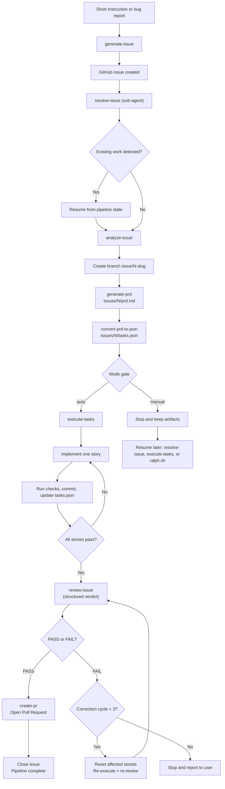

# Issue Flow: Skills & Sub-Agent Architecture

Issue Flow can also be used interactively within [Claude Code](https://docs.anthropic.com/en/docs/claude-code) via **skills** and the **`resolve-issue` sub-agent**. This document covers that usage model.

> For the CLI-first approach, see the [main README](../README.md).

## Architecture

Issue Flow uses a **sub-agent + skills** architecture:

- **`resolve-issue`** is a Claude Code **sub-agent** (`.claude/agents/resolve-issue.md`) that orchestrates the full pipeline
- All other components are **skills** preloaded into the sub-agent, callable without nesting
- Two execution modes: `auto` (no stops), `manual` (artifacts only)
- Auto-correction loop: review finds issues -> fix -> re-review (up to 3 cycles)
- Pipeline state tracking enables resumption from any phase

### Skills vs Sub-agent: how they are invoked

Skills and sub-agents are invoked differently in Claude Code:

| | Skills | Sub-agent (`resolve-issue`) |
|--|--------|---------------------------|
| **Slash command** | `/skill-name` (e.g., `/generate-issue`, `/review-issue`) | Not available -- sub-agents do not use `/` |
| **@-mention** | Not available | `@resolve-issue` + instructions |
| **Natural language** | Claude auto-invokes based on description | Claude auto-delegates based on description |
| **Session-wide** | Not available | `claude --agent resolve-issue` |
| **Headless** | `claude -p "/review-issue #42"` | `claude --agent resolve-issue -p "#42 --mode auto"` |

> **Important**: The `resolve-issue` sub-agent is **not** a skill and cannot be invoked with `/resolve-issue`. Use `@resolve-issue` or natural language instead.

## Components

| Component | Type | Description |
|-----------|------|-------------|
| [`resolve-issue`](../.claude/agents/resolve-issue.md) | **Sub-agent** | Orchestrates the full pipeline end-to-end with mode support and auto-correction loop. |
| [`generate-issue`](../skills/generate-issue/) | Skill | Generates architect-quality GitHub issues from short instructions with duplicate detection and label management. |
| [`analyze-issue`](../skills/analyze-issue/) | Skill | Analyzes a GitHub issue to extract context, scope, affected areas, and complexity. |
| [`generate-prd`](../skills/generate-prd/) | Skill | Generates a structured PRD with user stories, acceptance criteria, and functional requirements. |
| [`convert-prd-to-json`](../skills/convert-prd-to-json/) | Skill | Converts a PRD markdown file into a structured JSON task plan for autonomous execution. |
| [`execute-tasks`](../skills/execute-tasks/) | Skill | Iteratively implements user stories from a JSON task plan with quality checks and commits. |
| [`create-pr`](../skills/create-pr/) | Skill | Creates a Pull Request from the current branch with context from issue data, PRD, and git history. |
| [`review-issue`](../skills/review-issue/) | Skill | Reviews whether a GitHub issue has been fully resolved, with structured output for the correction loop. |

## Execution Modes

| Mode | Behavior | Use Case |
|------|----------|----------|
| `auto` | Full pipeline without stops (default) | Headless / CI / unattended |
| `manual` | Generates artifacts only, no execution | Planning / review before coding |

**Via @-mention (explicit):**
```
@resolve-issue #42
@resolve-issue #42 --mode auto
@resolve-issue #42 --mode manual
```

**Via natural language (Claude auto-delegates):**
```
Resolve issue #42
Resolve issue #42 --mode auto
```

**Via headless CLI:**
```bash
claude --agent resolve-issue -p "#42 --mode auto"
```

## End-to-End Workflow



## Interactive Walkthrough

<details>
<summary><strong>1. Create the GitHub issue with <code>generate-issue</code></strong></summary>

The pipeline can start from a short natural-language request such as "create an issue for adding rate limiting to the API".

`generate-issue` then:
- inspects the repository and stack
- expands the short request into a well-scoped technical issue
- checks for duplicates
- validates labels
- creates the issue with `gh`

Output: a published GitHub issue that is ready to be planned and executed.
</details>

<details>
<summary><strong>2. Resolve the issue with the <code>resolve-issue</code> sub-agent</strong></summary>

`resolve-issue` is a **sub-agent** that orchestrates the full pipeline. It runs in an isolated context window with all skills preloaded.

**Planning phases (automatic):**
1. Check for existing work and pipeline state in `issues/{N}/`
2. Analyze the issue with `analyze-issue`
3. Create the working branch `issue/{N}-{slug}`
4. Generate PRD with `generate-prd` -> `issues/{N}/prd.md`
5. Convert to task plan with `convert-prd-to-json` -> `issues/{N}/tasks.json`

**Mode-conditional gate:**
- `auto`: skips confirmation, proceeds directly to execution
- `manual`: stops here with artifacts saved

**Execution phases (if proceeding):**
6. Implement stories with `execute-tasks`
7. Validate with `review-issue` (structured verdict)
8. If FAIL: auto-correction loop (reset affected stories, re-execute, re-review -- up to 3 cycles)
9. If PASS: create PR with `create-pr` and close the issue
</details>

<details>
<summary><strong>3. Auto-correction loop</strong></summary>

After execution completes, the sub-agent automatically invokes `review-issue` which produces a structured verdict:

- **PASS**: All requirements met, tests pass, no regressions -> proceeds to create PR
- **FAIL**: Returns findings with affected user story IDs -> enters correction loop

The correction loop:
1. Saves review findings to `issues/{N}/review-findings.md`
2. Resets affected stories in `tasks.json` (`passes: false`)
3. Re-invokes `execute-tasks` to fix the issues
4. Re-invokes `review-issue` to validate the fixes
5. Repeats up to `maxCorrectionCycles` (default: 3) times
6. After 3 failed cycles, stops and reports to the user

This eliminates the need for manual back-and-forth between implementation and review.
</details>

<details>
<summary><strong>4. Pipeline resumption</strong></summary>

The `tasks.json` file tracks pipeline state:

```json
{
  "pipeline": {
    "analyzeCompleted": true,
    "prdCompleted": true,
    "jsonCompleted": true,
    "executionCompleted": false,
    "reviewCompleted": false,
    "prCreated": false
  }
}
```

When re-invoking `resolve-issue`, the sub-agent reads these flags and resumes from the last incomplete phase. In `auto` mode, this happens without any user interaction.
</details>

<details>
<summary><strong>5. Ralph Loop for large task plans</strong></summary>

For issues with many user stories (10+), the Ralph Loop is an alternative to the built-in `execute-tasks`. It runs fresh Claude Code sessions per story, avoiding context window exhaustion.

Ralph is **not** a replacement for the pipeline -- it replaces only the execution phase. Use it after planning is complete:

1. Invoke `@resolve-issue #42 --mode manual` to generate artifacts
2. Run `./scripts/ralph/ralph.sh --issue 42` to execute with context-reset per iteration

Both `execute-tasks` and Ralph consume the same `tasks.json` format.
</details>

## Ralph (Advanced / Optional)

[Ralph](../scripts/ralph/) is not part of issue creation and not part of planning. Its role starts only after `resolve-issue` has already created the branch and planning artifacts.

### What Ralph does

Ralph repeatedly runs a fresh Claude Code session against the existing task plan. In each iteration it:

1. reads `issues/{N}/tasks.json`
2. reads `issues/{N}/progress.txt`
3. checks out the branch from `branchName`
4. picks the highest-priority story where `passes: false`
5. implements only that story
6. runs quality checks
7. commits if checks pass
8. updates `tasks.json` and appends to `progress.txt`
9. repeats until every story passes or a fatal stop condition occurs

Because every iteration starts with clean context, memory persists through git history, `progress.txt`, and the task plan state in `tasks.json`.

### What Ralph does not do

Ralph does not:
- create the GitHub issue
- analyze the issue
- generate the PRD
- convert the PRD into the task plan
- decide scope for you

If those artifacts do not already exist, the script stops with an error.

### Before running Ralph

Run Ralph only after the planning pipeline is finished. In the normal flow, that means:

1. invoke the `resolve-issue` sub-agent for the target issue (via `@resolve-issue #N --mode manual` or natural language)
2. let it complete analysis, branch creation, PRD generation, and JSON task-plan generation
3. in `manual` mode it stops automatically
4. verify these inputs exist:
   - `issues/{N}/prd.md`
   - `issues/{N}/tasks.json`
   - branch `issue/{N}-{slug}`
5. make sure the required tools are installed:
   - `claude`
   - `jq`
   - `git`
   - `curl` or `wget` only when running remotely

`tasks.json` is the critical input. In `--issue` mode Ralph reads from `issues/{N}/tasks.json` and will fail immediately if that file is missing.

### Run Ralph

```bash
# Local (from a clone of this repo)
./scripts/ralph/ralph.sh --issue 42

# Remote (from any project -- no clone needed)
curl -sSL https://raw.githubusercontent.com/fabioassuncao/issue-flow/main/scripts/ralph/ralph.sh | bash -s -- --issue 42
```

Useful options:

```bash
# Stop after 15 iterations
./scripts/ralph/ralph.sh --issue 42 --max-iterations 15

# Retry transient Claude failures forever
./scripts/ralph/ralph.sh --issue 42 --retry-forever
```

In remote mode, `prompt.md` is downloaded automatically and cleaned up on exit. See the [Ralph README](../scripts/ralph/) for the full script documentation.

## Installation (Claude Code)

Issue Flow has two types of components with different installation methods:

| Component | Type | Portable | Claude Code required |
|-----------|------|----------|---------------------|
| `analyze-issue`, `generate-prd`, `convert-prd-to-json`, `execute-tasks`, `create-pr`, `review-issue`, `generate-issue` | Skills (`skills/`) | Yes -- works with any tool that supports [Agent Skills](https://agentskills.io) | No |
| `resolve-issue` (orchestrator) | Sub-agent (`agents/`) | **No** -- exclusive to Claude Code | **Yes** |

### Full installation (sub-agent + all skills)

Installs everything: the sub-agent orchestrator + all skills. This is the only way to get the full pipeline with modes, auto-correction loop, and pipeline resumption.

```bash
# Install all skills + sub-agent
npx skills add fabioassuncao/issue-flow
```

This installs all skills into `.claude/skills/` and the sub-agent into `.claude/agents/`.

**Sub-agent only (manual):**

If you only need the sub-agent orchestrator:

```bash
mkdir -p .claude/agents
curl -sSL https://raw.githubusercontent.com/fabioassuncao/issue-flow/main/agents/resolve-issue.md \
  -o .claude/agents/resolve-issue.md
```

The sub-agent also requires the skills it orchestrates to be installed (see below).

### Skills only (any Agent Skills-compatible tool)

If you use a tool other than Claude Code (or prefer to use skills individually without the orchestrator), install only the skills:

```bash
# All skills
npx skills add fabioassuncao/issue-flow

# A specific skill only
npx skills add fabioassuncao/issue-flow --skill generate-issue
```

**Manual:**

1. Download the desired skill folder from `skills/` in this repository.
2. Copy it into your project's `.claude/skills/` directory.

Skills are automatically available in any tool that supports [Agent Skills](https://agentskills.io).

### What works without the sub-agent

Without the `resolve-issue` sub-agent, each skill can still be used independently:

| Capability | Available without sub-agent? |
|-----------|------------------------------|
| Create issues (`generate-issue`) | Yes |
| Analyze issues (`analyze-issue`) | Yes |
| Generate PRDs (`generate-prd`) | Yes |
| Convert PRD to JSON (`convert-prd-to-json`) | Yes |
| Execute tasks (`execute-tasks`) | Yes |
| Create PRs (`create-pr`) | Yes |
| Review issues (`review-issue`) | Yes |
| Ralph Loop (`ralph.sh`) | Yes |
| **Full orchestrated pipeline** | **No -- requires sub-agent** |
| **Execution modes (auto/manual)** | **No -- requires sub-agent** |
| **Auto-correction loop** | **No -- requires sub-agent** |
| **Pipeline state resumption** | **No -- requires sub-agent** |

Without the sub-agent, you can still run the full workflow manually by invoking each skill in sequence, or use Ralph for the execution phase.

## Headless / CI Usage

```bash
# Full pipeline, no stops (sub-agent)
claude --agent resolve-issue -p "#42 --mode auto"

# Planning only (sub-agent)
claude --agent resolve-issue -p "#42 --mode manual"

# Individual skills (headless)
claude -p "/execute-tasks for issue #42"
claude -p "/review-issue #42"
claude -p "/create-pr for issue #42"

# Execute with context-reset (many stories)
./scripts/ralph/ralph.sh --issue 42
```

## Quick Start (Interactive)

**Skills (slash command):**
```
/generate-issue Add rate limiting to the API

/review-issue #42

/execute-tasks for issue #42
```

**Sub-agent (@-mention):**
```
@resolve-issue #42

@resolve-issue #42 --mode auto
```

**Sub-agent (natural language -- Claude auto-delegates):**
```
Resolve issue #42

Fix issue #42 in auto mode
```

See each skill's README for standalone usage.
