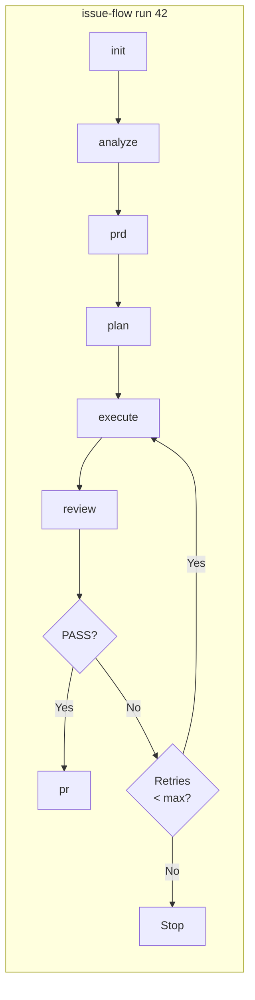

# issue-flow

> This is the npm package README. For full project documentation, see the [root README](../../README.md).

Unified CLI that orchestrates the full issue-to-PR pipeline via [Claude Code](https://docs.anthropic.com/en/docs/claude-code) Headless mode. Analyzes issues, generates PRDs, creates task plans, implements code iteratively, reviews results, and opens pull requests -- all programmatically, without interactive sessions.

Built on the [Ralph pattern](https://ghuntley.com/ralph/) for autonomous AI agent loops.

## Pipeline Flow



## Requirements

- **Node.js** >= 18.0.0
- **git** installed and available in PATH
- **Claude Code** (`npm install -g @anthropic-ai/claude-code`)
- **GitHub CLI** (`gh`) authenticated (`gh auth login`)

Run `npx issue-flow init` to verify all prerequisites.

## Installation

```bash
# Run directly via npx (no install needed)
npx issue-flow run 42

# Or install globally
npm install -g issue-flow
issue-flow run 42
```

## Commands

### `run` -- Full pipeline (end-to-end)

```bash
# Run the complete pipeline for an issue
npx issue-flow run 42

# Resume from a specific phase
npx issue-flow run 42 --from execute

# Manual mode (artifacts only, no execution)
npx issue-flow run 42 --mode manual
```

Executes all phases in order: **init** → **analyze** → **prd** → **plan** → **execute** → **review** → **pr**. Automatically resumes from the last incomplete phase if pipeline state exists. On review failure, runs correction cycles (re-execute + re-review) up to `maxCorrectionCycles`.

### `init` -- Check prerequisites

```bash
npx issue-flow init
```

Verifies that `claude`, `gh` (authenticated), and `git` (inside a repo) are available. Reports pass/fail for each with install hints.

### `analyze` -- Analyze an issue

```bash
npx issue-flow analyze 42
```

Invokes Claude headlessly to fetch issue data, analyze the codebase, and produce a structured analysis saved to `issues/42/analysis.md`.

### `prd` -- Generate a PRD

```bash
npx issue-flow prd 42
```

Generates a Product Requirements Document from the issue analysis. Reads `issues/N/analysis.md` as context if available. Saves to `issues/42/prd.md`.

### `plan` -- Convert PRD to task plan

```bash
npx issue-flow plan 42
```

Converts the PRD into a structured `issues/42/tasks.json` with ordered user stories, acceptance criteria, and pipeline state. Validates the output with zod schemas.

### `execute` -- Run the story execution loop

```bash
npx issue-flow execute --issue 42
npx issue-flow execute --issue 42 --max-iterations 15
npx issue-flow execute --issue 42 --retry-forever
```

Runs the iterative agent loop. Each iteration is a fresh Claude instance that picks the next pending story, implements it, runs quality checks, and commits.

| Flag | Description |
|------|-------------|
| `--issue N` | Issue number -- reads artifacts from `issues/N/` |
| `--max-iterations N` | Stop after N iterations (default: unlimited) |
| `--retry-limit N` | Retry transient Claude failures up to N consecutive times (default: 10) |
| `--retry-forever` | Retry transient Claude failures indefinitely |

### `review` -- Validate the implementation

```bash
npx issue-flow review 42
```

Invokes Claude headlessly to verify acceptance criteria, run tests, and check for regressions. Outputs `PASS` or `FAIL` with findings.

### `pr` -- Create a pull request

```bash
npx issue-flow pr 42
```

Creates a well-structured PR referencing the issue, with summary and test plan.

### `generate` -- Create a new issue

```bash
npx issue-flow generate --prompt "Add dark mode support to the settings page"
```

Analyzes the project and creates a detailed GitHub issue via Claude headless.

## Pipeline State

Each issue's state is tracked in `issues/N/tasks.json`:

```
issues/42/
  analysis.md    # Issue analysis
  prd.md         # Product requirements
  tasks.json     # Task plan with pipeline state and user stories
  progress.txt   # Execution log
```

The `pipeline` field tracks which phases have completed, enabling resume from any point:

```json
{
  "pipeline": {
    "analyzeCompleted": true,
    "prdCompleted": true,
    "jsonCompleted": true,
    "executionCompleted": false,
    "reviewCompleted": false,
    "prCreated": false
  }
}
```

## Architecture

```
src/
  cli.ts                  # Entry point, subcommand registration (commander)
  config.ts               # Configuration resolution and defaults
  types.ts                # Shared TypeScript interfaces
  schemas.ts              # Zod validation schemas
  commands/
    init.ts               # Prerequisite verification
    generate.ts           # Headless issue creation
    run.ts                # Full pipeline orchestrator
    analyze.ts            # Headless issue analysis
    prd.ts                # Headless PRD generation
    plan.ts               # Headless PRD-to-JSON conversion
    execute.ts            # Iterative story execution (engine wrapper)
    review.ts             # Headless implementation review
    pr.ts                 # Headless PR creation
  core/
    engine.ts             # Main agent loop
    executor.ts           # Claude CLI invocation via execa
    headless.ts           # Typed wrapper for claude -p invocations
    pipeline.ts           # Pipeline state machine
    state-manager.ts      # Typed CRUD for tasks.json
    prompt-resolver.ts    # Prompt resolution and templating
  ui/
    logger.ts             # Colored logging utilities
    progress.ts           # Progress bar and iteration headers
    summary.ts            # Box drawing and summary display
  utils/
    shell.ts              # Shell command execution
    git.ts                # Git operations
    retry.ts              # Transient failure detection and backoff
```

## Development

```bash
# Install dependencies
npm install

# Build
npm run build

# Type check
npm run typecheck

# Run tests
npm test

# Watch mode
npm run dev
```

For the full development setup, local testing, and NPM publishing guide, see [CONTRIBUTING.md](CONTRIBUTING.md).

## Credits

Based on [Geoffrey Huntley's Ralph pattern](https://ghuntley.com/ralph/) and the [snarktank/ralph](https://github.com/snarktank/ralph) repository.

## See Also

- [Skills & Sub-Agent Architecture](../../docs/skills-and-agents.md) -- Using Issue Flow interactively via Claude Code skills and the `resolve-issue` sub-agent.
